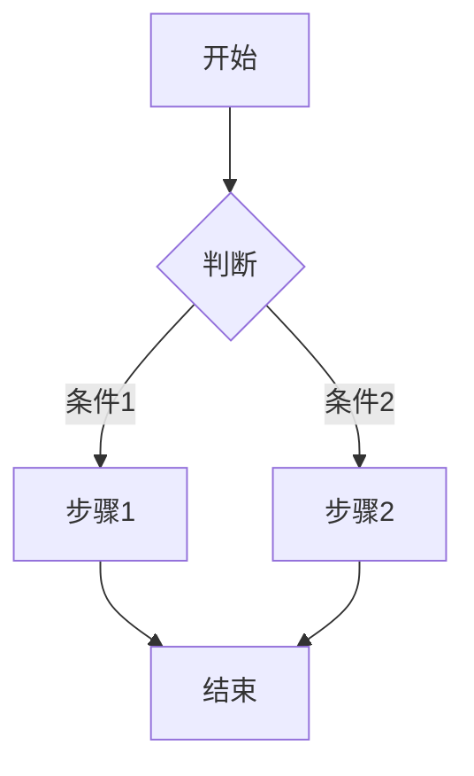
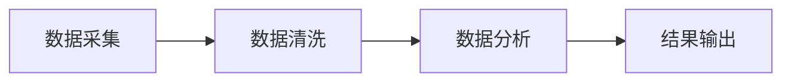

# Technical Proposal Illustration

技术方案智能配图，为章节内容自动生成匹配的示意图并插入文档。

## 核心原则

1. **内容优先** — 图片服务于文字，不是装饰。优先选择与内容相关性最强的类型。
2. **类型决定工具** — 流程图用 Mermaid，架构图/数据图/原型图用 AI 生成。
3. **风格统一** — 技术方案统一风格，不混用多种视觉风格。
4. **白色背景** — 所有 AI 生成的图片（架构图、数据图、指标对比、原型界面）**必须使用白色背景**。
5. **学术规范** — 架构图/系统图采用学术论文风格，核心组件配图标。

## 配图类型与工具选择

### 决策树

```
内容分析
  │
  ├─ 业务流程 / 工作流 / 业务阶段 ────────────→ baoyu-image-gen (白底 + 学术流程图)
  │                                             或 Mermaid (flowchart)
  │
  ├─ 数据流 / 数据加工路径 ──────────────────→ baoyu-image-gen (白底 + 学术数据流图)
  │
  ├─ 技术路线 / 演进路径 / 时间规划 ──────────→ baoyu-image-gen (白底 + 学术路线图)
  │
  ├─ 架构 / 系统结构 / 模块关系 ──────────────→ baoyu-image-gen (白底 + 学术架构图 + 图标)
  │
  ├─ 数据对比 / 指标 / 统计 ──────────────────→ baoyu-image-gen (白底 + 学术数据图)
  │
  ├─ 时序 / 交互流程 ─────────────────────────→ Mermaid (sequence)
  │
  ├─ 原型 / UI / 界面示意 ────────────────────→ baoyu-image-gen (白底 + wireframe)
  │
  └─ 概念解释 / 原理示意 ─────────────────────→ baoyu-image-gen (白底 + 学术风格)
```

### 工具速查

| 类型 | 工具 | 风格 |
|------|------|------|
| 业务流程图、工作流 | `baoyu-image-gen` 或 Mermaid | 白底 + 学术流程图 |
| 数据流图 | `baoyu-image-gen` | 白底 + 学术数据流图 |
| 技术路线图 / 时间轴 | `baoyu-image-gen` | 白底 + 学术路线图 |
| 架构图、系统图 | `baoyu-image-gen` | 白底 + 学术架构图 + 图标 |
| 数据图、指标对比 | `baoyu-image-gen` | 白底 + 学术数据图 |
| 时序图、状态图 | Mermaid 代码块 | 直接嵌入 markdown |
| 原型界面 | `baoyu-image-gen` | 白底 + wireframe |
| 网络拓扑、部署图 | `baoyu-image-gen` | 白底 + 学术拓扑图 |
| 概念解释 | `baoyu-image-gen` | 白底 + 学术风格 |

**通用规范：所有 AI 生成的图片必须为白色背景。**

## 执行流程

### Step 1: 分析章节内容

读取 `sections/` 目录下所有章节 markdown 文件，分析：

- 各章节主题（架构设计/数据治理/接口设计等）
- 包含的流程描述词（"首先...然后...最后"、"流程如下"）
- 包含的架构描述词（"系统分为...层"、"包括...模块"）
- 包含的数据描述词（"占比"、"对比"、"指标"）

输出：**配图候选清单**

### Step 2: 确认配图方案（AskUserQuestion）

向用户确认配图方案：

```
【P5 智能配图 - 方案确认】

已识别 N 个潜在配图位置：
- 图1：章节X.X "系统架构图" → 架构图 → baoyu-image-gen
- 图2：章节X.X "数据处理流程" → 流程图 → Mermaid
- ...

生成工具：
- 流程图/时序图 → Mermaid 代码块（自动嵌入）
- 架构图/数据图/原型图 → baoyu-image-gen

请确认：
1. 以上配图方案是否合理？有无遗漏或多余？
2. 风格偏好？（sci-fi/blueprint/minimal-flat/其他）
3. 是否需要补充其他类型的图？
```

### Step 3: 生成图片

#### 3.1 流程图（Mermaid）

直接在对应章节的 markdown 文件中添加 Mermaid 代码块：

````markdown

````

**Mermaid 适合的场景：**
- 工作流程（步骤1 → 步骤2 → 步骤3）
- 状态机（状态A ↔ 状态B）
- 时序图（用户 → 系统 → 数据库）
- 类图、ER 图

#### 3.2 AI 生成图片（baoyu-image-gen）

对于架构图、数据图、原型图等，调用 `baoyu-image-gen`：

```bash
# 确定脚本路径
baseDir="/Users/mathrippermacmini/.claude/skills/baoyu-image-gen"
BUN_X="npx -y bun"

# 生成架构图
$BUN_X $baseDir/scripts/main.ts \
  --promptfiles $outputDir/prompts/NN-framework-xxx.md \
  --image $outputDir/NN-framework-xxx.png \
  --ar 16:9 --quality 2k --provider dashscope

# 生成数据图
$BUN_X $baseDir/scripts/main.ts \
  --promptfiles $outputDir/prompts/NN-infographic-xxx.md \
  --image $outputDir/NN-infographic-xxx.png \
  --ar 16:9 --quality 2k --provider dashscope
```

**Prompt 构造要点（技术方案风格）：**
- **白色背景**（必须）：`Background: Pure white (#FFFFFF). No dark backgrounds.`
- 学术论文风格：简洁、专业、几何化，避免花哨装饰
- 核心组件配图标：用通用图标符号表示（数据库=圆柱、API=↔、用户=👤、服务=⚙）
- 包含具体的技术术语和数值
- 布局清晰，分区明确
- 色彩语义化且克制（蓝色=接入/接口，青色=服务层，紫色=数据层，灰色=基础设施）
- 无渐变、无阴影、无复杂纹理

**Prompt 示例（业务流程图 — 学术白底风格）：**
```
Business process flowchart. Academic paper style.

BACKGROUND: Pure white (#FFFFFF). No dark backgrounds, no gradients.

Layout: Left-to-right horizontal flow.

STEPS (process nodes):
1. 业务受理 → labeled "业务受理" in rounded rectangle
2. 材料审核 → labeled "材料审核" in rounded rectangle
3. 智能审批 → labeled "智能审批" in rounded rectangle (highlighted as key step)
4. 结果输出 → labeled "结果输出" in rounded rectangle

CONNECTIONS: Solid arrows (→) between each step. Direction: left to right.
DECISION: Step 2 "材料审核" branches to "补充材料" (left) and "进入下一环节" (right) with dashed arrow.

Icons per step:
- 业务受理: clipboard icon
- 材料审核: magnifying glass icon
- 智能审批: gear/automation icon
- 结果输出: checkmark icon

Colors:
- Background: Pure white (#FFFFFF)
- Normal steps: Light gray fill (#F3F4F6), dark gray (#374151) border
- Key step (智能审批): Light blue fill (#EFF6FF), blue (#2563EB) border
- Decision: Dashed border (#9CA3AF)
- Arrows: Dark gray (#4B5563)
- All text: Dark gray (#374151)

Style: Academic flowchart. Clean geometric shapes, minimal decoration, precise layout. No 3D effects, no shadows, no gradients. Clear directional flow from left to right.
ASPECT: 16:9
```

**Prompt 示例（数据流图 — 学术白底风格）：**
```
Data flow diagram (DFD). Academic paper style.

BACKGROUND: Pure white (#FFFFFF). No dark backgrounds, no gradients.

Layout: Top-to-bottom hierarchical data flow.

NODES (processes and data stores):
- External Entity: "用户端" (labeled, rectangle with double outline)
- Process: "数据采集层" (labeled, rounded rectangle)
- Process: "数据处理层" (labeled, rounded rectangle)
- Data Store: "原始数据库" ⧈ (labeled, cylinder icon)
- Data Store: "分析数据库" ⧈ (labeled, cylinder icon)
- Process: "数据服务层" (labeled, rounded rectangle)
- External Entity: "应用系统" (labeled, rectangle with double outline)

FLOWS (data movements with labels):
- 用户端 → 数据采集层: labeled "原始数据"
- 数据采集层 → 原始数据库: labeled "写入"
- 数据采集层 → 数据处理层: labeled "清洗后数据"
- 数据处理层 → 分析数据库: labeled "分析结果"
- 分析数据库 → 数据服务层: labeled "查询"
- 数据服务层 → 应用系统: labeled "服务接口"

CONNECTIONS: Solid arrows with arrowheads showing direction.

Colors:
- Background: Pure white (#FFFFFF)
- External entities: Light blue fill (#EFF6FF), blue (#2563EB) outline
- Processes: Light gray fill (#F3F4F6), dark gray (#374151) outline
- Data stores: Light purple fill (#F5F3FF), purple (#7C3AED) outline (cylinder shape)
- Flow arrows: Dark gray (#4B5563)
- Data labels: Medium gray (#6B7280), italic

Style: Academic data flow diagram. Clean geometric nodes, clear directional arrows, precise labels. No 3D, no shadows, no gradients. Formal and technical.
ASPECT: 16:9
```

**Prompt 示例（技术路线图 / 时间轴 — 学术白底风格）：**
```
Technology roadmap / timeline. Academic paper style.

BACKGROUND: Pure white (#FFFFFF). No dark backgrounds, no gradients.

Layout: Horizontal timeline with 3-4 phases, top-to-bottom per phase.

TIMELINE AXIS: Horizontal dashed line at center, labeled "时间轴 →"

PHASES:
- Phase 1 (2024): "第一阶段：基础设施建设"
  → 3 milestones as small dots with labels below:
    "数据采集平台搭建" / "知识库架构设计" / "核心算法验证"

- Phase 2 (2025): "第二阶段：能力构建"
  → 3 milestones:
    "知识图谱构建" / "智能问答引擎" / "合规条款解析"

- Phase 3 (2026): "第三阶段：系统集成"
  → 3 milestones:
    "多源数据融合" / "人机协同机制" / "性能优化调优"

- Phase 4 (2027): "第四阶段：推广应用"
  → 2 milestones:
    "试点运行" / "全面部署"

CONNECTORS: Vertical dashed lines connecting each phase to its milestones.

Colors:
- Background: Pure white (#FFFFFF)
- Timeline axis: Dark gray (#374151), solid horizontal line
- Phase labels: Blue (#2563EB), bold
- Milestones: Blue circles (#2563EB) on the axis
- Milestone text: Dark gray (#374151)
- Connector lines: Light gray (#D1D5DB)

Style: Academic timeline / roadmap. Clean horizontal axis, clear phase divisions, precise milestone placement. No fancy decorations, no gradients. Formal and structured, like a journal paper figure.
ASPECT: 16:9
```

**Prompt 示例（架构图 — 学术白底风格）：**
```
Technical system architecture diagram. Academic paper style.

BACKGROUND: Pure white (#FFFFFF). No gradients, no shadows, no textures.

Layout: Top-down hierarchical, 3 layers.

ZONES:
- Zone 1 (Top): API Gateway / User Interface layer
  → Icon: ↔ (bidirectional arrows) for gateway
  → Label: "接入层" in Chinese
- Zone 2 (Middle): Core Services layer
  → Icon: ⚙ (gear) for each service module
  → 3 service modules with icons: 用户服务 ⚙ / 业务服务 ⚙ / 数据服务 ⚙
  → Label: "服务层" in Chinese
- Zone 3 (Bottom): Data Persistence layer
  → Icon: ⧈ (cylinder) for database
  → 3 data stores: 主数据 ⧈ / 业务数据 ⧈ / 日志数据 ⧈
  → Label: "数据层" in Chinese

CONNECTIONS: Clean straight lines with directional arrows. No curved lines.
Clean geometric containers: rounded rectangles with 1px solid borders. No fill (white/transparent fill).

Colors:
- Gateway: Blue (#2563EB) outline
- Service modules: Teal (#0D9488) outline
- Data stores: Purple (#7C3AED) outline
- All text: Dark gray (#374151) or black
- Borders: 1px solid, matching component color

Style: Academic / technical diagram. Flat design, white background, precise layout, clean lines, minimal decoration. Each component has a clear icon. Text labels in Chinese. Professional and formal.
ASPECT: 16:9
```

**Prompt 示例（数据图 / 指标对比 — 白底学术风格）：**
```
Data visualization infographic. Academic paper style.

BACKGROUND: Pure white (#FFFFFF). No dark backgrounds, no gradients.

Layout: Grid layout, 2x2 or 3-column comparison.

ZONES:
- Zone 1: Metric A — labeled with actual value "准确率 98.5%"
- Zone 2: Metric B — labeled with actual value "召回率 95.2%"
- Zone 3: Metric C — labeled with actual value "响应时间 < 200ms"
- Zone 4: Summary — key insight

Icons per metric: ✓ checkmark for accuracy, ⬆ for performance, ⚡ for speed

Colors:
- White background
- Metric boxes: light gray fill (#F3F4F6), colored top border per category
- Accuracy: Green (#059669) top border
- Performance: Blue (#2563EB) top border
- Speed: Amber (#D97706) top border
- Text: Dark gray (#374151)

Style: Flat infographic, academic presentation style. Clean bars, clear labels, no 3D effects. Minimal, professional.
ASPECT: 16:9
```

**Prompt 示例（原型界面 — 白底线框风格）：**
```
UI wireframe / prototype mockup. Academic white paper style.

BACKGROUND: Pure white (#FFFFFF).

Layout: Wireframe showing interface layout with placeholder components.

ZONES:
- Top: Header bar (labeled "导航栏")
- Left: Sidebar menu (3 items with icons)
- Center: Main content area with table/widget placeholders
- Bottom: Action buttons (提交 / 取消)

Icons: Simple line icons for menu items (home, settings, user)
Wireframe style: Gray borders (#D1D5DB), white fills, placeholder rectangles labeled with function names.

Colors:
- Background: Pure white (#FFFFFF)
- Borders: Light gray (#D1D5DB)
- Text: Dark gray (#374151)
- Interactive elements: Blue (#2563EB) accent

Style: Clean wireframe, no color fills, minimal labels in Chinese, technical and formal.
ASPECT: 16:9
```

### Step 4: 插入图片

生成完成后，在对应段落后插入图片引用：

**Mermaid 图片**（代码块已嵌入，无需额外引用）：
````markdown
数据处理流程如下：



如图所示，数据经过采集、清洗、分析三个阶段后输出。
````

**AI 生成图片**：
```markdown
系统采用三层架构设计，各层职责清晰、边界明确。如图所示：


- 接入层：负责用户请求的接入、认证与路由
- 业务层：承载核心业务逻辑，支持水平扩展
- 数据层：提供统一的数据访问接口，支持多数据源
```

### Step 5: 输出报告

```
P5 智能配图完成

文档：{方案名称}
配图数量：N 张
- 流程图：M 张（Mermaid）
- 架构图：K 张（baoyu-image-gen）
- 数据图：L 张（baoyu-image-gen）

产出文件：
- sections/（已更新，含 Mermaid 代码块）
- images/（AI 生成图片）
  - 01-framework-xxx.png
  - 02-flowchart-xxx.png
  - ...
```

## 输出目录结构

```
{项目目录}/项目文档/技术方案/
├── sections/          # 已更新，含 Mermaid 代码块
├── images/            # AI 生成图片
│   ├── 01-framework-xxx.png
│   ├── 02-infographic-xxx.png
│   └── ...
└── 配图方案.md        # 配图清单（可选）
```

## 技术方案推荐 Style Preset

基于 baoyu-article-illustrator 的 style-presets，为技术方案推荐以下 preset：

| 内容类型 | Preset | Type | Style | 背景 | 说明 |
|----------|--------|------|-------|------|------|
| 系统架构 | `system-design` | framework | **academic-white** | **白底** | 学术论文风格，核心组件图标 |
| 数据指标 | `data-report` | infographic | **academic-white** | **白底** | 学术数据展示，清晰指标 |
| 业务流程图 | `process-flow` | flowchart | **academic-white** | **白底** | 学术流程图风格，节点图标 |
| 数据流图 | - | framework | **academic-white** | **白底** | DFD风格，外部实体/处理/数据存储 |
| 技术路线图 | `timeline` | timeline | **academic-white** | **白底** | 学术时间轴，阶段清晰 |
| 原型界面 | - | scene | **wireframe-white** | **白底** | 线框风格，无填充 |
| 技术对比 | `versus` | comparison | **academic-white** | **白底** | 学术对比风格 |
| 网络拓扑 | - | framework | **academic-white** | **白底** | 学术拓扑图，节点图标 |
| 概念解释 | - | framework | **academic-white** | **白底** | 学术示意图 |

**通用规范（所有 AI 生成图片）：**
- 背景：**纯白色 #FFFFFF**
- 禁止：渐变、阴影、复杂纹理、深色背景
- 核心组件必须配有对应图标（数据库=圆柱 ⧈、API=双向箭头 ↔、服务=齿轮 ⚙、用户=简化人形、文件=矩形）
- 色彩克制且语义化（蓝=接口/接入，青=服务，紫=数据，灰=基础设施，橙=关键步骤）
- 文字深灰或黑色，中文标签
- 连线清晰：实线=正常流向，虚线=条件分支，点线=时间轴/连接线

## 相关 Skills

- `baoyu-article-illustrator` — 通用文章配图（参考其 prompt 模板）
- `baoyu-image-gen` — AI 图片生成（生成架构图、数据图）
- `technical-proposal-workflow` — 编排器（调用本 skill）
- `technical-proposal-writing` — P4 并行写作（产出的 sections/ 是本 skill 的输入）
- `technical-proposal-merge` — P6 文档合并（合并含图的 sections）
