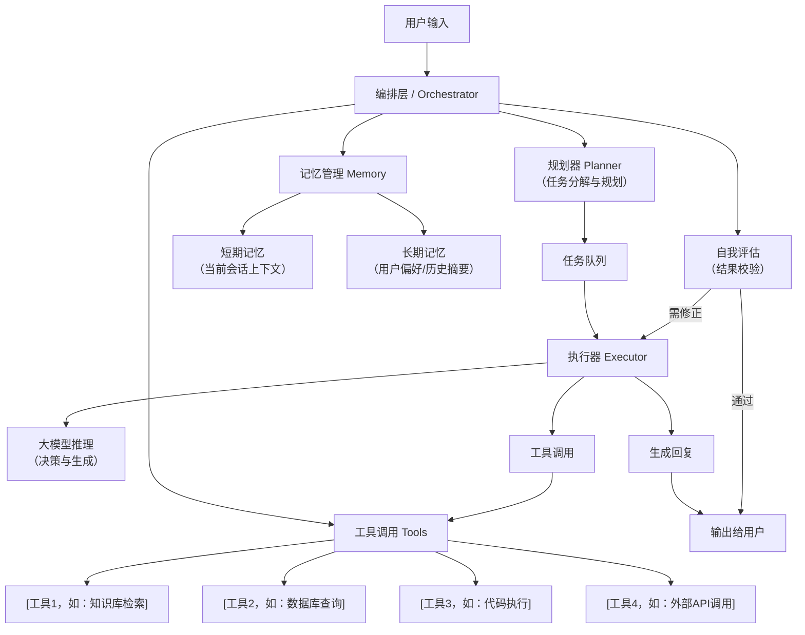
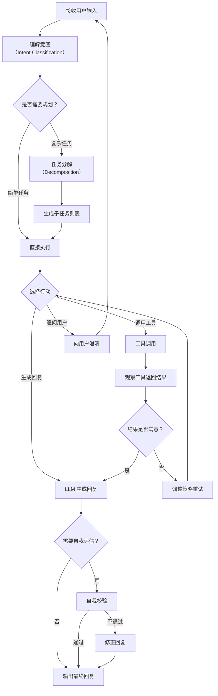
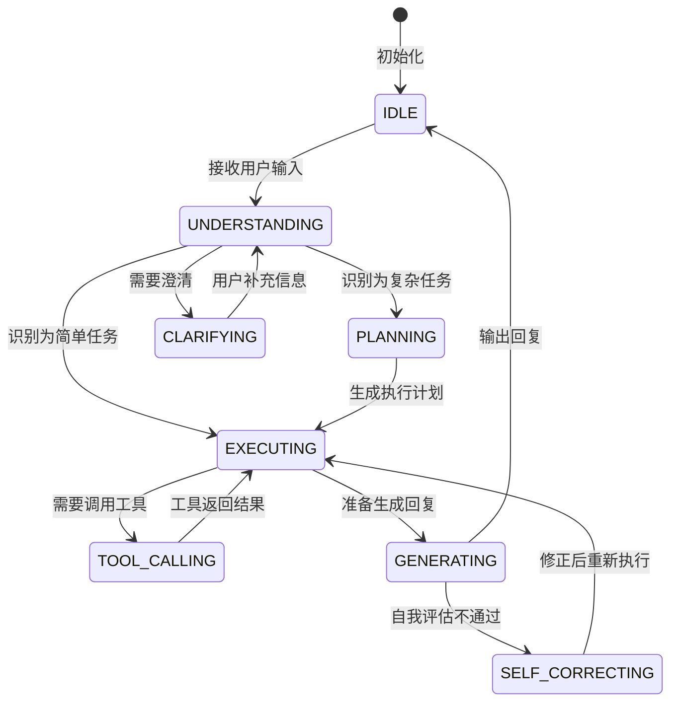
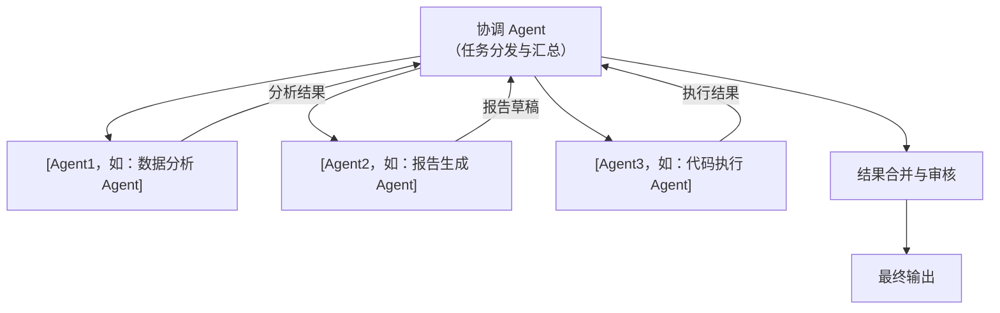
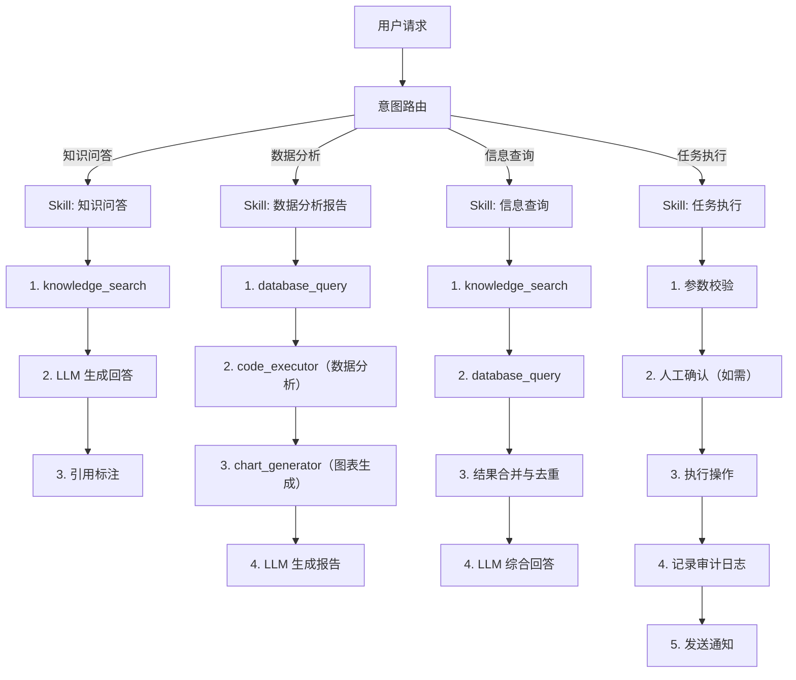
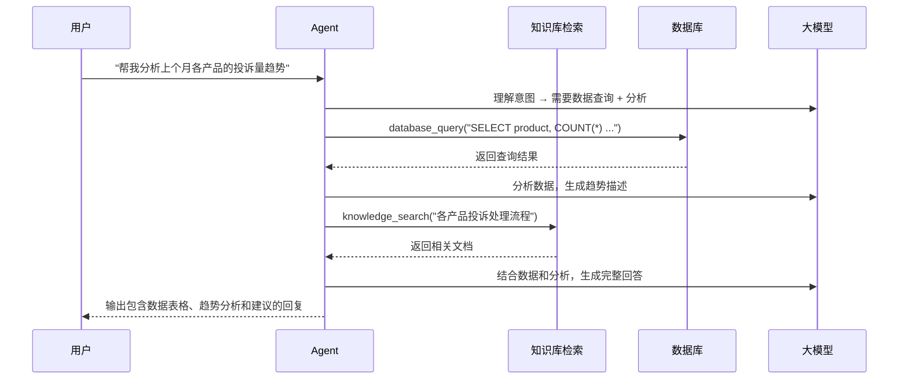
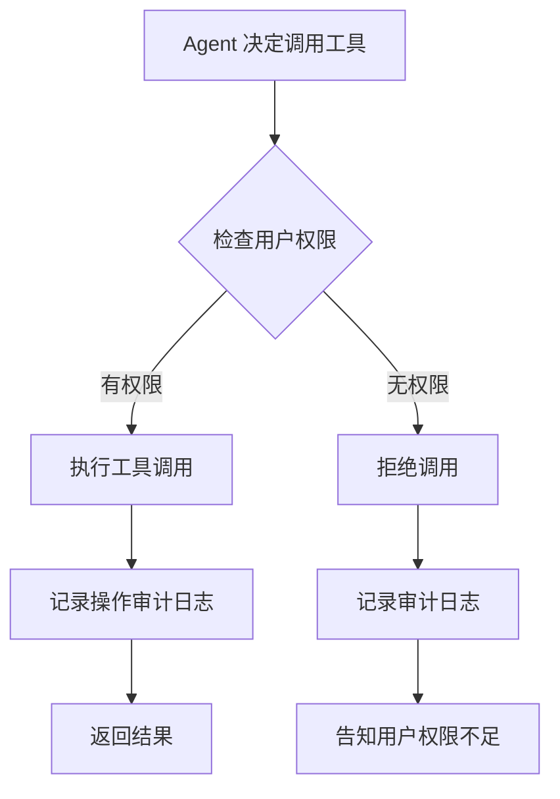

# 智能体文档模板集

本文件包含 3 个智能体类别的知识库文档模板：Agent设计.md、工具与集成.md、应用成效.md。

---

# 模板一：Agent设计.md

```markdown
# [项目名称] Agent 设计

## Agent 架构总览

### 设计概述

[用 2-3 段文字描述 Agent 的整体架构设计。说明 Agent 的核心定位（如：自动化客服、数据分析助手、运维机器人等），采用什么 Agent 框架或自研方案，以及核心设计决策的考量。]

**Agent 类型：** [如：ReAct Agent / Plan-and-Execute Agent / Multi-Agent 系统 / Workflow Agent]

**核心能力：**
1. [能力1，如：自然语言理解与意图识别]
2. [能力2，如：多步骤推理与任务规划]
3. [能力3，如：工具调用与外部系统交互]
4. [能力4，如：上下文管理与多轮对话]

### 架构图



> **说明：** 请根据实际 Agent 架构调整。如为 Multi-Agent 系统，可在图中展示各 Agent 之间的协作关系。

### 技术选型

| 组件 | 选型 | 版本 | 选型理由 |
|------|------|------|----------|
| [如：Agent 框架] | [如：LangChain / AutoGen / CrewAI / 自研] | [如：0.1.x] | [选型理由] |
| [如：编排引擎] | [如：LangGraph / 自研工作流引擎] | [如：0.2.x] | [选型理由] |
| [如：基础大模型] | [如：GLM-4 / GPT-4o / Qwen2.5] | [如：最新版] | [选型理由] |
| [如：向量数据库] | [如：Milvus / ChromaDB] | [如：2.x] | [选型理由] |
| [如：运行时] | [如：Python 3.11] | [如：3.11] | [选型理由] |

## 决策流程

### 核心决策循环



### 意图识别

| 意图类型 | 描述 | 处理策略 | 占比（预估） |
|----------|------|----------|-------------|
| [如：知识问答] | [如：用户询问产品/技术相关问题] | [RAG 检索 + LLM 生成] | [如：60%] |
| [如：任务执行] | [如：用户要求执行具体操作] | [工具调用 + 结果反馈] | [如：25%] |
| [如：闲聊/引导] | [如：用户进行非业务对话] | [直接 LLM 回复] | [如：10%] |
| [如：投诉/反馈] | [如：用户表达不满或提出建议] | [转人工 / 记录反馈] | [如：5%] |

### 任务规划能力

| 规划特征 | 描述 | 示例 |
|----------|------|------|
| [如：支持多步推理] | [如：能将复杂任务分解为多个有序子任务] | [如："帮我分析上个月的客户投诉趋势并生成报告" → 1.查询数据 2.分析趋势 3.生成报告] |
| [如：支持动态调整] | [如：根据中间结果调整后续步骤] | [如：工具返回错误时自动切换备选方案] |
| [如：支持并行执行] | [如：独立子任务可并行执行] | [如：同时查询多个数据源] |
| [如：最大规划深度] | [如：最多支持 5 层子任务嵌套] | [防止过度规划导致性能问题] |

## Prompt 策略

### 系统提示词

**主系统提示词模板：**

```
你是一个专业的[角色名称]，服务于[目标用户群体]。

## 角色定位
[描述 Agent 的角色和能力边界]

## 核心能力
1. [能力1描述]
2. [能力2描述]
3. [能力3描述]

## 行为规则
1. [规则1，如：回答必须基于事实，不得编造信息]
2. [规则2，如：遇到不确定的问题，主动向用户澄清]
3. [规则3，如：使用工具前先说明将要做什么]
4. [规则4，如：涉及敏感操作必须确认后执行]

## 工具使用规则
[描述何时、如何使用工具]

## 输出格式
[描述期望的输出格式和风格]
```

### Prompt 变体

| 场景 | Prompt 调整 | 触发条件 |
|------|------------|----------|
| [如：复杂任务模式] | [如：增加分步思考指令，要求先输出计划再执行] | [如：检测到多步骤任务] |
| [如：简洁模式] | [如：限制输出长度，要求直接给出答案] | [如：用户明确要求简洁回答] |
| [如：专业模式] | [如：使用更专业的术语和表达] | [如：检测到专业用户或技术问题] |
| [如：兜底模式] | [如：明确告知能力边界，引导用户转向人工] | [如：超出能力范围或多次失败] |

### Few-shot 示例

[如有 Few-shot 示例，列出关键的示例对]

| 示例编号 | 用户输入 | 期望输出 | 说明 |
|----------|----------|----------|------|
| [如：示例1] | [如："帮我查一下 XX 产品的价格"] | [如：调用价格查询工具，返回结构化价格信息] | [工具调用示例] |
| [如：示例2] | [如："为什么上个月投诉量增加了？"] | [如：调用数据分析工具，给出趋势分析和可能原因] | [多步推理示例] |

## 状态管理

### 对话状态

| 状态属性 | 类型 | 说明 | 示例值 |
|----------|------|------|--------|
| [如：current_intent] | [Enum] | [当前识别到的用户意图] | [如：KNOWLEDGE_QUERY] |
| [如：pending_tasks] | [List] | [待执行的子任务列表] | [如：["查询数据", "生成图表"]] |
| [如：execution_history] | [List] | [已执行的工具调用历史] | [如：[{tool: "search", result: "..."}]] |
| [如：clarification_needed] | [Boolean] | [是否需要向用户澄清] | [如：true] |
| [如：context_summary] | [Text] | [当前对话的上下文摘要] | [如："用户在咨询 XX 产品功能"] |

### 状态流转



## 记忆机制

### 短期记忆

| 配置项 | 配置值 | 说明 |
|--------|--------|------|
| [如：会话上下文窗口] | [如：最近 20 轮对话] | [保留的对话轮数] |
| [如：上下文压缩策略] | [如：滑动窗口 + 重要信息提取] | [超出窗口时的处理方式] |
| [如：工具结果保留] | [如：最近 10 次工具调用结果] | [保留的工具返回数据] |
| [如：会话摘要] | [如：每 5 轮自动生成摘要] | [长对话的压缩摘要] |

### 长期记忆

| 记忆类型 | 存储方式 | 更新策略 | 用途 |
|----------|----------|----------|------|
| [如：用户画像] | [如：结构化 KV 存储（Redis/DB）] | [每次交互后更新] | [个性化回答和推荐] |
| [如：偏好记忆] | [如：JSON 文档（MongoDB）] | [显式设置 + 隐式学习] | [记住用户习惯和偏好] |
| [如：知识记忆] | [如：向量数据库] | [定期更新] | [跨会话的知识积累] |
| [如：经验记忆] | [如：日志 + 摘要存储] | [从成功/失败案例中提取] | [避免重复犯错，优化策略] |

### 记忆检索

| 检索场景 | 检索方式 | 触发条件 |
|----------|----------|----------|
| [如：用户信息查询] | [如：根据用户 ID 直接查询] | [每次会话开始时] |
| [如：历史对话回忆] | [如：向量检索 + 时间过滤] | [用户提到之前的话题时] |
| [如：经验借鉴] | [如：语义相似度匹配] | [遇到相似问题时] |

## 多 Agent 协作（如有）

### 协作架构



### Agent 职责分工

| Agent 名称 | 职责描述 | 专用工具 | 触发条件 |
|------------|----------|----------|----------|
| [如：协调 Agent] | [任务理解、分解、分发、结果汇总] | [无专用工具] | [所有请求首先进入] |
| [如：数据 Agent] | [数据查询、分析、可视化] | [SQL 执行、图表生成] | [涉及数据分析的任务] |
| [如：知识 Agent] | [知识检索、问答] | [向量检索、知识图谱查询] | [涉及知识查询的任务] |
| [如：执行 Agent] | [代码执行、文件操作] | [代码沙箱、文件管理] | [需要执行代码或操作文件] |

### 协作通信

| 通信方式 | 说明 | 适用场景 |
|----------|------|----------|
| [如：任务分发] | [协调 Agent 将子任务分配给专业 Agent] | [复杂多步骤任务] |
| [如：结果回传] | [专业 Agent 将执行结果返回给协调 Agent] | [任务完成后] |
| [如：中间协商] | [Agent 之间交换信息以解决依赖] | [子任务之间存在数据依赖] |

## 安全与边界

### 安全机制

| 安全维度 | 策略 | 实现方式 |
|----------|------|----------|
| [如：权限控制] | [如：基于角色的访问控制（RBAC）] | [用户角色 → 可用工具/数据范围映射] |
| [如：输入安全] | [如：Prompt 注入检测、敏感信息过滤] | [正则匹配 + LLM 检测双重过滤] |
| [如：输出安全] | [如：内容安全审核、敏感信息脱敏] | [内容安全 API + 正则脱敏] |
| [如：工具安全] | [如：危险操作需人工确认、操作审计日志] | [确认机制 + 日志记录] |
| [如：数据安全] | [如：用户数据隔离、传输加密] | [租户隔离 + TLS] |

### 能力边界

| 边界类型 | 边界说明 | 超出边界的处理 |
|----------|----------|---------------|
| [如：知识边界] | [如：仅能回答已入库的知识内容] | [明确告知用户信息不在知识范围内，建议咨询相关部门] |
| [如：操作边界] | [如：不能执行删除、修改等破坏性操作] | [引导用户通过正规渠道操作] |
| [如：权限边界] | [如：仅能访问当前用户权限范围内的数据] | [提示用户权限不足] |
| [如：对话边界] | [如：单次对话最多执行 10 个子任务] | [提示任务过于复杂，建议拆分] |

### 降级策略

| 场景 | 降级方案 | 触发条件 |
|------|----------|----------|
| [如：大模型不可用] | [如：切换到备用模型 / 降级为关键词匹配] | [API 连续 3 次超时] |
| [如：工具调用失败] | [如：尝试备选工具 / 告知用户暂时无法处理] | [工具返回错误] |
| [如：对话过长导致性能下降] | [如：启用上下文压缩 / 建议用户新开会话] | [上下文超过 Token 限制的 80%] |
| [如：识别到恶意输入] | [如：拒绝执行并记录告警] | [安全检测触发] |
```

---

# 模板二：工具与集成.md

```markdown
# [项目名称] 工具与集成

## 工具清单

### 核心工具

| 工具名称 | 描述 | 输入参数 | 输出结果 | 调用方式 | 依赖 | 优先级 |
|----------|------|----------|----------|----------|------|--------|
| [如：knowledge_search] | [知识库语义检索] | [query: 搜索查询<br/>top_k: 返回数量<br/>filters: 过滤条件] | [{title, content, score, source}] | [如：本地函数调用] | [如：Milvus 向量库] | P0 |
| [如：database_query] | [数据库结构化查询] | [sql: SQL 语句<br/>db: 数据库名称] | [{columns, rows, count}] | [如：本地函数调用] | [如：PostgreSQL] | P0 |
| [如：code_executor] | [安全沙箱代码执行] | [code: Python 代码<br/>timeout: 超时秒数] | [{stdout, stderr, exit_code}] | [如：本地沙箱] | [如：Docker 沙箱] | P1 |
| [如：web_search] | [外部网页搜索] | [query: 搜索关键词<br/>num_results: 结果数] | [{title, url, snippet}] | [如：API 调用] | [如：搜索 API] | P1 |
| [如：chart_generator] | [数据可视化图表生成] | [data: 数据<br/>chart_type: 图表类型<br/>title: 标题] | [{image_url, chart_config}] | [如：本地函数调用] | [如：Matplotlib/ECharts] | P2 |
| [如：file_reader] | [文件读取与解析] | [file_path: 文件路径<br/>file_type: 文件类型] | [{content, metadata}] | [如：本地函数调用] | [如：文件系统] | P1 |
| [如：notification] | [消息通知发送] | [recipient: 接收人<br/>message: 消息内容<br/>channel: 渠道] | [{status, message_id}] | [如：API 调用] | [如：企微/钉钉 API] | P2 |

### 工具接口定义

#### [工具名称1，如：knowledge_search]

```
工具名称: knowledge_search
描述: 在知识库中进行语义检索，返回与查询最相关的文档片段。

输入参数:
  - query (string, 必填): 用户查询文本
  - top_k (integer, 可选, 默认5): 返回结果数量，范围 1-20
  - category (string, 可选): 限定搜索的知识类别
  - date_after (string, 可选): 限定文档的最早更新日期 (YYYY-MM-DD)

输出:
  - results (array): 检索结果列表
    - title (string): 文档标题
    - content (string): 文档内容片段
    - score (float): 相关性分数 (0-1)
    - source (string): 文档来源
    - updated_at (string): 最后更新时间

错误处理:
  - 空查询: 返回提示信息，建议用户提供更具体的查询
  - 无结果: 返回空列表，并提示尝试其他关键词
```

#### [工具名称2，如：database_query]

[按上述格式继续定义每个工具的详细接口]

---

## Skill 编排

### Skill 定义

| Skill 名称 | 描述 | 组成的工具链 | 触发条件 | 预期效果 |
|------------|------|-------------|----------|----------|
| [如：数据分析报告] | [自动完成数据查询、分析和报告生成] | [database_query → code_executor → chart_generator] | [用户要求生成数据报告] | [输出包含图表的文字报告] |
| [如：知识问答] | [基于知识库回答用户问题] | [knowledge_search → LLM 生成] | [用户提出知识类问题] | [准确回答并标注来源] |
| [如：信息查询] | [从多个数据源综合查询信息] | [knowledge_search + database_query + web_search] | [用户要求综合查询] | [汇总多个来源的信息] |
| [如：任务执行] | [执行具体的业务操作] | [database_write + notification + audit_log] | [用户要求执行操作] | [安全执行并记录日志] |

### 编排流程



## 外部系统集成

### 集成系统清单

| 系统名称 | 集成类型 | 集成方式 | 数据流向 | 认证方式 | 可用性要求 |
|----------|----------|----------|----------|----------|------------|
| [如：企业微信] | [消息通道] | [Webhook + API] | [双向] | [如：企业微信应用凭证] | [99.9%] |
| [如：CRM 系统] | [数据源] | [REST API] | [单向读取] | [如：OAuth2] | [99.5%] |
| [如：工单系统] | [业务系统] | [REST API] | [双向] | [如：API Key] | [99.9%] |
| [如：邮件系统] | [通知通道] | [SMTP] | [单向发送] | [如：账号密码] | [99%] |
| [如：对象存储] | [文件存储] | [S3 API] | [双向] | [如：AK/SK] | [99.99%] |

### 集成详情

#### [系统1名称，如：企业微信集成]

| 集成项 | 说明 |
|--------|------|
| **集成目的** | [如：作为 Agent 的消息入口和出口，用户通过企业微信与 Agent 交互] |
| **接口方式** | [如：企业微信回调 Webhook 接收消息，主动调用 API 发送消息] |
| **消息格式** | [如：文本消息 / Markdown / 图片 / 文件] |
| **支持的功能** | [如：文本对话、图文消息、文件收发、卡片消息] |
| **限制** | [如：单条消息最大 2048 字节、图片最大 2MB] |
| **异常处理** | [如：消息发送失败重试 3 次，超时 5 秒] |

#### [系统2名称，如：CRM 系统集成]

[按上述格式继续描述每个集成系统的详情]

---

## 工具调用链

### 典型调用链路



### 调用链路统计

| 调用链路 | 涉及工具 | 平均调用次数/会话 | 平均耗时 | 使用频率 |
|----------|----------|-------------------|----------|----------|
| [如：纯知识问答] | [knowledge_search] | [如：1.2 次] | [如：800ms] | [如：60%] |
| [如：数据查询+分析] | [database_query, code_executor] | [如：2.5 次] | [如：3s] | [如：20%] |
| [如：综合查询] | [knowledge_search, database_query, web_search] | [如：3.0 次] | [如：5s] | [如：15%] |
| [如：任务执行] | [database_write, notification] | [如：2.0 次] | [如：2s] | [如：5%] |

## 错误处理与重试

### 错误分类

| 错误类型 | 错误码 | 描述 | 处理策略 | 用户可见信息 |
|----------|--------|------|----------|-------------|
| [如：工具超时] | [TOOL_TIMEOUT] | [工具调用超过设定时间] | [重试 1 次，仍失败则跳过该工具] | [如："查询超时，请稍后重试"] |
| [如：工具返回错误] | [TOOL_ERROR] | [工具执行过程中出错] | [记录错误，尝试备选工具或告知用户] | [如："暂时无法执行该操作"] |
| [如：参数错误] | [PARAM_ERROR] | [传递给工具的参数不合法] | [LLM 重新生成参数并重试] | [如：不显示，内部处理] |
| [如：权限不足] | [PERMISSION_DENIED] | [当前用户无权使用该工具] | [直接拒绝，提示权限不足] | [如："您没有执行此操作的权限"] |
| [如：速率限制] | [RATE_LIMITED] | [超过工具调用频率限制] | [等待后重试 / 降级处理] | [如："系统繁忙，请稍后重试"] |
| [如：模型不可用] | [LLM_UNAVAILABLE] | [大模型 API 不可用] | [切换备用模型 / 启用降级模式] | [如："系统暂时不可用，请稍后重试"] |

### 重试策略

| 工具 | 最大重试次数 | 重试间隔 | 退避策略 | 是否有备选工具 |
|------|-------------|----------|----------|----------------|
| [如：knowledge_search] | [如：2 次] | [如：1s, 2s] | [如：指数退避] | [如：web_search] |
| [如：database_query] | [如：1 次] | [如：2s] | [如：固定间隔] | [如：无] |
| [如：code_executor] | [如：1 次] | [如：1s] | [如：固定间隔] | [如：无] |
| [如：LLM 调用] | [如：3 次] | [如：1s, 2s, 4s] | [如：指数退避] | [如：切换到备用模型] |

### 降级策略

| 场景 | 主方案 | 降级方案 | 降级条件 |
|------|--------|----------|----------|
| [如：知识库检索失败] | [向量检索] | [关键词检索（BM25）] | [向量库连续 2 次超时] |
| [如：大模型不可用] | [主模型推理] | [备用模型推理] | [主模型 API 连续 3 次失败] |
| [如：所有工具不可用] | [工具调用] | [基于预置知识的直接回答] | [所有工具调用均失败] |

## 权限管理

### 权限模型

| 用户角色 | 可用工具 | 可访问数据 | 可执行操作 | 说明 |
|----------|----------|------------|------------|------|
| [如：普通用户] | [knowledge_search, database_query(只读)] | [公开知识库、本人相关数据] | [查询、浏览] | [仅查询权限] |
| [如：业务人员] | [普通用户所有 + notification, file_reader] | [部门数据] | [查询、通知、报告生成] | [增加通知和报告权限] |
| [如：管理员] | [所有工具] | [全部数据] | [查询、修改、删除、管理] | [完全权限] |

### 权限校验流程



### 审计日志

| 日志字段 | 说明 | 示例 |
|----------|------|------|
| [如：timestamp] | [操作时间] | [如：2025-06-10 14:30:00] |
| [如：user_id] | [操作用户] | [如：user_12345] |
| [如：session_id] | [会话ID] | [如：sess_abc123] |
| [如：tool_name] | [调用的工具] | [如：database_query] |
| [如：tool_params] | [调用参数（脱敏）] | [如：{sql: "SELECT COUNT(*)..."}] |
| [如：tool_result] | [调用结果摘要] | [如：成功，返回 5 行数据] |
| [如：duration_ms] | [调用耗时] | [如：230ms] |
| [如：risk_level] | [风险等级] | [如：低/中/高] |
```

---

# 模板三：应用成效.md

```markdown
# [项目名称] 应用成效

## 任务完成率

### 整体完成率

| 指标 | 定义 | 目标值 | 实际值 | 趋势 |
|------|------|--------|--------|------|
| [如：端到端完成率] | [用户请求被完整解决的比例] | [如：> 85%] | [如：88%] | [上升/稳定] |
| [如：单次完成率] | [无需追问即可完成的比例] | [如：> 70%] | [如：73%] | [上升/稳定] |
| [如：工具调用成功率] | [工具调用首次成功的比例] | [如：> 90%] | [如：93%] | [上升/稳定] |
| [如：任务正确率] | [执行结果正确的比例] | [如：> 95%] | [如：96.5%] | [上升/稳定] |

### 分任务类型完成率

| 任务类型 | 完成率 | 单次完成率 | 平均耗时 | 主要失败原因 |
|----------|--------|------------|----------|-------------|
| [如：知识问答] | [如：95%] | [如：85%] | [如：3s] | [如：知识未覆盖（3%）、理解偏差（2%）] |
| [如：数据查询] | [如：88%] | [如：72%] | [如：5s] | [如：SQL 生成错误（7%）、权限不足（3%）、超时（2%）] |
| [如：报告生成] | [如：80%] | [如：65%] | [如：15s] | [如：数据量大导致超时（12%）、图表生成失败（5%）、格式不满意（3%）] |
| [如：任务执行] | [如：92%] | [如：90%] | [如：8s] | [如：参数校验失败（5%）、系统异常（3%）] |

### 完成率优化历程

| 时间点 | 优化措施 | 效果 |
|--------|----------|------|
| [如：2025-Q1] | [如：优化 Prompt，增加 Few-shot 示例] | [如：端到端完成率从 78% 提升到 83%] |
| [如：2025-Q2] | [如：增加自我校验机制，失败自动重试] | [如：端到端完成率从 83% 提升到 88%] |
| [如：2025-Q3] | [如：优化工具参数生成，减少 SQL 错误] | [如：数据查询完成率从 82% 提升到 88%] |

## 响应质量指标

### 质量评分

| 评估维度 | 评分方式 | 目标值 | 实际值 | 说明 |
|----------|----------|--------|--------|------|
| [如：准确性] | [人工抽检 1-5 分] | [如：> 4.0] | [如：4.3] | [回答内容是否正确] |
| [如：完整性] | [人工抽检 1-5 分] | [如：> 3.8] | [如：3.9] | [回答是否充分解决问题] |
| [如：相关性] | [人工抽检 1-5 分] | [如：> 4.0] | [如：4.2] | [回答是否切题] |
| [如：有用性] | [用户反馈 1-5 分] | [如：> 4.0] | [如：4.1] | [用户认为回答是否有用] |
| [如：可读性] | [人工抽检 1-5 分] | [如：> 4.0] | [如：4.4] | [回答是否清晰易懂] |

### 质量分布

| 质量等级 | 占比 | 说明 |
|----------|------|------|
| [如：优秀（4.5-5.0）] | [如：35%] | [回答准确、完整、结构清晰] |
| [如：良好（4.0-4.4）] | [如：40%] | [回答基本正确，偶有细节不足] |
| [如：一般（3.5-3.9）] | [如：18%] | [回答方向正确但不够深入] |
| [如：较差（< 3.5）] | [如：7%] | [回答存在明显问题或答非所问] |

### 典型质量问题

| 问题类型 | 占比 | 示例 | 改进方向 |
|----------|------|------|----------|
| [如：信息过时] | [如：30%] | [如：引用了已过期的产品价格] | [加快知识库更新频率] |
| [如：理解偏差] | [如：25%] | [如：误解了用户意图中的专业术语] | [优化意图识别，增加领域词表] |
| [如：信息不足] | [如：20%] | [如：回答正确但不够详细] | [优化生成策略，增加追问机制] |
| [如：幻觉] | [如：15%] | [如：编造了不存在的功能特性] | [加强 RAG 约束，降低 Temperature] |
| [如：格式问题] | [如：10%] | [如：表格格式错乱] | [优化输出格式后处理] |

## 用户反馈

### 量化反馈

| 反馈渠道 | 反馈量（月均） | 正面比例 | 中性比例 | 负面比例 |
|----------|---------------|----------|----------|----------|
| [如：应用内评分] | [如：2,000+] | [如：72%] | [如：22%] | [如：6%] |
| [如：用户调研] | [如：200+] | [如：80%] | [如：15%] | [如：5%] |
| [如：客服转接反馈] | [如：100+] | [如：65%] | [如：25%] | [如：10%] |

### 用户满意度趋势

| 时间 | 满意度评分 | 正面比例 | NPS | 关键变化 |
|------|-----------|----------|-----|----------|
| [如：2025-Q1] | [如：3.8/5] | [如：65%] | [如：30] | [上线初期] |
| [如：2025-Q2] | [如：4.0/5] | [如：70%] | [如：38] | [优化知识库覆盖] |
| [如：2025-Q3] | [如：4.2/5] | [如：75%] | [如：45] | [增加工具调用能力] |

### 典型用户评价

> **[用户类型1 - XX部门员工]**
> "[引用正面评价：如'以前查一个技术问题要在多个系统间切换，现在直接问 Agent 就能拿到答案']"

> **[用户类型2 - XX团队负责人]**
> "[引用正面评价：如'团队的报表生成效率提升了很多，以前需要半天的工作现在几分钟就能完成']"

> **[改进建议]**
> "[引用改进建议：如'希望支持更多数据源，比如 XXX 系统的数据']"

## 典型场景案例

### 案例1：[场景名称，如：智能数据分析助手]

| 属性 | 内容 |
|------|------|
| 应用场景 | [如：业务部门日常数据分析] |
| 上线时间 | [YYYY-MM-DD] |
| 用户规模 | [如：50+ 名业务分析师] |

**场景描述：**
[描述该场景的具体应用方式。如：业务分析师通过自然语言描述数据分析需求，Agent 自动生成 SQL 查询、执行分析并生成包含图表的报告。]

**典型交互流程：**

| 步骤 | 用户输入 | Agent 行为 | 输出 |
|------|----------|------------|------|
| 1 | [如："帮我分析上个月华东区的销售趋势"] | [如：理解意图 → 生成 SQL → 查询数据] | [如：数据查询结果] |
| 2 | [如：Agent 自动继续] | [如：分析数据趋势 → 生成图表] | [如：趋势图表] |
| 3 | [如：Agent 自动继续] | [如：生成文字分析报告] | [如：包含数据和图表的完整报告] |
| 4 | [如："再对比一下去年同期"] | [如：追加查询去年同期数据] | [如：同比对比图表和分析] |

**量化效果：**

| 指标 | 使用 Agent 前 | 使用 Agent 后 | 提升幅度 |
|------|--------------|--------------|----------|
| [如：单次分析耗时] | [如：2 小时] | [如：15 分钟] | [如：缩短 87%] |
| [如：人均日分析量] | [如：3 份] | [如：10 份] | [如：提升 233%] |
| [如：分析准确率] | [如：95%（人工验证）] | [如：97%（含自动校验）] | [如：提升 2 个百分点] |

### 案例2：[场景名称，如：智能运维助手]

| 属性 | 内容 |
|------|------|
| 应用场景 | [如：IT 运维日常巡检和故障排查] |
| 上线时间 | [YYYY-MM-DD] |
| 用户规模 | [如：20+ 名运维工程师] |

**场景描述：**
[描述场景]

**量化效果：**

| 指标 | 使用前 | 使用后 | 提升幅度 |
|------|--------|--------|----------|
| [如：故障排查时间] | [如：平均 45 分钟] | [如：平均 15 分钟] | [如：缩短 67%] |
| [如：巡检覆盖率] | [如：70%] | [如：98%] | [如：提升 28 个百分点] |

### 案例3：[场景名称]

[按案例1格式继续添加]

---

## 效率提升量化

### 核心效率指标

| 效率维度 | 传统方式 | Agent 方式 | 提升幅度 | 量化依据 |
|----------|----------|------------|----------|----------|
| [如：信息获取效率] | [如：平均 30 分钟] | [如：平均 10 秒] | [如：提升 99%] | [从发起查询到获得答案的时间对比] |
| [如：任务自动化率] | [如：10%] | [如：75%] | [如：提升 65 个百分点] | [无需人工介入即可完成的任务比例] |
| [如：人均产出] | [如：X 件/天] | [如：2.5X 件/天] | [如：提升 150%] | [每日完成的有效任务数量对比] |
| [如：错误率] | [如：8%] | [如：3%] | [如：降低 5 个百分点] | [任务执行出错的频率对比] |
| [如：响应时效] | [如：4 小时（人工处理）] | [如：实时] | [如：从小时级到秒级] | [用户获得首次响应的时间] |

### ROI 分析

| 项目 | 金额/数值 | 说明 |
|------|-----------|------|
| 系统建设成本 | [如：120 万元] | [开发、测试、部署] |
| 年度运营成本 | [如：30 万元/年] | [服务器、API 调用、维护] |
| 年度效率收益 | [如：200 万元/年] | [人力节省 + 业务效率提升] |
| 投资回收期 | [如：约 8 个月] | [建设成本 / (年收益 - 年运营成本)] |
| 三年净收益 | [如：450 万元] | [3年收益 - 建设成本 - 3年运营成本] |
| 三年 ROI | [如：300%] | [三年净收益 / 总投入] |

### 成本明细

| 成本项 | 月度成本 | 年度成本 | 说明 |
|--------|----------|----------|------|
| [如：GPU 推理成本] | [如：1.5 万元] | [如：18 万元] | [如：2 张 A100 按需实例] |
| [如：大模型 API 调用] | [如：0.5 万元] | [如：6 万元] | [如：按 Token 计费] |
| [如：向量数据库] | [如：0.3 万元] | [如：3.6 万元] | [如：托管服务费] |
| [如：运维人力] | [如：0.5 万元] | [如：6 万元] | [如：部分运维工作量] |

## 局限性分析

### 已知局限

| 局限类型 | 描述 | 影响 | 改进计划 |
|----------|------|------|----------|
| [如：复杂推理能力有限] | [如：涉及多跳逻辑推理的任务完成率较低（65%）] | [如：部分复杂问题需要人工介入] | [如：引入 CoT 推理增强、增加推理步数上限] |
| [如：知识更新延迟] | [如：新知识入库到可检索平均延迟 24 小时] | [如：用户可能获取到过时信息] | [如：优化自动化同步流程，目标延迟 < 4 小时] |
| [如：长上下文处理] | [如：对话超过 20 轮后质量明显下降] | [如：长会话体验不佳] | [如：优化上下文压缩策略] |
| [如：非结构化数据处理] | [如：对扫描件、图片等非文本数据处理能力弱] | [如：无法处理文档扫描件中的内容] | [如：集成 OCR 能力] |
| [如：并发处理能力] | [如：高并发场景下响应时间增加] | [如：峰值时段用户体验下降] | [如：增加推理资源、优化请求队列] |

### 失败案例

| 场景描述 | 失败原因 | 后果 | 改进措施 |
|----------|----------|------|----------|
| [如：用户要求分析跨 3 个系统的数据] | [如：缺乏跨系统数据整合能力] | [如：Agent 只能查询单一系统，回答不完整] | [如：开发统一数据查询接口] |
| [如：用户使用模糊描述查询] | [如：意图识别失败率较高] | [如：Agent 追问过多轮，用户体验差] | [如：增加模糊查询处理策略] |
| [如：用户要求执行高风险操作] | [如：安全策略过于保守] | [如：所有操作都需人工确认，自动化率低] | [如：分级确认机制，低风险操作自动执行] |
```
