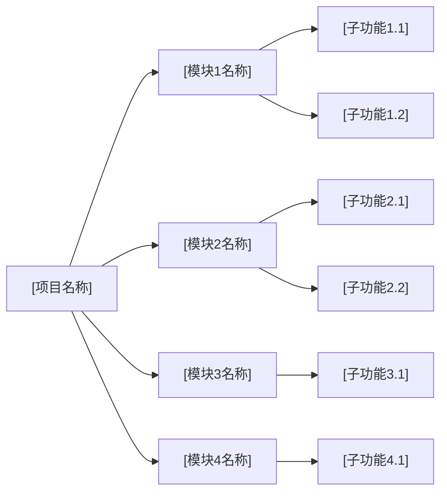
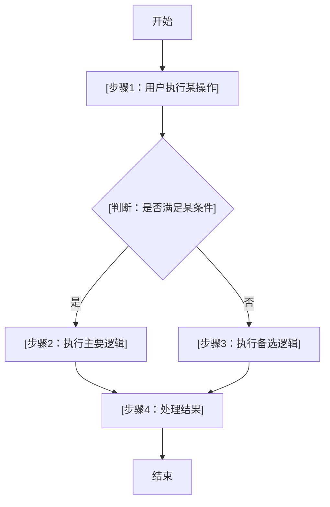
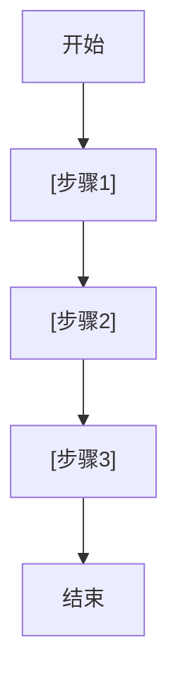
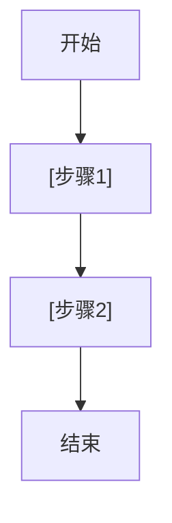

# 核心文档模板集

本文件包含 4 个核心知识库文档模板：概述.md、技术架构.md、功能清单.md、部署与运维.md。

---

# 模板一：概述.md

```markdown
# [项目名称] 概述

## 基本信息

| 属性 | 内容 |
|------|------|
| 产品名称 | [填写产品全称] |
| 产品版本 | [填写当前版本号] |
| 所属分类 | [数据治理 / 模型训练 / 知识库与知识治理 / 智能体] |
| 开发团队 | [填写负责团队名称] |
| 当前状态 | [已上线 / 试点中 / 研发中 / 规划中] |
| 首次上线日期 | [YYYY-MM-DD] |
| 最后更新日期 | [YYYY-MM-DD] |

## 产品定位

[用 2-3 段文字描述产品的核心定位。说明该产品在技术栈或业务体系中的角色和位置，解决什么层面的问题，与上下游系统的关系。]

**一句话定位：** [用一句话概括产品是什么]

## 目标客户

| 客户类型 | 描述 | 典型代表 |
|----------|------|----------|
| [客户类型1] | [该类型客户的主要特征和需求] | [列出 2-3 个典型客户名称，如不便透露可用代号] |
| [客户类型2] | [该类型客户的主要特征和需求] | [列出 2-3 个典型客户名称] |
| [客户类型3] | [该类型客户的主要特征和需求] | [列出 2-3 个典型客户名称] |

**客户画像：** [进一步描述最匹配的客户画像，包括行业、规模、技术能力等]

## 解决的痛点

| 编号 | 痛点描述 | 严重程度 | 当前解决方案及其不足 |
|------|----------|----------|----------------------|
| P1 | [痛点1：描述客户面临的核心问题] | 高/中/低 | [描述客户当前如何应对，以及为什么不够好] |
| P2 | [痛点2：描述客户面临的次要问题] | 高/中/低 | [同上] |
| P3 | [痛点3：描述客户面临的其他问题] | 高/中/低 | [同上] |

## 核心价值主张

### 主要价值

1. **[价值维度1]**：[详细描述该维度带来的核心价值，用数据或案例佐证]
2. **[价值维度2]**：[详细描述]
3. **[价值维度3]**：[详细描述]
4. **[价值维度4]**：[详细描述]

### 价值量化

| 价值维度 | 量化指标 | 典型数值 |
|----------|----------|----------|
| [维度1，如：效率提升] | [度量方式，如：处理时间缩短比例] | [如：60%] |
| [维度2，如：成本降低] | [度量方式] | [典型数值] |
| [维度3，如：准确率提升] | [度量方式] | [典型数值] |

## 竞品对比

| 对比维度 | 本产品 | 竞品A | 竞品B | 竞品C |
|----------|--------|-------|-------|-------|
| 核心能力 | [本产品核心能力概述] | [竞品A核心能力] | [竞品B核心能力] | [竞品C核心能力] |
| 技术路线 | [本产品技术路线] | [竞品A技术路线] | [竞品B技术路线] | [竞品C技术路线] |
| 部署方式 | [公有云/私有化/混合] | [部署方式] | [部署方式] | [部署方式] |
| 定价模式 | [定价方式] | [定价方式] | [定价方式] | [定价方式] |
| 目标市场 | [主要市场] | [主要市场] | [主要市场] | [主要市场] |
| 核心优势 | [列出 1-2 个核心优势] | [竞品优势] | [竞品优势] | [竞品优势] |
| 核心劣势 | [列出 1-2 个不足] | [竞品劣势] | [竞品劣势] | [竞品劣势] |

## 关键词

`[关键词1]` `[关键词2]` `[关键词3]` `[关键词4]` `[关键词5]`
```

---

# 模板二：技术架构.md

```markdown
# [项目名称] 技术架构

## 架构概述

[用 2-3 段文字描述系统整体架构设计思路。说明架构的核心设计原则（如高可用、可扩展、松耦合等），以及为什么选择这种架构模式。描述各层级之间的交互关系和数据流向。]

**架构风格：** [如：微服务架构 / 单体架构 / 事件驱动架构 / 分层架构 / Serverless 架构]

**核心设计原则：**
1. [原则1，如：服务解耦，各模块独立部署和扩展]
2. [原则2]
3. [原则3]

## 系统架构图

```mermaid
graph TB
    subgraph ["接入层"]
        A["[接入组件1，如：API Gateway]"]
        B["[接入组件2，如：负载均衡]"]
    end

    subgraph ["应用层"]
        C["[应用服务1]"]
        D["[应用服务2]"]
        E["[应用服务3]"]
    end

    subgraph ["数据层"]
        F["[数据存储1，如：PostgreSQL]"]
        G["[数据存储2，如：Redis]"]
        H["[数据存储3，如：Elasticsearch]"]
    end

    subgraph ["外部依赖"]
        I["[外部系统1]"]
        J["[外部系统2]"]
    end

    A --> C
    A --> D
    A --> E
    C --> F
    C --> G
    D --> F
    D --> H
    E --> G
    E --> H
    C --> I
    D --> J
```

> **说明：** 请根据实际系统架构调整上述 Mermaid 图。可使用以下语法：
> - `graph TB`（从上到下）/ `graph LR`（从左到右）
> - `subgraph` 用于分组
> - `-->` 表示数据流方向
> - 如需时序图可使用 `sequenceDiagram`

## 技术栈

### 后端技术

| 技术 | 版本 | 用途 | 选型理由 |
|------|------|------|----------|
| [如：Python] | [如：3.11] | [后端服务开发] | [为什么选择该技术] |
| [如：FastAPI] | [如：0.104] | [Web 框架] | [选型理由] |
| [如：Celery] | [如：5.3] | [异步任务队列] | [选型理由] |

### 前端技术

| 技术 | 版本 | 用途 | 选型理由 |
|------|------|------|----------|
| [如：React] | [如：18.2] | [前端框架] | [选型理由] |
| [如：Ant Design] | [如：5.x] | [UI 组件库] | [选型理由] |

### 基础设施

| 技术 | 版本 | 用途 | 选型理由 |
|------|------|------|----------|
| [如：Docker] | [如：24.x] | [容器化部署] | [选型理由] |
| [如：Kubernetes] | [如：1.28] | [容器编排] | [选型理由] |
| [如：Nginx] | [如：1.25] | [反向代理] | [选型理由] |

### 数据存储

| 技术 | 版本 | 用途 | 选型理由 |
|------|------|------|----------|
| [如：PostgreSQL] | [如：15] | [关系型数据库] | [选型理由] |
| [如：Redis] | [如：7.x] | [缓存 / 消息队列] | [选型理由] |

## 部署架构

```mermaid
graph TB
    subgraph ["生产环境"]
        subgraph ["可用区 A"]
            N1["[服务节点1]"]
            N2["[服务节点2]"]
        end
        subgraph ["可用区 B"]
            N3["[服务节点3]"]
            N4["[服务节点4]"]
        end
        LB["[负载均衡器]"]
        DB["[主数据库]"]
        DB_R["[只读副本]"]
        CACHE["[缓存集群]"]
    end

    USER["用户请求"] --> LB
    LB --> N1
    LB --> N2
    LB --> N3
    LB --> N4
    N1 --> DB
    N2 --> DB
    N3 --> DB_R
    N4 --> DB_R
    N1 --> CACHE
    N2 --> CACHE
    DB --> DB_R
```

> **说明：** 请根据实际部署架构调整。如果有多环境（开发/测试/生产），可以分别绘制。

## 外部依赖与集成

| 依赖项 | 类型 | 用途 | 接口方式 | 可用性要求 |
|--------|------|------|----------|------------|
| [如：大模型API] | [外部服务] | [文本生成] | [REST API] | [99.9%] |
| [如：企业SSO] | [认证服务] | [统一认证] | [SAML/OAuth2] | [99.9%] |
| [如：对象存储] | [基础设施] | [文件存储] | [S3 API] | [99.99%] |

## 架构设计亮点

### [亮点1标题]

[详细描述该架构设计亮点，包括：]
- **设计目标：** [要解决什么问题]
- **实现方式：** [如何实现的]
- **带来的好处：** [实际效果和收益]

### [亮点2标题]

[同上格式]

### [亮点3标题]

[同上格式]
```

---

# 模板三：功能清单.md

```markdown
# [项目名称] 功能清单

## 功能模块总览



> **说明：** 上图为功能模块的层级关系总览。根据实际功能模块数量调整节点和层级。

## 功能模块详情

---

### [模块1名称]

| 属性 | 内容 |
|------|------|
| 模块标识 | [如：M1] |
| 优先级 | P0（核心）/ P1（重要）/ P2（一般）/ P3（低） |
| 当前状态 | 已完成 / 开发中 / 规划中 |
| 模块描述 | [用 2-3 句话描述该模块的核心功能和价值] |

**功能点清单：**

| 编号 | 功能点 | 优先级 | 状态 | 描述 |
|------|--------|--------|------|------|
| M1-F1 | [功能点名称] | P0 | 已完成 | [详细描述该功能点的行为和作用] |
| M1-F2 | [功能点名称] | P1 | 已完成 | [详细描述] |
| M1-F3 | [功能点名称] | P1 | 开发中 | [详细描述] |
| M1-F4 | [功能点名称] | P2 | 规划中 | [详细描述] |

**核心流程：**



**依赖关系：**
- 上游依赖：[依赖的其他模块或外部系统]
- 下游影响：[依赖本模块的其他模块]

---

### [模块2名称]

| 属性 | 内容 |
|------|------|
| 模块标识 | [如：M2] |
| 优先级 | P0（核心）/ P1（重要）/ P2（一般）/ P3（低） |
| 当前状态 | 已完成 / 开发中 / 规划中 |
| 模块描述 | [用 2-3 句话描述该模块的核心功能和价值] |

**功能点清单：**

| 编号 | 功能点 | 优先级 | 状态 | 描述 |
|------|--------|--------|------|------|
| M2-F1 | [功能点名称] | P0 | 已完成 | [详细描述] |
| M2-F2 | [功能点名称] | P1 | 已完成 | [详细描述] |
| M2-F3 | [功能点名称] | P2 | 规划中 | [详细描述] |

**核心流程：**



**依赖关系：**
- 上游依赖：[依赖的其他模块或外部系统]
- 下游影响：[依赖本模块的其他模块]

---

### [模块3名称]

| 属性 | 内容 |
|------|------|
| 模块标识 | [如：M3] |
| 优先级 | P0（核心）/ P1（重要）/ P2（一般）/ P3（低） |
| 当前状态 | 已完成 / 开发中 / 规划中 |
| 模块描述 | [用 2-3 句话描述该模块的核心功能和价值] |

**功能点清单：**

| 编号 | 功能点 | 优先级 | 状态 | 描述 |
|------|--------|--------|------|------|
| M3-F1 | [功能点名称] | P0 | 已完成 | [详细描述] |
| M3-F2 | [功能点名称] | P1 | 已完成 | [详细描述] |

**核心流程：**



**依赖关系：**
- 上游依赖：[依赖的其他模块或外部系统]
- 下游影响：[依赖本模块的其他模块]

---

> **注意：** 根据实际模块数量继续添加。每个模块均应包含：模块属性表、功能点清单表、核心流程图（Mermaid flowchart）、依赖关系说明。
```

---

# 模板四：部署与运维.md

```markdown
# [项目名称] 部署与运维

## 部署方案

### Docker 部署（推荐）

```bash
# [步骤1：拉取镜像或构建]
docker pull [镜像地址] / docker build -t [镜像名:标签] .

# [步骤2：启动服务]
docker-compose up -d

# [步骤3：验证部署]
curl http://localhost:[端口号]/[健康检查路径]
```

**docker-compose.yml 关键配置说明：**

| 服务名 | 镜像 | 端口 | 依赖 | 说明 |
|--------|------|------|------|------|
| [服务1] | [镜像名:标签] | [宿主端口]:[容器端口] | [依赖的其他服务] | [简要说明] |
| [服务2] | [镜像名:标签] | [宿主端口]:[容器端口] | [依赖的其他服务] | [简要说明] |

### 手动部署

```bash
# [步骤1：环境准备]
# [如：安装 Python 3.11、Node.js 18 等]

# [步骤2：安装依赖]
pip install -r requirements.txt
# 或
npm install

# [步骤3：配置文件]
cp .env.example .env
# 编辑 .env 文件，填写实际配置

# [步骤4：数据库初始化]
python manage.py migrate
# 或
python scripts/init_db.py

# [步骤5：启动服务]
python main.py
# 或
npm run start
```

## 环境要求

| 环境 | 最低配置 | 推荐配置 | 说明 |
|------|----------|----------|------|
| CPU | [如：4 核] | [如：8 核] | [说明] |
| 内存 | [如：8 GB] | [如：16 GB] | [说明] |
| 磁盘 | [如：100 GB SSD] | [如：500 GB SSD] | [说明] |
| GPU | [如：无 / NVIDIA T4] | [如：NVIDIA A100] | [说明是否必须] |
| 操作系统 | [如：Ubuntu 20.04+] | [如：Ubuntu 22.04] | [支持的操作系统列表] |
| Python | [如：3.9+] | [如：3.11] | [运行时版本要求] |
| 网络 | [如：需要访问外网] | [如：内网部署+代理] | [网络访问要求] |

## 配置说明

| 配置项 | 环境变量 | 默认值 | 说明 |
|--------|----------|--------|------|
| [如：服务端口] | `SERVER_PORT` | `8080` | [配置项用途说明] |
| [如：数据库地址] | `DB_HOST` | `localhost` | [配置项用途说明] |
| [如：日志级别] | `LOG_LEVEL` | `INFO` | [可选值：DEBUG/INFO/WARN/ERROR] |
| [如：模型路径] | `MODEL_PATH` | `/models/` | [配置项用途说明] |
| [如：API密钥] | `API_KEY` | - | [必填/选填，敏感信息说明] |

## 监控与告警

### 监控指标

| 监控维度 | 指标名称 | 采集方式 | 告警阈值 | 告警级别 |
|----------|----------|----------|----------|----------|
| 系统资源 | CPU 使用率 | [如：Prometheus node_exporter] | > 80% | 警告 |
| 系统资源 | 内存使用率 | [如：Prometheus node_exporter] | > 85% | 严重 |
| 系统资源 | 磁盘使用率 | [如：Prometheus node_exporter] | > 90% | 严重 |
| 应用层 | 请求成功率 | [如：应用埋点] | < 99% | 警告 |
| 应用层 | 接口响应时间 P99 | [如：APM 探针] | > [如：2000ms] | 警告 |
| 应用层 | 错误日志数量 | [如：日志采集] | > [如：100/min] | 严重 |
| 业务层 | [业务指标1] | [如：自定义埋点] | [阈值] | [级别] |

### 监控工具

| 工具 | 用途 | 配置方式 |
|------|------|----------|
| [如：Prometheus + Grafana] | [指标采集与可视化] | [简要配置说明] |
| [如：ELK Stack] | [日志采集与分析] | [简要配置说明] |
| [如：AlertManager] | [告警分发] | [简要配置说明] |

## 扩展策略

### 水平扩展

| 组件 | 是否支持水平扩展 | 扩展方式 | 注意事项 |
|------|------------------|----------|----------|
| [如：API 服务] | 是 | [如：通过 K8s HPA 自动扩缩] | [如：需要无状态设计] |
| [如：Worker 服务] | 是 | [如：增加 Worker 实例数] | [如：需要消息队列支持] |
| [如：数据库] | 有限 | [如：读写分离 / 分库分表] | [如：需要考虑数据一致性] |

### 垂直扩展

| 场景 | 扩展方式 | 预期效果 |
|------|----------|----------|
| [如：计算密集型任务] | [如：增加 CPU / GPU 资源] | [如：训练速度提升 X 倍] |
| [如：高并发场景] | [如：增加内存、优化连接池] | [如：支持 QPS 从 X 提升到 Y] |

## 故障处理

### 常见故障与处理方案

| 故障场景 | 现象 | 可能原因 | 处理步骤 | 预防措施 |
|----------|------|----------|----------|----------|
| [如：服务启动失败] | [如：日志报端口占用] | [如：端口被其他进程占用] | [1. 检查端口占用<br>2. 杀死占用进程<br>3. 重启服务] | [如：使用 systemd 管理进程] |
| [如：数据库连接失败] | [如：大量超时错误] | [如：连接池耗尽 / 数据库宕机] | [1. 检查数据库状态<br>2. 检查连接池配置<br>3. 必要时重启] | [如：配置连接池监控告警] |
| [如：内存溢出 OOM] | [如：进程被系统杀死] | [如：内存泄漏 / 数据量过大] | [1. 分析 heap dump<br>2. 优化代码<br>3. 增加内存限制] | [如：配置 cgroup 限制] |
| [如：模型推理超时] | [如：API 响应时间过长] | [如：GPU 资源不足 / 请求批量过大] | [1. 检查 GPU 状态<br>2. 降低 batch size<br>3. 启用队列削峰] | [如：配置请求队列和限流] |
| [如：磁盘空间不足] | [如：写入失败] | [如：日志/数据文件堆积] | [1. 清理过期数据<br>2. 扩展磁盘<br>3. 配置自动清理] | [如：配置日志轮转和数据保留策略] |

### 应急联系

| 角色 | 负责人 | 联系方式 | 负责范围 |
|------|--------|----------|----------|
| [如：技术负责人] | [姓名] | [联系方式] | [如：架构决策、重大故障处理] |
| [如：运维负责人] | [姓名] | [联系方式] | [如：部署、监控、日常运维] |
```
