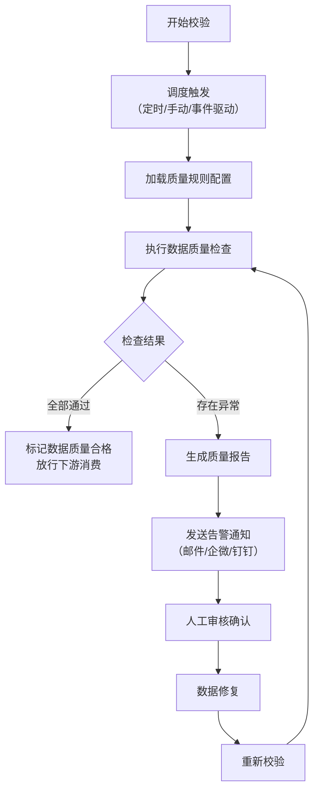
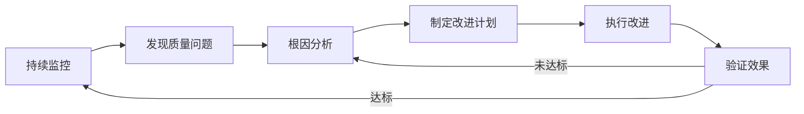

# 数据治理文档模板集

本文件包含 3 个数据治理类别的知识库文档模板：数据流.md、数据质量.md、应用成效.md。

---

# 模板一：数据流.md

```markdown
# [项目名称] 数据流

## 端到端数据流总览

```mermaid
flowchart LR
    subgraph ["数据源"]
        S1["[数据源1，如：业务数据库]"]
        S2["[数据源2，如：API 接口]"]
        S3["[数据源3，如：文件上传]"]
    end

    subgraph ["数据采集"]
        C1["[采集组件1，如：CDC 同步]"]
        C2["[采集组件2，如：API 拉取]"]
    end

    subgraph ["数据处理"]
        P1["[数据清洗]"]
        P2["[数据转换]"]
        P3["[数据标注]"]
        P4["[质量校验]"]
    end

    subgraph ["数据存储"]
        D1["[原始数据层 ODS]"]
        D2["[标准数据层 DWD]"]
        D3["[应用数据层 ADS]"]
    end

    subgraph ["数据消费"]
        E1["[下游系统1]"]
        E2["[下游系统2]"]
        E3["[分析报表]"]
    end

    S1 --> C1
    S2 --> C2
    S3 --> C2
    C1 --> P1
    C2 --> P1
    P1 --> P2
    P2 --> P3
    P3 --> P4
    P4 --> D1
    D1 --> D2
    D2 --> D3
    D3 --> E1
    D3 --> E2
    D3 --> E3
```

> **说明：** 请根据实际数据流调整上述 Mermaid 图。使用 `flowchart LR`（从左到右）或 `flowchart TB`（从上到下）展示数据的完整生命周期。

## 数据输入

| 数据源名称 | 数据类型 | 数据格式 | 更新频率 | 数据量级 | 接入方式 | 负责人 |
|------------|----------|----------|----------|----------|----------|--------|
| [如：客户管理系统] | [如：结构化数据] | [如：JSON / CSV / 数据库表] | [如：实时 / 每日 / 每周] | [如：日均 10 万条] | [如：CDC / API / 文件传输] | [姓名] |
| [如：设备传感器] | [如：时序数据] | [如：Protobuf] | [如：实时（秒级）] | [如：日均 100 万条] | [如：Kafka] | [姓名] |
| [如：外部采购数据] | [如：半结构化数据] | [如：Excel / XML] | [如：每月] | [如：每月 50 万条] | [如：SFTP 文件传输] | [姓名] |

## 数据处理流程

### 阶段一：数据采集

- **[采集方式1]**：[描述采集方式、采集工具、调度策略]
  - 采集工具：[如：Debezium / Airbyte / 自研采集服务]
  - 调度策略：[如：定时全量 + 实时增量]
  - 数据暂存：[如：Kafka 消息队列]
  - 容错机制：[如：断点续传、失败重试 3 次]

- **[采集方式2]**：[同上格式]

### 阶段二：数据清洗

- **缺失值处理**：[描述如何处理空值、缺失字段]
  - 策略：[如：删除 / 填充默认值 / 基于规则推断]
  - 规则说明：[具体规则]

- **重复数据去除**：[描述去重策略]
  - 去重维度：[如：基于主键 / 基于内容哈希]
  - 去重窗口：[如：最近 7 天内]

- **异常值处理**：[描述如何识别和处理异常数据]
  - 识别规则：[如：超出 3 倍标准差 / 业务规则判断]
  - 处理策略：[如：标记为异常 / 截断 / 修正]

- **格式标准化**：[描述数据格式的统一化处理]
  - 编码统一：[如：全部转为 UTF-8]
  - 时间格式：[如：ISO 8601]
  - 命名规范：[如：蛇形命名法]

### 阶段三：数据转换与标注

- **特征工程**：[描述从原始数据中提取特征的过程]
  - [特征1名称]：[提取方式描述]
  - [特征2名称]：[提取方式描述]

- **数据标注**：[描述标注流程（如适用）]
  - 标注方式：[如：人工标注 / 半自动标注 / 自动标注]
  - 标注规范：[标注标准和规则说明]
  - 标注质量抽检：[如：每批次抽检 10%]

### 阶段四：质量校验

- **校验规则执行**：[描述在数据入仓前执行的质量检查]
  - 完整性校验：[如：必填字段不得为空]
  - 一致性校验：[如：跨表关联字段必须存在]
  - 准确性校验：[如：数值范围检查]
  - 时效性校验：[如：数据延迟不得超过阈值]

- **不合格数据处理**：
  - 处理策略：[如：写入异常表 / 阻断流程 / 告警通知]
  - 回溯机制：[如：支持重新处理历史数据]

## 数据输出

| 输出名称 | 数据类型 | 输出格式 | 更新频率 | 消费方 | 接口方式 |
|----------|----------|----------|----------|--------|----------|
| [如：标准化客户画像] | [如：结构化数据] | [如：Parquet] | [如：T+1] | [如：推荐系统] | [如：Hive 表 / API] |
| [如：训练数据集] | [如：标注数据] | [如：JSONL] | [如：按需生成] | [如：模型训练管线] | [如：对象存储路径] |
| [如：质量报告] | [如：统计指标] | [如：JSON] | [如：每日] | [如：运维团队] | [如：API / 邮件] |

## 数据存储

| 存储层 | 存储系统 | 数据内容 | 保留策略 | 存储量估算 | 备份策略 |
|--------|----------|----------|----------|------------|----------|
| [如：原始层 ODS] | [如：HDFS / S3] | [原始采集数据，不做修改] | [如：保留 90 天] | [如：500 GB] | [如：每日增量备份] |
| [如：标准层 DWD] | [如：Hive / PostgreSQL] | [清洗后的标准化数据] | [如：保留 1 年] | [如：200 GB] | [如：每日全量备份] |
| [如：应用层 ADS] | [如：Elasticsearch] | [面向应用的处理结果] | [如：保留 3 年] | [如：100 GB] | [如：实时副本同步] |
| [如：元数据存储] | [如：MySQL] | [数据血缘、质量报告、标注元信息] | [如：永久保留] | [如：10 GB] | [如：主从复制] |

## 数据质量保障

### 质量检查点

| 检查点位置 | 检查内容 | 检查方式 | 频率 | 不合格处理 |
|------------|----------|----------|------|------------|
| [如：采集入库前] | [格式校验、必填字段检查] | [自动化规则引擎] | [每条数据] | [拒绝入库并告警] |
| [如：清洗后] | [完整性、一致性、唯一性] | [SQL 校验脚本] | [每批次] | [写入异常队列，人工审核] |
| [如：标注后] | [标注质量抽检] | [人工 + 自动交叉验证] | [每批次抽检 10%] | [不合格批次返工] |
| [如：输出前] | [输出格式、字段完整性] | [自动化测试] | [每次输出] | [阻断输出并告警] |

### 数据血缘追踪

- **血缘记录方式**：[如：Apache Atlas / 自研血缘系统 / 代码级血缘]
- **血缘覆盖范围**：[描述从哪些源头到哪些终点的血缘关系被记录]
- **血缘查询能力**：[描述支持的血缘查询场景，如：影响分析、溯源分析]
```

---

# 模板二：数据质量.md

```markdown
# [项目名称] 数据质量

## 质量规则定义

### 数据质量维度

| 质量维度 | 定义 | 适用数据范围 | 优先级 |
|----------|------|-------------|--------|
| **完整性** | [数据记录和字段是否完整，无缺失] | [如：所有核心业务表] | P0 |
| **准确性** | [数据值是否正确反映真实情况] | [如：金额、日期等关键字段] | P0 |
| **一致性** | [跨数据源、跨表的数据是否一致] | [如：关联表之间的外键引用] | P1 |
| **唯一性** | [数据记录是否存在重复] | [如：主键、业务唯一标识] | P0 |
| **时效性** | [数据是否在预期时间内更新] | [如：实时数据延迟不超过 5 分钟] | P1 |
| **规范性** | [数据格式是否符合预设标准] | [如：手机号、身份证号格式] | P1 |
| **合理性** | [数据值是否在合理的业务范围内] | [如：年龄在 0-150 之间] | P2 |

### 规则清单

| 规则编号 | 规则名称 | 质量维度 | 规则描述 | 涉及表/字段 | 严重级别 |
|----------|----------|----------|----------|-------------|----------|
| R001 | [如：客户姓名非空] | 完整性 | [如：customer_name 字段不得为 NULL 或空字符串] | [customer.name] | 致命 |
| R002 | [如：金额非负] | 合理性 | [如：amount 字段必须 >= 0] | [order.amount] | 致命 |
| R003 | [如：手机号格式] | 规范性 | [如：mobile 字段必须匹配 11 位手机号正则] | [customer.mobile] | 严重 |
| R004 | [如：订单时间有序] | 一致性 | [如：create_time 不得晚于 update_time] | [order.create_time, update_time] | 严重 |
| R005 | [如：客户唯一性] | 唯一性 | [如：customer_id 在主表中不得重复] | [customer.customer_id] | 致命 |

## 校验机制

### 校验执行方式

| 校验类型 | 执行时机 | 执行方式 | 工具/平台 | 耗时 |
|----------|----------|----------|-----------|------|
| **实时校验** | [如：数据写入时] | [如：数据库约束 / 应用层校验] | [如：业务应用 + DB 约束] | [如：< 10ms] |
| **批量校验** | [如：每日 T+1] | [如：SQL 脚本 / Spark 任务] | [如：Apache Griffin / 自研平台] | [如：30 分钟] |
| **抽样校验** | [如：标注数据抽检] | [如：人工审核 / 交叉验证] | [如：标注平台] | [如：人工 2 小时/批次] |

### 校验流程



### 校验覆盖率

| 数据域 | 总表数 | 已配置规则表数 | 规则覆盖率 | 核心表覆盖率 |
|--------|--------|----------------|------------|-------------|
| [如：客户域] | [如：15] | [如：12] | [如：80%] | [如：100%] |
| [如：交易域] | [如：20] | [如：18] | [如：90%] | [如：100%] |
| [如：产品域] | [如：10] | [如：7] | [如：70%] | [如：100%] |

## 异常检测

### 异常检测策略

| 检测方式 | 适用场景 | 检测逻辑 | 检测频率 | 响应方式 |
|----------|----------|----------|----------|----------|
| **规则引擎** | [已知的异常模式] | [基于预定义规则判断] | [实时 / 批量] | [自动阻断 / 告警] |
| **统计检测** | [数值型字段的异常] | [如：Z-score > 3 / IQR 方法] | [批量] | [标记 + 告警] |
| **趋势检测** | [数据量或质量的突变] | [如：同比/环比偏差超过阈值] | [每日] | [告警] |
| **模式检测** | [数据分布的异常变化] | [如：Kolmogorov-Smirnov 检验] | [每周] | [告警 + 人工审核] |

### 异常处理流程

| 异常级别 | 定义 | 响应时间 | 处理流程 | 负责人 |
|----------|------|----------|----------|--------|
| **P0-致命** | [如：核心数据大面积缺失或错误] | [如：30 分钟内] | [1. 阻断下游消费<br>2. 立即通知数据负责人<br>3. 启动数据修复流程] | [数据负责人] |
| **P1-严重** | [如：部分数据质量不合格] | [如：2 小时内] | [1. 发送告警<br>2. 评估影响范围<br>3. 安排修复] | [数据工程师] |
| **P2-一般** | [如：少量数据异常] | [如：24 小时内] | [1. 记录异常日志<br>2. 纳入修复计划] | [数据工程师] |

## 质量度量指标

### 质量看板指标

| 指标名称 | 计算公式 | 目标值 | 当前值 | 趋势 |
|----------|----------|--------|--------|------|
| **数据完整率** | [非空字段数 / 总字段数 * 100%] | [如：> 99.5%] | [如：99.8%] | [上升/稳定/下降] |
| **数据准确率** | [准确记录数 / 总记录数 * 100%] | [如：> 99%] | [如：99.2%] | [趋势] |
| **数据唯一率** | [去重后记录数 / 总记录数 * 100%] | [如：> 99.9%] | [如：99.95%] | [趋势] |
| **规则通过率** | [通过的规则数 / 总规则数 * 100%] | [如：> 98%] | [如：97.5%] | [趋势] |
| **异常修复率** | [已修复异常数 / 总异常数 * 100%] | [如：> 95%] | [如：96%] | [趋势] |
| **数据及时率** | [按时完成更新的数据源数 / 总数据源数 * 100%] | [如：> 99%] | [如：99.5%] | [趋势] |

### 历史趋势

[描述数据质量指标的历史变化趋势，包括关键改善节点和原因]

| 时间段 | 主要问题 | 改善措施 | 效果 |
|--------|----------|----------|------|
| [如：2025-Q1] | [如：客户数据重复率高] | [如：引入去重规则 + 源头治理] | [如：唯一率从 98% 提升到 99.9%] |
| [如：2025-Q2] | [如：标注质量不稳定] | [如：增加人工抽检比例 + 标注规范培训] | [如：准确率从 92% 提升到 96%] |

## 质量改进流程

### 持续改进机制



### 改进计划跟踪

| 改进项 | 发现日期 | 根因 | 改进方案 | 责任人 | 计划完成日期 | 当前状态 | 实际效果 |
|--------|----------|------|----------|--------|-------------|----------|----------|
| [如：客户手机号格式统一] | [YYYY-MM-DD] | [如：历史系统未做格式校验] | [如：添加格式规则 + 历史数据清洗] | [姓名] | [YYYY-MM-DD] | [进行中/已完成] | [如：格式合规率从 85% 提升到 99%] |
```

---

# 模板三：应用成效.md

```markdown
# [项目名称] 应用成效

## 应用案例

### 案例1：[客户/项目名称]

| 属性 | 内容 |
|------|------|
| 客户名称 | [如：XX 省 XX 公司] |
| 行业 | [如：金融 / 制造 / 政务] |
| 上线时间 | [YYYY-MM-DD] |
| 应用规模 | [如：覆盖 50 个业务部门，日处理数据 100 万条] |

**应用场景：**
[描述该客户的具体应用场景，包括业务背景、面临的问题、部署的方案]

**使用方式：**
[描述客户日常如何使用该系统/产品，主要使用哪些功能]

**解决的问题：**
1. [问题1：描述上线前客户面临的具体痛点]
2. [问题2]
3. [问题3]

**量化效果：**

| 效果维度 | 上线前 | 上线后 | 提升幅度 |
|----------|--------|--------|----------|
| [如：数据处理时间] | [如：8 小时/天] | [如：2 小时/天] | [如：缩短 75%] |
| [如：数据准确率] | [如：92%] | [如：99.5%] | [如：提升 7.5 个百分点] |
| [如：人力投入] | [如：5 人全职] | [如：1 人兼管] | [如：减少 80%] |
| [如：异常发现时效] | [如：T+3] | [如：实时] | [如：提前 3 天] |

**客户反馈：**
> "[引用客户的真实反馈评价]"

---

### 案例2：[客户/项目名称]

| 属性 | 内容 |
|------|------|
| 客户名称 | [如：XX 集团] |
| 行业 | [如：电信 / 医疗 / 教育] |
| 上线时间 | [YYYY-MM-DD] |
| 应用规模 | [如：覆盖全集团 200+ 子公司] |

**应用场景：**
[描述该客户的具体应用场景]

**使用方式：**
[描述客户日常如何使用]

**解决的问题：**
1. [问题1]
2. [问题2]

**量化效果：**

| 效果维度 | 上线前 | 上线后 | 提升幅度 |
|----------|--------|--------|----------|
| [如：数据治理覆盖率] | [如：40%] | [如：95%] | [如：提升 55 个百分点] |
| [如：合规风险事件] | [如：月均 15 起] | [如：月均 1 起] | [如：降低 93%] |

**客户反馈：**
> "[引用客户的真实反馈评价]"

---

### 案例3：[客户/项目名称]

[按案例1的格式继续添加，至少 2-3 个案例]

---

## 量化指标汇总

### 核心指标表现

| 指标类别 | 指标名称 | 定义 | 平均值 | 最佳值 | 行业基准 |
|----------|----------|------|--------|--------|----------|
| **效率类** | [如：数据处理速度] | [指标定义] | [如：提升 65%] | [如：提升 85%] | [如：30-50%] |
| **质量类** | [如：数据准确率] | [指标定义] | [如：99.2%] | [如：99.9%] | [如：95%] |
| **成本类** | [如：人力成本节省] | [指标定义] | [如：节省 60%] | [如：节省 80%] | [如：30-40%] |
| **业务类** | [如：业务决策效率] | [指标定义] | [如：提升 50%] | [如：提升 70%] | [如：20-30%] |

### 指标趋势

[描述关键指标随时间的变化趋势，可引用具体数据点]

## 客户反馈

### 综合满意度

| 评价维度 | 满意度评分（1-5） | 主要好评 | 主要改进建议 |
|----------|-------------------|----------|-------------|
| [如：功能完整性] | [如：4.5] | [好评摘要] | [改进建议] |
| [如：系统稳定性] | [如：4.8] | [好评摘要] | [改进建议] |
| [如：易用性] | [如：3.8] | [好评摘要] | [改进建议] |
| [如：技术支持] | [如：4.2] | [好评摘要] | [改进建议] |
| [如：数据质量] | [如：4.6] | [好评摘要] | [改进建议] |

### 典型客户评价

> **[客户A - XX公司 CTO]**
> "[引用具体评价内容]"

> **[客户B - XX集团 数据总监]**
> "[引用具体评价内容]"

## ROI 分析

### 投入成本

| 成本项 | 一次性投入 | 年度运营成本 | 说明 |
|--------|------------|-------------|------|
| [如：软件授权] | [如：50 万元] | [如：10 万元/年] | [如：按节点授权] |
| [如：硬件资源] | [如：30 万元] | [如：8 万元/年] | [如：服务器、存储] |
| [如：实施部署] | [如：20 万元] | - | [如：首次部署实施费] |
| [如：培训成本] | [如：5 万元] | [如：2 万元/年] | [如：使用培训] |
| **合计** | **[如：105 万元]** | **[如：20 万元/年]** | |

### 收益评估

| 收益项 | 年度收益 | 计算依据 |
|--------|----------|----------|
| [如：人力成本节省] | [如：80 万元/年] | [如：减少 4 名数据工程师，人均 20 万] |
| [如：数据驱动决策收益] | [如：50 万元/年] | [如：业务决策效率提升带来的间接收益] |
| [如：合规风险降低] | [如：30 万元/年] | [如：避免合规罚款和业务中断] |
| [如：数据资产增值] | [如：20 万元/年] | [如：高质量数据支撑新业务场景] |
| **合计** | **[如：180 万元/年]** | |

### ROI 结论

| 指标 | 数值 |
|------|------|
| 首年投入回报率 | [如：(180-20-105)/105 = 51%] |
| 投资回收期 | [如：约 9 个月] |
| 三年净收益 | [如：180*3 - 105 - 20*3 = 395 万元] |
| 三年 ROI | [如：376%] |

## 适用场景总结

| 场景类型 | 适用条件 | 预期效果 | 不适用情况 |
|----------|----------|----------|------------|
| [如：大规模数据集成] | [如：日数据量 > 100 万条，多源异构] | [如：效率提升 50%+，准确率 > 99%] | [如：单一数据源、数据量小] |
| [如：数据合规治理] | [如：受监管行业，需满足数据质量标准] | [如：合规通过率 > 99%] | [如：无合规要求的场景] |
| [如：数据资产建设] | [如：需要构建企业级数据中台] | [如：数据可用率 > 95%] | [如：仅需临时数据处理的场景] |
```
