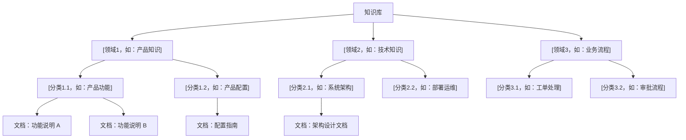
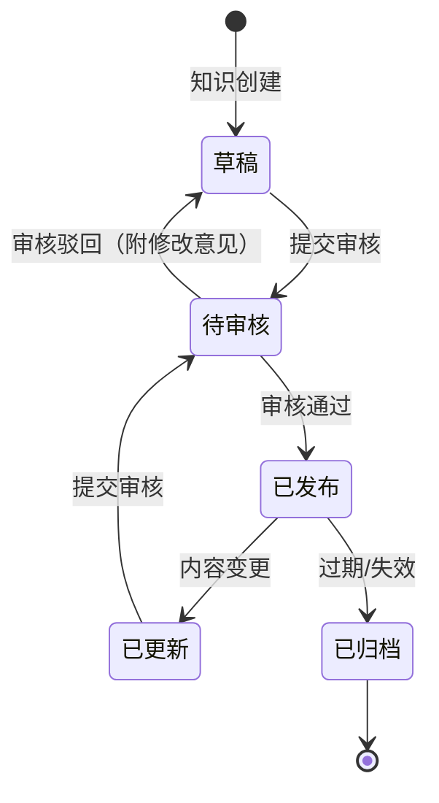
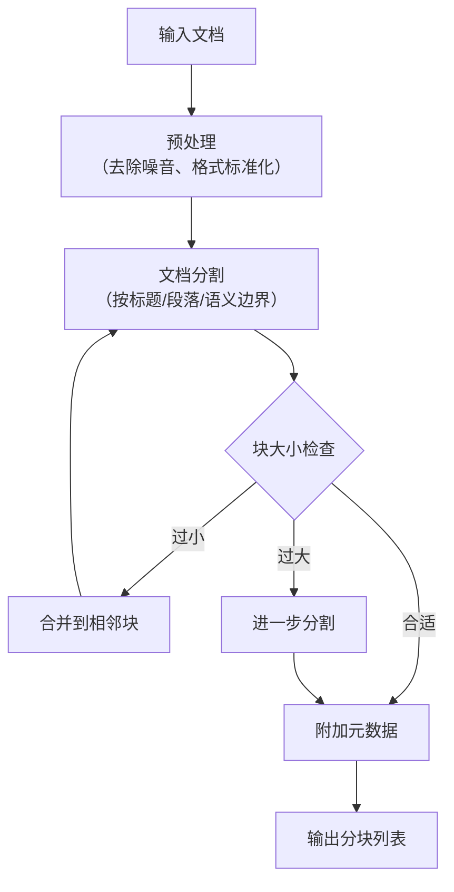
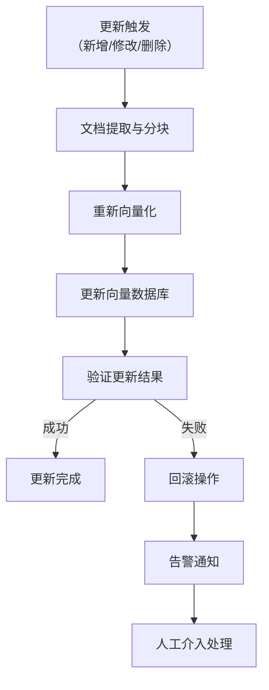

# 知识库与知识治理文档模板集

本文件包含 3 个知识库与知识治理类别的知识库文档模板：知识模型.md、检索与生成.md、应用成效.md。

---

# 模板一：知识模型.md

```markdown
# [项目名称] 知识模型

## 知识结构设计

### 设计概述

[用 2-3 段文字描述知识结构的整体设计思路。说明知识如何组织、分类和关联，以及为什么选择这种结构。描述知识模型在系统中的角色——是作为 RAG 系统的底层支撑，还是作为独立的知识管理平台。]

**知识建模方法：** [如：本体驱动 / 分类体系驱动 / 混合方法]

**核心设计原则：**
1. [原则1，如：面向检索优化——知识粒度与检索场景匹配]
2. [原则2，如：层次清晰——支持从宏观到微观的知识导航]
3. [原则3，如：可扩展——支持新增知识类型和关系]

### 知识层次结构



> **说明：** 请根据实际知识结构调整。如知识以图谱形式组织，可用 ER 图或图谱示意图替代。

## Schema 定义

### 核心实体类型

| 实体类型 | 说明 | 核心属性 | 属性类型 | 示例 |
|----------|------|----------|----------|------|
| [如：产品] | [如：公司销售的产品或服务] | [产品名称, 产品版本, 所属分类, 状态] | [String, String, Enum, Enum] | [如：智能客服系统 v2.0] |
| [如：功能模块] | [如：产品的功能模块] | [模块名称, 所属产品, 描述, 优先级] | [String, Ref, Text, Enum] | [如：意图识别模块] |
| [如：技术文档] | [如：技术相关文档] | [标题, 作者, 创建时间, 文档类型, 关联产品] | [String, String, DateTime, Enum, Ref] | [如：部署运维手册] |
| [如：业务流程] | [如：业务操作流程] | [流程名称, 步骤列表, 触发条件, 负责角色] | [String, List, Text, Ref] | [如：客户投诉处理流程] |
| [如：FAQ] | [如：常见问答对] | [问题, 答案, 分类, 关键词, 更新时间] | [Text, Text, Enum, List, DateTime] | [如：如何重置密码？] |

### 关系类型

| 关系名称 | 源实体 | 目标实体 | 关系类型 | 说明 |
|----------|--------|----------|----------|------|
| [如：包含] | [产品] | [功能模块] | [一对多] | [一个产品包含多个功能模块] |
| [如：关联文档] | [功能模块] | [技术文档] | [多对多] | [功能模块与相关文档的关联] |
| [如：依赖] | [功能模块] | [功能模块] | [多对多] | [模块之间的依赖关系] |
| [如：属于] | [FAQ] | [产品] | [多对一] | [FAQ 所属的产品] |
| [如：相关] | [技术文档] | [技术文档] | [多对多] | [文档之间的相关关系] |

### Schema 示例（JSON）

```json
{
  "entity_type": "产品",
  "properties": {
    "name": {"type": "string", "required": true, "description": "产品名称"},
    "version": {"type": "string", "description": "版本号"},
    "category": {"type": "enum", "values": ["智能体", "数据治理", "模型训练", "知识库"], "required": true},
    "status": {"type": "enum", "values": ["规划中", "研发中", "已上线", "已下线"]},
    "description": {"type": "text", "description": "产品描述"},
    "tags": {"type": "list<string>", "description": "标签"}
  },
  "relations": {
    "contains": {"target": "功能模块", "type": "one-to-many"},
    "has_documents": {"target": "技术文档", "type": "many-to-many"}
  }
}
```

## 知识组织方式

### 方案选择

| 组织方式 | 是否采用 | 说明 |
|----------|----------|------|
| **分类体系（Taxonomy）** | [是/否] | [如：采用三级分类体系，覆盖所有知识类型] |
| **标签体系（Tagging）** | [是/否] | [如：支持多标签，用于跨分类的知识关联] |
| **本体模型（Ontology）** | [是/否] | [如：定义核心概念和关系，支持语义推理] |
| **知识图谱（Knowledge Graph）** | [是/否] | [如：基于 Neo4j 构建实体关系图谱] |
| **向量索引（Vector Index）** | [是/否] | [如：基于 Embedding 的语义检索] |

### 分类体系详情（如采用）

```
知识库
├── [一级分类1，如：产品知识]
│   ├── [二级分类1.1，如：产品概述]
│   │   ├── [三级分类1.1.1，如：产品介绍]
│   │   └── [三级分类1.1.2，如：版本历史]
│   └── [二级分类1.2，如：产品功能]
│       ├── [三级分类1.2.1，如：核心功能]
│       └── [三级分类1.2.2，如：辅助功能]
├── [一级分类2，如：技术知识]
│   ├── [二级分类2.1，如：架构设计]
│   └── [二级分类2.2，如：开发指南]
└── [一级分类3，如：业务知识]
    ├── [二级分类3.1，如：业务流程]
    └── [二级分类3.2，如：政策法规]
```

### 知识图谱详情（如采用）

**图模型设计：**

| 节点类型 | 数量级 | 核心属性 |
|----------|--------|----------|
| [如：概念节点] | [如：500+] | [如：名称、定义、同义词] |
| [如：实体节点] | [如：10,000+] | [如：名称、类型、属性列表] |
| [如：文档节点] | [如：2,000+] | [如：标题、摘要、内容哈希] |

**图存储：** [如：Neo4j 5.x / NebulaGraph / JanusGraph]

**查询模式：**
- [如：基于关系的路径查询——"产品A 的所有依赖模块"]
- [如：基于属性的节点查询——"所有状态为已上线的文档"]
- [如：基于图算法的推荐——"与文档 X 最相关的 Top 5 文档"]

## 知识更新机制

### 更新策略

| 更新类型 | 触发方式 | 更新频率 | 负责人 | 审核流程 |
|----------|----------|----------|--------|----------|
| [如：新增知识] | [如：手动提交] | [按需] | [知识管理员] | [提交 → 审核 → 入库] |
| [如：知识修改] | [如：变更申请] | [按需] | [知识管理员] | [申请 → 评估 → 修改 → 审核] |
| [如：知识归档] | [如：定期巡检] | [如：每季度] | [知识管理员] | [自动检测过期内容 → 人工确认 → 归档] |
| [如：知识同步] | [如：自动化同步] | [如：每日] | [系统自动] | [从源系统拉取 → 格式化 → 入库] |

### 知识生命周期



### 知识采集渠道

| 渠道 | 采集方式 | 数据格式 | 更新频率 | 自动化程度 |
|------|----------|----------|----------|------------|
| [如：内部文档系统] | [如：API 同步] | [如：Markdown / Word] | [如：实时] | [全自动] |
| [如：Wiki/Confluence] | [如：定时爬取] | [如：HTML → Markdown] | [如：每日] | [全自动] |
| [如：人工提交] | [如：Web 表单] | [如：结构化表单] | [如：按需] | [半自动（人工填写）] |
| [如：会议纪要] | [如：NLP 自动提取] | [如：文本] | [如：每次会议后] | [半自动（人工确认）] |

## 知识版本管理

### 版本策略

| 策略项 | 配置 |
|--------|------|
| 版本号格式 | [如：v{major}.{minor}.{patch}] |
| 是否保留全量历史 | [是/否] |
| 历史版本保留期限 | [如：永久保留] |
| 版本回滚支持 | [是/否] |
| 版本对比功能 | [是/否，如支持 diff 展示] |

### 变更记录

| 版本 | 变更日期 | 变更类型 | 变更内容摘要 | 变更人 |
|------|----------|----------|-------------|--------|
| [如：v2.1.0] | [YYYY-MM-DD] | [如：新增] | [如：新增 XX 产品知识条目 50 条] | [姓名] |
| [如：v2.0.1] | [YYYY-MM-DD] | [如：修改] | [如：更新 XX 产品功能描述] | [姓名] |
| [如：v2.0.0] | [YYYY-MM-DD] | [如：重构] | [如：重构分类体系，新增标签系统] | [姓名] |
```

---

# 模板二：检索与生成.md

```markdown
# [项目名称] 检索与生成

## RAG 管线总览

```mermaid
flowchart LR
    subgraph ["文档处理"]
        DOC["原始文档"] --> CHUNK["文档分块"]
        CHUNK --> EMB["向量化 Embedding"]
        EMB --> STORE["存入向量数据库"]
    end

    subgraph ["检索阶段"]
        Q["用户查询"] --> Q_EMB["查询向量化"]
        Q_EMB --> RETRIEVE["多路检索"]
        RETRIEVE --> RERANK["重排序 Rerank"]
        RERANK --> CONTEXT["上下文组装"]
    end

    subgraph ["生成阶段"]
        CONTEXT --> PROMPT["Prompt 组装"]
        PROMPT --> LLM["大模型推理"]
        LLM --> ANSWER["生成回答"]
    end

    subgraph ["反馈优化"]
        ANSWER --> EVAL["质量评估"]
        EVAL -->|"低质量"| FEEDBACK["反馈到知识库优化"]
        EVAL -->|"高质量"| OUTPUT["输出给用户"]
    end

    STORE --> RETRIEVE
```

> **说明：** 请根据实际 RAG 架构调整。如包含多模态检索、Agent 增强 RAG 等，可扩展子图。

## 文档分块策略

### 分块配置

| 配置项 | 配置值 | 说明 |
|--------|--------|------|
| [如：分块方法] | [如：按段落 + 语义分割 / 固定长度滑动窗口 / 按标题层级] | [选择理由] |
| [如：块大小（Chunk Size）] | [如：512 tokens] | [每个块的最大 token 数] |
| [如：重叠长度（Overlap）] | [如：50 tokens] | [相邻块的重叠部分，保持上下文连贯] |
| [如：最小块大小] | [如：100 tokens] | [过小的块合并到相邻块] |
| [如：元数据保留] | [如：文档标题、章节标题、页码、来源 URL] | [每个块携带的元信息] |

### 分块处理流程



### 分块质量

| 质量指标 | 目标值 | 当前值 | 说明 |
|----------|--------|--------|------|
| [如：平均块大小] | [如：300-500 tokens] | [如：420 tokens] | [确保信息密度适中] |
| [如：语义完整性] | [如：> 90%] | [如：92%] | [块内容在语义上是否完整] |
| [如：元数据覆盖率] | [如：100%] | [如：100%] | [每个块是否都携带元数据] |

## 向量化方案

### Embedding 模型

| 配置项 | 配置值 |
|--------|--------|
| [如：Embedding 模型] | [如：bge-large-zh-v1.5 / text2vec-large-chinese] |
| [如：向量维度] | [如：1024] |
| [如：最大输入长度] | [如：512 tokens] |
| [如：推理方式] | [如：本地部署 / API 调用] |
| [如：推理硬件] | [如：单张 RTX 3090 / CPU] |
| [如：吞吐量] | [如：500 条/秒] |

### 向量数据库

| 配置项 | 配置值 |
|--------|--------|
| [如：向量数据库] | [如：Milvus 2.x / FAISS / ChromaDB / Weaviate] |
| [如：索引类型] | [如：IVF_FLAT / HNSW] |
| [如：距离度量] | [如：余弦相似度 / 内积 / L2 距离] |
| [如：向量总数] | [如：50 万+] |
| [如：索引构建时间] | [如：约 30 分钟] |
| [如：查询延迟 P99] | [如：< 50ms] |

### 查询向量化优化

| 优化策略 | 描述 | 效果 |
|----------|------|------|
| [如：查询扩展] | [如：使用 LLM 将用户查询扩展为多个相关查询] | [如：召回率提升 15%] |
| [如：查询改写] | [如：将口语化查询改写为规范表达] | [如：准确率提升 10%] |
| [如：HyDE] | [如：让 LLM 先生成假设性回答，用回答做检索] | [如：语义匹配度提升 12%] |

## 检索策略

### 多路检索

| 检索路径 | 检索方式 | 权重 | 用途 |
|----------|----------|------|------|
| [如：向量检索] | [如：ANN 近似最近邻] | [如：0.6] | [语义相似度匹配] |
| [如：关键词检索] | [如：BM25 / Elasticsearch] | [如：0.3] | [精确关键词匹配] |
| [如：知识图谱检索] | [如：图遍历 + 实体链接] | [如：0.1] | [结构化关系查询] |

### 检索参数

| 参数 | 配置值 | 说明 |
|------|--------|------|
| [如：Top-K（初始召回）] | [如：20] | [每路检索召回的候选数量] |
| [如：最终返回数] | [如：5] | [重排序后返回给 LLM 的文档数量] |
| [如：相似度阈值] | [如：0.7] | [低于阈值的文档不返回] |
| [如：元数据过滤] | [如：按产品/分类/时间范围过滤] | [缩小检索范围] |

### 重排序（Rerank）

| 配置项 | 配置值 |
|--------|--------|
| [如：Rerank 模型] | [如：bge-reranker-large / Cohere Rerank] |
| [如：Rerank 策略] | [如：Cross-Encoder 精排 / LLM 辅助排序] |
| [如：Rerank 延迟] | [如：100-200ms（5 个候选）] |
| [如：Rerank 效果] | [如：NDCG@5 从 0.72 提升到 0.85] |

## 生成策略

### Prompt 设计

**系统 Prompt 模板：**

```
你是一个专业的[角色，如：产品技术助手]。你的任务是根据提供的参考资料，准确回答用户的问题。

规则：
1. 仅基于提供的参考资料回答，不要编造信息
2. 如果参考资料不足以回答问题，请明确说明
3. 回答时引用参考资料的来源
4. 使用清晰、专业的语言
5. 如有多个相关信息，按重要程度排列

参考资料：
{context}

用户问题：{question}
```

**Prompt 变体：**

| 场景 | Prompt 调整 | 说明 |
|------|------------|------|
| [如：简洁回答] | [如：要求回答不超过 200 字] | [移动端或快速查询场景] |
| [如：详细解答] | [如：要求展开分析、给出步骤] | [复杂问题深度解答] |
| [如：对比分析] | [如：要求列出对比表格] | [产品/方案对比场景] |

### 大模型配置

| 配置项 | 配置值 |
|--------|--------|
| [如：基础模型] | [如：GLM-4 / Qwen2.5-72B / GPT-4o] |
| [如：Temperature] | [如：0.1（低温度，减少幻觉）] |
| [如：Max Tokens] | [如：2048] |
| [如：Top-P] | [如：0.9] |
| [如：调用方式] | [如：API 调用 / 本地部署] |

### 生成后处理

| 处理步骤 | 描述 | 工具/方法 |
|----------|------|-----------|
| [如：引用标注] | [在回答中标注信息来源] | [如：基于文档 ID 回溯] |
| [如：格式化] | [统一输出格式（Markdown/纯文本）] | [如：后处理脚本] |
| [如：安全过滤] | [检查输出内容是否合规] | [如：内容安全 API] |
| [如：质量打分] | [自动评估回答质量] | [如：LLM-as-Judge] |

## 质量评估

### 检索质量指标

| 指标 | 计算方式 | 目标值 | 当前值 |
|------|----------|--------|--------|
| [如：Recall@5] | [前 5 个结果中包含相关文档的比例] | [如：> 85%] | [如：88%] |
| [如：Recall@10] | [前 10 个结果中包含相关文档的比例] | [如：> 95%] | [如：96%] |
| [如：MRR] | [第一个相关文档排名的倒数均值] | [如：> 0.8] | [如：0.82] |
| [如：NDCG@5] | [归一化折损累计增益] | [如：> 0.8] | [如：0.85] |

### 生成质量指标

| 指标 | 评估方式 | 目标值 | 当前值 |
|------|----------|--------|--------|
| [如：忠实度（Faithfulness）] | [回答是否基于检索到的上下文] | [如：> 90%] | [如：92%] |
| [如：回答相关性] | [回答是否切题] | [如：> 90%] | [如：88%] |
| [如：完整性] | [回答是否完整覆盖问题] | [如：> 80%] | [如：83%] |
| [如：有害性] | [回答是否包含不当内容] | [如：< 1%] | [如：0.3%] |

### 评估数据集

| 数据集 | 来源 | 规模 | 用途 |
|--------|------|------|------|
| [如：内部问答测试集] | [如：人工构造] | [如：500 对] | [核心场景评估] |
| [如：用户真实查询采样] | [如：线上日志采样] | [如：200 对] | [真实场景评估] |

## 知识更新流程

### 更新流程



### 增量更新 vs 全量更新

| 更新方式 | 触发条件 | 耗时 | 频率 |
|----------|----------|------|------|
| [如：增量更新] | [如：单篇/少量文档变更] | [如：秒级] | [按需] |
| [如：全量重建] | [如：分块策略变更 / Embedding 模型更换] | [如：小时级] | [如：每月或模型升级时] |
```

---

# 模板三：应用成效.md

```markdown
# [项目名称] 应用成效

## 检索准确率

### 核心检索指标

| 指标 | 定义 | 目标值 | 实际值 | 趋势 |
|------|------|--------|--------|------|
| [如：Recall@5] | [Top-5 召回率] | [如：> 85%] | [如：88%] | [上升/稳定] |
| [如：Recall@10] | [Top-10 召回率] | [如：> 95%] | [如：96%] | [上升/稳定] |
| [如：MRR] | [平均倒数排名] | [如：> 0.8] | [如：0.82] | [上升/稳定] |
| [如：NDCG@5] | [归一化折损累计增益] | [如：> 0.8] | [如：0.85] | [上升/稳定] |
| [如：精确匹配率] | [Top-1 精确匹配比例] | [如：> 60%] | [如：65%] | [上升/稳定] |

### 分类别检索表现

| 知识类别 | Recall@5 | NDCG@5 | 文档数量 | 说明 |
|----------|----------|--------|----------|------|
| [如：产品功能] | [如：92%] | [如：0.88] | [如：1,200 条] | [结构化程度高，检索效果好] |
| [如：技术文档] | [如：85%] | [如：0.82] | [如：800 条] | [技术术语多，偶有歧义] |
| [如：业务流程] | [如：78%] | [如：0.75] | [如：500 条] | [流程描述较长，分块影响检索] |
| [如：FAQ] | [如：95%] | [如：0.92] | [如：3,000 条] | [问答对形式，检索效果最佳] |

### 检索优化历程

| 时间点 | 优化措施 | 效果 |
|--------|----------|------|
| [如：2025-Q1] | [如：引入 BM25 混合检索] | [如：Recall@5 从 75% 提升到 82%] |
| [如：2025-Q2] | [如：添加 Rerank 模型] | [如：NDCG@5 从 0.78 提升到 0.85] |
| [如：2025-Q3] | [如：优化分块策略（按语义边界）] | [如：各维度均提升 3-5 个百分点] |

## 知识覆盖率

### 覆盖率统计

| 知识域 | 总知识条目数 | 已入库条目数 | 覆盖率 | 知识时效（最新更新时间） |
|--------|-------------|-------------|--------|------------------------|
| [如：产品知识] | [如：2,000] | [如：1,850] | [如：92.5%] | [如：2025-06-10] |
| [如：技术知识] | [如：1,500] | [如：1,200] | [如：80%] | [如：2025-06-08] |
| [如：业务知识] | [如：1,000] | [如：900] | [如：90%] | [如：2025-06-12] |
| [如：合计] | [如：4,500] | [如：3,950] | [如：87.8%] | - |

### 覆盖缺口分析

| 缺口领域 | 缺口原因 | 影响评估 | 补全计划 |
|----------|----------|----------|----------|
| [如：XX产品新功能] | [如：产品刚发布，文档尚未同步] | [如：高——用户咨询量大] | [如：计划 2 周内补全] |
| [如：XX系统运维手册] | [如：文档分散在多个 Wiki，未统一采集] | [如：中——偶有用户咨询] | [如：已接入自动化同步，预计 1 个月内完成] |

### 知识时效性

| 指标 | 目标值 | 实际值 |
|------|--------|--------|
| [如：知识更新平均延迟] | [如：< 24 小时] | [如：18 小时] |
| [如：过期知识占比] | [如：< 5%] | [如：3.2%] |
| [如：知识定期审查覆盖率] | [如：> 90%] | [如：85%] |

## 用户满意度

### 整体满意度

| 评估维度 | 满意度评分（1-5） | 说明 |
|----------|-------------------|------|
| [如：回答准确性] | [如：4.3] | [回答是否正确、可靠] |
| [如：回答完整性] | [如：3.9] | [回答是否充分解决问题] |
| [如：响应速度] | [如：4.6] | [从提问到获得回答的时间] |
| [如：易用性] | [如：4.1] | [交互体验是否友好] |
| [如：整体满意度] | [如：4.2] | [综合评价] |

### 用户反馈分析

| 反馈类型 | 占比 | 典型反馈 | 改进方向 |
|----------|------|----------|----------|
| [如：正面反馈] | [如：65%] | [如："回答很准确，节省了大量查阅文档的时间"] | [持续优化] |
| [如：中性反馈] | [如：25%] | [如："有时回答不够详细，需要追问"] | [优化生成策略，增加细节] |
| [如：负面反馈] | [如：10%] | [如："部分新功能信息未覆盖"] | [加快知识更新频率] |

### 用户使用数据

| 指标 | 数值 | 说明 |
|------|------|------|
| [如：日活跃用户] | [如：200+] | [每日使用系统的独立用户数] |
| [如：日均查询量] | [如：1,500+] | [每日发起的知识查询次数] |
| [如：用户留存率（7日）] | [如：72%] | [一周后继续使用的用户比例] |
| [如：用户推荐率 NPS] | [如：45] | [净推荐值] |

## 典型应用案例

### 案例1：[客户/场景名称]

| 属性 | 内容 |
|------|------|
| 客户/场景 | [如：XX 公司内部知识助手] |
| 上线时间 | [YYYY-MM-DD] |
| 用户规模 | [如：500+ 名员工日常使用] |

**应用场景：**
[描述具体场景，如：员工在日常工作中遇到技术问题时，通过知识助手快速获取准确的技术文档和操作指南]

**使用方式：**
[描述用户如何使用，如：通过企业微信/飞书机器人发起提问，系统检索知识库并生成回答]

**关键效果：**
| 指标 | 效果 |
|------|------|
| [如：问题解决率] | [如：85% 的问题无需人工介入] |
| [如：平均响应时间] | [如：从原来的 30 分钟（人工查找）缩短到 5 秒] |
| [如：知识查找效率] | [如：提升 90%] |

**用户评价：**
> "[引用真实用户评价]"

### 案例2：[客户/场景名称]

[按案例1格式继续添加，至少 2-3 个案例]

---

## 效率提升量化

### 核心效率指标

| 效率维度 | 传统方式 | 知识库系统 | 提升幅度 | 计算方式 |
|----------|----------|------------|----------|----------|
| [如：信息查找时间] | [如：平均 30 分钟/次] | [如：平均 10 秒/次] | [如：缩短 99.4%] | [从发起查询到获得答案的时间] |
| [如：新人培训周期] | [如：3 个月] | [如：1.5 个月] | [如：缩短 50%] | [新人达到独立工作能力的时间] |
| [如：知识复用率] | [如：30%] | [如：75%] | [如：提升 45 个百分点] | [已有知识被成功检索和使用的比例] |
| [如：重复问题处理] | [如：人工逐个回答] | [如：自动化回答 85%] | [如：人工工作量减少 85%] | [高频重复问题的自动化处理比例] |

### ROI 分析

| 项目 | 金额/数值 | 说明 |
|------|-----------|------|
| 系统建设成本 | [如：80 万元] | [一次性投入] |
| 年度运营成本 | [如：15 万元/年] | [维护、更新、服务器] |
| 年度效率收益 | [如：120 万元/年] | [人力节省 + 业务效率提升折算] |
| 投资回收期 | [如：约 8 个月] | [建设成本 / 年净收益] |
| 三年 ROI | [如：350%] | [(3年收益 - 3年成本) / 3年成本] |

### 长期价值

1. **知识资产沉淀**：[如：企业知识不再依赖个人，形成可复用的数字资产]
2. **决策效率提升**：[如：基于准确知识做出更快、更好的业务决策]
3. **组织能力建设**：[如：降低对核心人员的依赖，新人快速上手]
4. **创新加速**：[如：已有知识的高效复用为创新提供基础]
```
