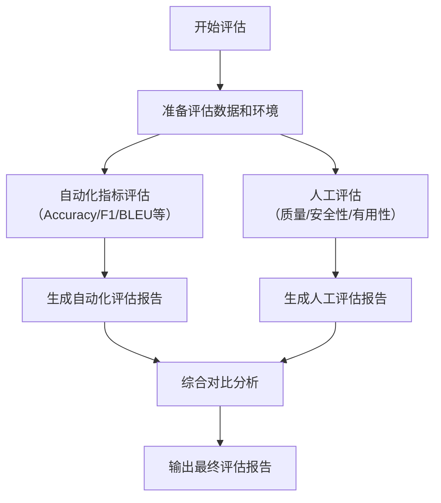

# 模型训练文档模板集

本文件包含 3 个模型训练类别的知识库文档模板：训练管线.md、模型评估.md、应用成效.md。

---

# 模板一：训练管线.md

```markdown
# [项目名称] 训练管线

## 训练流程总览

```mermaid
flowchart TB
    subgraph ["数据准备"]
        A1["原始数据收集"] --> A2["数据清洗"]
        A2 --> A3["数据标注"]
        A3 --> A4["数据集划分<br/>（训练/验证/测试）"]
    end

    subgraph ["数据预处理"]
        B1["Tokenization"] --> B2["向量化/编码"]
        B2 --> B3["数据增强<br/>（如有）"]
        B3 --> B4["Batch 构建"]
    end

    subgraph ["模型训练"]
        C1["超参数配置"] --> C2["模型初始化"]
        C2 --> C3["训练循环"]
        C3 --> C4["验证评估"]
        C4 -->|"未达标"| C3
        C4 -->|"达标"| C5["最优模型选择"]
    end

    subgraph ["导出与部署"]
        D1["模型导出"] --> D2["模型压缩/量化<br/>（如有）"]
        D2 --> D3["版本注册"]
        D3 --> D4["部署上线"]
    end

    A4 --> B1
    B4 --> C1
    C5 --> D1
```

> **说明：** 请根据实际训练流程调整上述 Mermaid 图。如包含 SFT、RLHF 等多阶段训练，可在模型训练子图中进一步展开。

## 数据准备阶段

### 原始数据

| 数据来源 | 数据类型 | 数据量 | 数据格式 | 收集方式 | 时间跨度 |
|----------|----------|--------|----------|----------|----------|
| [如：业务日志] | [如：文本对话] | [如：100 万条] | [如：JSONL] | [如：数据库导出] | [如：2024-01 至 2025-06] |
| [如：公开数据集] | [如：领域问答对] | [如：50 万条] | [如：JSON] | [如：开源获取] | [如：N/A] |
| [如：人工构造] | [如：指令-回答对] | [如：10 万条] | [如：CSV] | [如：人工编写 + 审核] | [如：2025-03 至 2025-06] |

### 数据清洗

- **去重策略**：[描述去重方法，如：基于 MinHash 的近似去重，相似度阈值 0.9]
- **过滤规则**：
  - [规则1：如：移除长度 < 10 字符的记录]
  - [规则2：如：移除包含特定噪声模式的记录]
  - [规则3：如：移除低质量标注（标注置信度 < 0.7）]
- **语言过滤**：[如：仅保留中文数据，使用 langdetect 过滤]
- **清洗前后对比**：

| 指标 | 清洗前 | 清洗后 | 过滤比例 |
|------|--------|--------|----------|
| [如：总记录数] | [如：160 万] | [如：120 万] | [如：25%] |
| [如：平均文本长度] | [如：85 字] | [如：120 字] | - |

### 数据标注

- **标注方式**：[如：人工标注 / 众包标注 / 半自动标注（模型预标注 + 人工审核）]
- **标注工具**：[如：Label Studio / 自研标注平台]
- **标注规范**：[描述标注标准和规范要点]
- **标注团队**：[如：内部团队 5 人 + 外部众包 20 人]
- **标注质量**：
  - 标注一致性（IAA）：[如：Cohen's Kappa = 0.85]
  - 抽检通过率：[如：96%]

### 数据集划分

| 数据集 | 用途 | 占比 | 数据量 | 划分策略 |
|--------|------|------|--------|----------|
| [如：训练集] | [模型训练] | [如：80%] | [如：96 万条] | [如：随机划分，按类别分层采样] |
| [如：验证集] | [超参调优、早停] | [如：10%] | [如：12 万条] | [如：同上] |
| [如：测试集] | [最终评估] | [如：10%] | [如：12 万条] | [如：时间后置划分，确保无数据泄露] |

## 预处理阶段

### Tokenization

| 配置项 | 配置值 | 说明 |
|--------|--------|------|
| [如：分词器] | [如：ChatGLM Tokenizer / BPE] | [选择理由] |
| [如：最大序列长度] | [如：2048 / 4096 / 8192] | [选择理由] |
| [如：特殊 Token] | [如：\<s\>, \</s\>, \<pad\>, \<unk\>] | [说明各特殊 token 用途] |

### 向量化/编码

- **文本编码方式**：[描述如何将文本转换为模型输入，如：Token ID + Position ID + Attention Mask]
- **特征提取**：[如有额外特征，描述特征提取方式]
- **数据增强**（如有）：
  - [增强方法1：如：同义词替换]
  - [增强方法2：如：回译增强]
  - 增强比例：[如：增强数据占总训练数据的 10%]

### Batch 构建

| 配置项 | 配置值 | 说明 |
|--------|--------|------|
| [如：Batch Size] | [如：32 / 64 / 128] | [受 GPU 显存限制] |
| [如：梯度累积步数] | [如：4] | [等效 Batch Size = 32 * 4 = 128] |
| [如：数据加载线程] | [如：8] | [并行数据加载] |
| [如：是否打乱] | [如：每个 epoch 打乱] | [避免训练顺序偏差] |

## 训练配置

### 超参数

| 超参数 | 值 | 说明 |
|--------|-----|------|
| **基础模型** | [如：ChatGLM3-6B / Qwen2-7B] | [预训练模型名称] |
| **训练方法** | [如：全参微调 / LoRA / P-Tuning v2] | [选择理由] |
| **学习率** | [如：2e-5 / 1e-4] | [调度策略：如 cosine decay with warmup] |
| **Warmup 步数** | [如：100 步] | [学习率预热] |
| **训练轮数** | [如：3 epochs] | [实际训练轮数] |
| **权重衰减** | [如：0.01] | [正则化] |
| **Dropout** | [如：0.1] | [防止过拟合] |
| **LoRA Rank** | [如：64] | [仅 LoRA 时适用] |
| **LoRA Alpha** | [如：128] | [仅 LoRA 时适用] |
| **LoRA Target** | [如：q_proj, v_proj, k_proj, o_proj] | [仅 LoRA 时适用] |
| **最大梯度范数** | [如：1.0] | [梯度裁剪，防止梯度爆炸] |
| **早停耐心值** | [如：3 epochs] | [验证集无改善时停止训练] |

### 训练环境

| 硬件/软件 | 配置 | 说明 |
|-----------|------|------|
| GPU | [如：NVIDIA A100 80GB x 4] | [多卡训练] |
| CPU | [如：AMD EPYC 7763 x 2] | [CPU 配置] |
| 内存 | [如：512 GB] | [系统内存] |
| 框架 | [如：PyTorch 2.1 + DeepSpeed] | [训练框架] |
| 分布式 | [如：DeepSpeed ZeRO-2 / FSDP] | [分布式训练策略] |

## 训练执行

### 训练过程

| 阶段 | 训练步数 | 训练时长 | Loss 变化 | 验证指标 |
|------|----------|----------|-----------|----------|
| [如：阶段1 - SFT] | [如：50,000 步] | [如：12 小时] | [如：2.5 → 0.3] | [如：Acc: 78% → 92%] |
| [如：阶段2 - RLHF<br/>（如有）] | [如：20,000 步] | [如：6 小时] | [如：Reward: 0.5 → 2.1] | [如：Win Rate: 55% → 72%] |

### 训练监控

- **Loss 曲线**：[描述训练 loss 和验证 loss 的变化趋势，是否出现欠拟合/过拟合]
- **学习率调度**：[描述学习率的变化过程]
- **GPU 利用率**：[如：平均 85%，峰值 95%]
- **吞吐量**：[如：约 1500 samples/s]

### Checkpoint 管理

| 策略 | 配置 | 说明 |
|------|------|------|
| 保存频率 | [如：每 1000 步] | [保存训练中间状态] |
| 保留数量 | [如：最近 3 个] | [自动清理旧 checkpoint] |
| 最佳模型 | [如：基于验证集最优指标保存] | [自动覆盖] |
| 存储位置 | [如：/checkpoints/project_name/] | [checkpoint 存储路径] |

## 评估与导出

### 训练后评估

| 评估维度 | 评估方法 | 训练前 | 训练后 | 提升 |
|----------|----------|--------|--------|------|
| [如：任务准确率] | [如：标准测试集评估] | [如：72%] | [如：94%] | [如：+22 个百分点] |
| [如：生成质量] | [如：人工评分（1-5）] | [如：3.2] | [如：4.5] | [如：+1.3] |
| [如：推理延迟] | [如：单条推理耗时] | [如：200ms] | [如：200ms] | [如：无变化] |

### 模型导出

| 导出格式 | 用途 | 大小 | 说明 |
|----------|------|------|------|
| [如：PyTorch .bin] | [研究/二次训练] | [如：12 GB] | [完整模型权重] |
| [如：GGUF Q4] | [CPU 推理] | [如：4 GB] | [4-bit 量化] |
| [如：ONNX] | [跨平台推理] | [如：12 GB] | [ONIR Runtime 部署] |
| [如：vLLM 格式] | [高性能推理] | [如：12 GB] | [vLLM 推理引擎] |

## 版本管理

### 模型版本历史

| 版本号 | 训练日期 | 数据版本 | 训练方法 | 主要变更 | 评估指标 | 状态 |
|--------|----------|----------|----------|----------|----------|------|
| [如：v1.0.0] | [2025-01-15] | [data_v1] | [如：LoRA r=16] | [初始版本] | [如：Acc 85%] | [已废弃] |
| [如：v1.1.0] | [2025-03-20] | [data_v2] | [如：LoRA r=64] | [扩大训练数据，提升 LoRA rank] | [如：Acc 92%] | [已废弃] |
| [如：v2.0.0] | [2025-06-10] | [data_v3] | [如：全参微调] | [新增任务数据，全参训练] | [如：Acc 94%] | [当前生产] |
| [如：v2.1.0] | [规划中] | [data_v4] | [待定] | [计划增加 XX 数据] | - | [规划中] |

### 模型仓库

- **模型存储位置**：[如：HuggingFace Hub / 内部模型仓库 / MinIO]
- **元数据管理**：[如：MLflow / 自研模型管理平台]
- **访问权限**：[如：团队内部可见，上线需审批]
```

---

# 模板二：模型评估.md

```markdown
# [项目名称] 模型评估

## 评估指标体系

### 核心评估指标

| 指标类别 | 指标名称 | 计算方式 | 适用任务 | 目标值 |
|----------|----------|----------|----------|--------|
| **准确性** | [如：准确率 Accuracy] | [正确预测数 / 总数] | [分类任务] | [如：> 90%] |
| **准确性** | [如：BLEU-4] | [n-gram 匹配度] | [文本生成] | [如：> 30] |
| **准确性** | [如：ROUGE-L] | [最长公共子序列] | [文本摘要] | [如：> 50] |
| **准确性** | [如：F1-Score] | [精确率和召回率的调和平均] | [实体识别/分类] | [如：> 85%] |
| **实用性** | [如：胜率 Win Rate] | [人工对比中优于基线的比例] | [对话/生成] | [如：> 70%] |
| **实用性** | [如：有用性评分] | [人工评分 1-5 分] | [通用] | [如：> 4.0] |
| **安全性** | [如：安全合规率] | [安全回答数 / 总数] | [对话] | [如：> 99%] |
| **效率** | [如：推理延迟 P99] | [99% 请求的响应时间] | [在线推理] | [如：< 2s] |
| **效率** | [如：吞吐量 QPS] | [每秒处理请求数] | [在线推理] | [如：> 50] |

### 任务特定指标

| 任务类型 | 特定指标 | 说明 |
|----------|----------|------|
| [如：意图识别] | [如：Precision / Recall / F1 per class] | [按类别分别统计] |
| [如：知识问答] | [如：EM（精确匹配）/ F1（宽松匹配）] | [答案匹配度] |
| [如：文本分类] | [如：Macro-F1 / Micro-F1] | [处理类别不平衡] |
| [如：内容生成] | [如：人工评分 + 自动指标（如 perplexity）] | [综合评估生成质量] |

## 基准测试方法

### 测试数据集

| 数据集名称 | 数据来源 | 数据量 | 数据分布 | 用途 |
|------------|----------|--------|----------|------|
| [如：内部测试集] | [如：生产环境采样] | [如：5,000 条] | [覆盖各业务场景] | [主要评估依据] |
| [如：公开基准] | [如：C-Eval / CMMLU] | [如：10,000 条] | [通用能力评估] | [横向对比] |
| [如：对抗测试集] | [如：红队构造] | [如：1,000 条] | [边界和异常场景] | [安全性评估] |

### 评估流程



### 评估环境

| 配置项 | 配置值 | 说明 |
|--------|--------|------|
| [如：推理硬件] | [如：NVIDIA A100 80GB x 1] | [与生产环境一致] |
| [如：推理框架] | [如：vLLM 0.4.x] | [推理引擎版本] |
| [如：量化方式] | [如：FP16 / INT8] | [与生产部署一致] |
| [如：并发数] | [如：1（单线程评估）] | [排除并发影响] |

## 模型对比

### 版本间对比

| 评估指标 | v1.0.0 | v1.1.0 | v2.0.0（当前） | 基线模型（如：原始预训练模型） |
|----------|--------|--------|-----------------|------------------------------|
| [如：任务准确率] | [如：85%] | [如：92%] | [如：94%] | [如：72%] |
| [如：BLEU-4] | [如：25] | [如：30] | [如：33] | [如：18] |
| [如：人工评分] | [如：3.5] | [如：4.2] | [如：4.5] | [如：3.0] |
| [如：安全合规率] | [如：97%] | [如：98.5%] | [如：99.2%] | [如：95%] |
| [如：推理延迟 P99] | [如：180ms] | [如：185ms] | [如：200ms] | [如：150ms] |
| [如：模型大小] | [如：6.2 GB] | [如：6.5 GB] | [如：12 GB] | [如：12 GB] |

### 与竞品/开源模型对比

| 评估维度 | 本模型 | [竞品/开源模型 A] | [竞品/开源模型 B] |
|----------|--------|-------------------|-------------------|
| [如：领域任务准确率] | [如：94%] | [如：88%] | [如：91%] |
| [如：通用能力（C-Eval）] | [如：72%] | [如：78%] | [如：75%] |
| [如：推理速度] | [如：200ms] | [如：150ms] | [如：300ms] |
| [如：部署成本] | [如：1 张 A100] | [如：1 张 A100] | [如：2 张 A100] |
| [如：数据安全] | [如：完全私有化] | [如：API 调用] | [如：完全私有化] |

## A/B 测试方案

### 测试设计

| 项目 | 配置 |
|------|------|
| 测试目标 | [如：验证 v2.0.0 是否显著优于 v1.1.0] |
| 对照组 | [如：v1.1.0 模型] |
| 实验组 | [如：v2.0.0 模型] |
| 流量分配 | [如：50% vs 50%] |
| 测试周期 | [如：2 周] |
| 样本量要求 | [如：每组至少 10,000 次请求] |
| 显著性水平 | [如：p < 0.05] |

### 评估指标

| 指标 | 对照组预估值 | 实验组预估值 | 最小可检测效应 |
|------|-------------|-------------|----------------|
| [如：任务完成率] | [如：85%] | [如：90%] | [如：3%] |
| [如：用户满意度] | [如：3.8/5] | [如：4.2/5] | [如：0.2] |
| [如：退出率] | [如：15%] | [如：10%] | [如：2%] |

### 测试结果

[填写实际 A/B 测试结果]

| 指标 | 对照组结果 | 实验组结果 | 提升幅度 | p 值 | 是否显著 |
|------|-----------|-----------|----------|------|----------|
| [如：任务完成率] | [如：85.2%] | [如：89.7%] | [如：+4.5%] | [如：0.003] | [是] |
| [如：用户满意度] | [如：3.8] | [如：4.1] | [如：+0.3] | [如：0.01] | [是] |

## 评估自动化

### 自动化评估流水线

| 组件 | 工具/框架 | 说明 |
|------|-----------|------|
| [如：指标计算] | [如：自研评估脚本 / lm-eval-harness] | [自动化计算各类指标] |
| [如：报告生成] | [如：Jinja 模板 + Markdown] | [自动生成评估报告] |
| [如：回归检测] | [如：CI/CD Pipeline 集成] | [每次模型更新自动评估] |
| [如：结果存储] | [如：MLflow Tracking] | [评估结果版本化管理] |

### 触发条件

| 触发场景 | 评估范围 | 是否阻断上线 |
|----------|----------|-------------|
| [如：模型训练完成] | [全量评估] | [是，核心指标不达标则不上线] |
| [如：代码合并] | [回归测试（核心指标子集）] | [是] |
| [如：定期巡检] | [全量评估] | [否，仅监控] |

## 评估报告模板

### 报告结构

```
模型评估报告
============

1. 评估概要
   - 模型版本、评估日期、评估人
   - 核心结论（1-2 句话）

2. 评估环境
   - 硬件配置、软件版本
   - 数据集说明

3. 自动化指标结果
   - 各指标数值及与上一版本的对比
   - 按任务/类别的详细分解

4. 人工评估结果
   - 评分分布、典型案例
   - 质量分析（好/中/差案例各举 2-3 个）

5. 安全性评估
   - 对抗测试结果
   - 合规性检查结果

6. 效率评估
   - 推理延迟、吞吐量
   - 资源消耗

7. 综合结论
   - 是否推荐上线
   - 已知风险和限制
   - 改进建议
```
```

---

# 模板三：应用成效.md

```markdown
# [项目名称] 应用成效

## 训练效果量化

### 训练前后对比

| 评估维度 | 基线（训练前） | 微调后（当前） | 提升幅度 | 说明 |
|----------|---------------|----------------|----------|------|
| [如：核心任务准确率] | [如：72%] | [如：94%] | [如：+22 个百分点] | [如：在内部测试集上评估] |
| [如：领域知识问答 F1] | [如：65%] | [如：88%] | [如：+23 个百分点] | [如：领域专业问答] |
| [如：生成内容有用性] | [如：3.0/5] | [如：4.5/5] | [如：+50%] | [如：人工评分] |
| [如：指令遵循率] | [如：60%] | [如：92%] | [如：+32 个百分点] | [如：按指令格式输出] |
| [如：幻觉率] | [如：35%] | [如：8%] | [如：降低 27 个百分点] | [如：生成内容中的事实错误比例] |
| [如：推理延迟] | [如：150ms] | [如：200ms] | [如：增加 33%] | [如：因模型能力增强略有增加] |

### 各细分任务表现

| 任务类型 | 基线表现 | 微调后表现 | 提升说明 |
|----------|----------|------------|----------|
| [如：意图识别] | [如：F1=78%] | [如：F1=93%] | [如：新增行业特定意图训练数据] |
| [如：知识问答] | [如：EM=55%] | [如：EM=82%] | [如：注入领域知识库训练数据] |
| [如：文本摘要] | [如：ROUGE-L=42] | [如：ROUGE-L=58] | [如：优化摘要格式训练] |
| [如：多轮对话] | [如：评分 2.8/5] | [如：评分 4.2/5] | [如：增加多轮对话训练数据] |

## 模型上线指标

### 生产环境表现

| 指标 | 目标值 | 实际值 | 是否达标 |
|------|--------|--------|----------|
| [如：服务可用性] | [如：99.9%] | [如：99.95%] | [达标] |
| [如：推理延迟 P50] | [如：< 500ms] | [如：320ms] | [达标] |
| [如：推理延迟 P99] | [如：< 2000ms] | [如：1500ms] | [达标] |
| [如：吞吐量] | [如：> 30 QPS] | [如：45 QPS] | [达标] |
| [如：GPU 显存占用] | [如：< 40GB] | [如：35GB] | [达标] |
| [如：请求成功率] | [如：> 99.5%] | [如：99.8%] | [达标] |

### 线上质量监控

| 监控指标 | 监控方式 | 告警阈值 | 当前状态 |
|----------|----------|----------|----------|
| [如：输出质量评分] | [如：自动评分 + 采样人工审核] | [如：日均评分 < 3.5] | [正常（4.2）] |
| [如：幻觉率] | [如：自动检测（与知识库对比）] | [如：> 15%] | [正常（8%）] |
| [如：安全拦截率] | [如：内容安全过滤器] | [如：> 5%] | [正常（2%）] |
| [如：用户负面反馈率] | [如：用户反馈统计] | [如：> 10%] | [正常（5%）] |

## 业务影响

### 直接业务指标

| 业务指标 | 上线前 | 上线后 | 变化 | 计算方式 |
|----------|--------|--------|------|----------|
| [如：客户问题解决率] | [如：65%] | [如：88%] | [如：+23 个百分点] | [如：一次性解决率统计] |
| [如：人工坐席转接率] | [如：40%] | [如：18%] | [如：降低 22 个百分点] | [如：转人工比例] |
| [如：平均响应时间] | [如：3 分钟] | [如：30 秒] | [如：缩短 83%] | [如：从用户提问到收到回答的时间] |
| [如：用户满意度] | [如：3.5/5] | [如：4.3/5] | [如：+0.8] | [如：用户评分] |

### 间接业务价值

| 价值维度 | 量化方式 | 估算价值 |
|----------|----------|----------|
| [如：人力成本节省] | [如：减少 XX 名客服人员的工作量] | [如：每年节省 XX 万元] |
| [如：业务效率提升] | [如：问题解决速度提升带来的业务流转加速] | [如：间接增收 XX 万元] |
| [如：知识沉淀价值] | [如：模型内化的领域知识形成企业资产] | [如：难以量化，但战略价值显著] |

## 迭代历史

### 版本迭代记录

| 版本 | 发布日期 | 核心改进 | 训练数据变化 | 效果变化 | 关键决策 |
|------|----------|----------|-------------|----------|----------|
| [如：v1.0] | [2025-01] | [如：基础能力建设] | [如：1 万条通用指令数据] | [如：基础可用，准确率 85%] | [如：选择 LoRA 降低训练成本] |
| [如：v1.1] | [2025-03] | [如：领域知识增强] | [如：新增 5 万条领域问答数据] | [如：领域问答 F1 提升到 88%] | [如：增加高质量领域数据] |
| [如：v2.0] | [2025-06] | [如：全量微调 + 多任务] | [如：数据量增至 20 万条，覆盖 5 个子任务] | [如：综合准确率 94%] | [如：从 LoRA 切换为全参微调] |

### 关键经验总结

1. **[经验1标题]**：[如：高质量标注数据比数量更重要]
   - 详情：[描述具体经验教训]
   - 数据佐证：[如：使用 1 万条高质量数据比 5 万条普通数据效果更好]

2. **[经验2标题]**：[如：训练数据分布需与生产分布一致]
   - 详情：[描述]
   - 数据佐证：[具体数据]

3. **[经验3标题]**：[如：定期更新训练数据以应对业务变化]
   - 详情：[描述]
   - 数据佐证：[具体数据]

## 典型案例

### 案例1：[客户/场景名称]

| 属性 | 内容 |
|------|------|
| 客户/场景 | [如：XX 公司智能客服] |
| 上线时间 | [YYYY-MM-DD] |
| 应用方式 | [如：作为客服系统的智能回答引擎] |

**场景描述：**
[描述具体应用场景和业务背景]

**使用效果：**
| 指标 | 效果 |
|------|------|
| [如：日均处理量] | [如：从 500 次人工处理提升到 3000 次自动处理] |
| [如：问题解决率] | [如：85%（无需转人工）] |
| [如：客户满意度] | [如：4.3/5] |

**客户评价：**
> "[引用客户真实反馈]"

### 案例2：[客户/场景名称]

[按案例1格式继续添加]
```
