# Mermaid 图表编写指南

本指南为知识库文档中各类 Mermaid 图表提供模板、规范与示例。

---

## 一、系统架构图

### 1.1 模板模式

使用 `graph TB`（从上到下）方向，按层次组织节点。

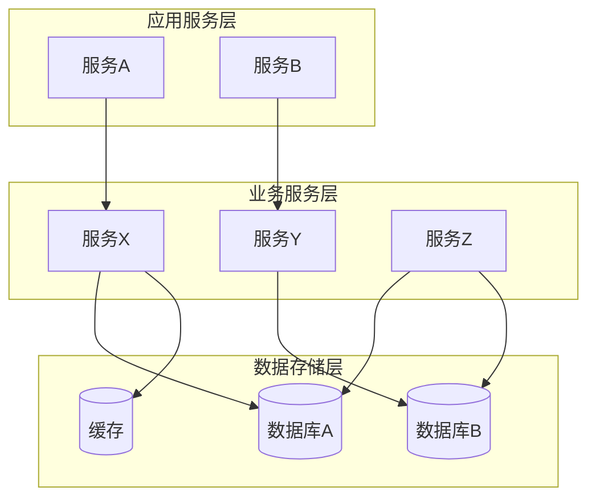

### 1.2 常见布局模式

**三层架构：**

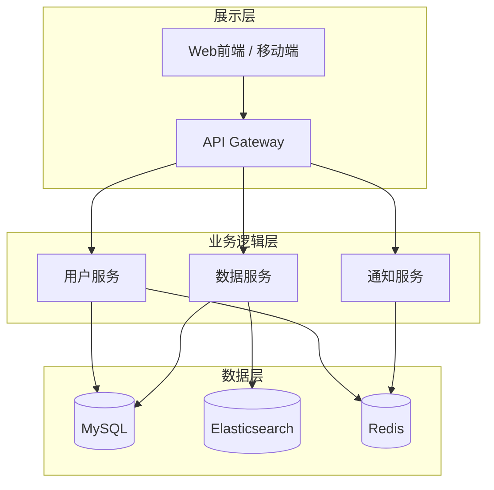

**四层架构：**

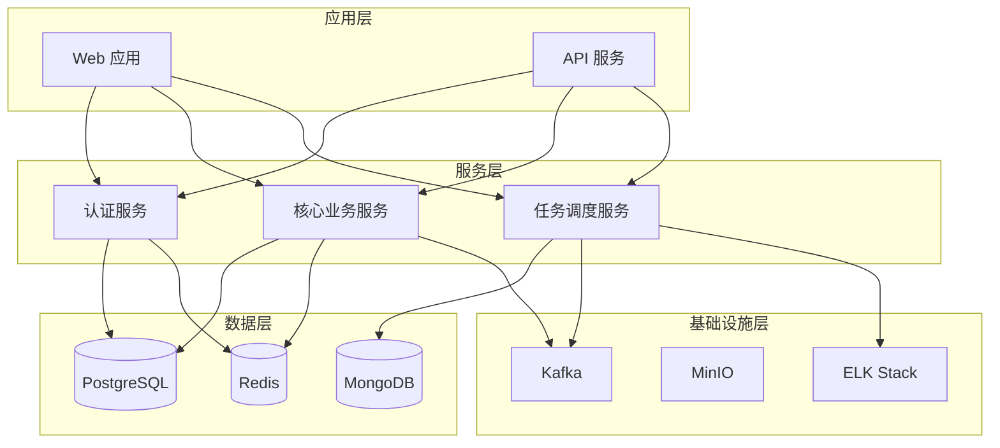

**微服务架构：**

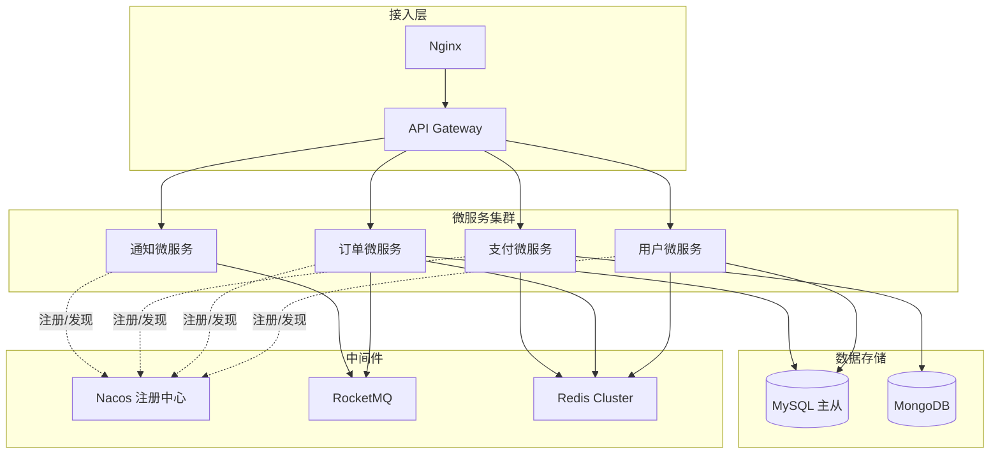

### 1.3 节点样式规范

| 节点类型 | 语法 | 用途 |
|---------|------|------|
| 矩形 | `[名称]` | 服务、组件、模块 |
| 圆角矩形 | `(名称)` | 实体、通用组件 |
| 数据库 | `[(名称)]` | 数据库、数据存储 |
| 圆柱体 | `[(名称)]` | 数据库（与圆角矩形同语法，Mermaid 无原生圆柱体） |
| 菱形 | `{名称}` | 决策点、判断节点 |
| 平行四边形 | `[/名称/]` | 输入/输出 |
| 双圆 | `(((名称)))` | 外部系统 |
| 虚线连接 | `-.-` | 可选依赖、异步通信 |
| 粗线连接 | `===` | 核心数据流、主链路 |

**连接线标注：**

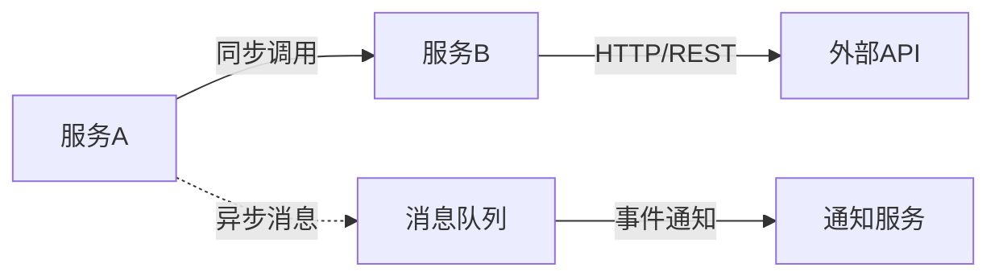

### 1.4 示例：典型数据平台架构

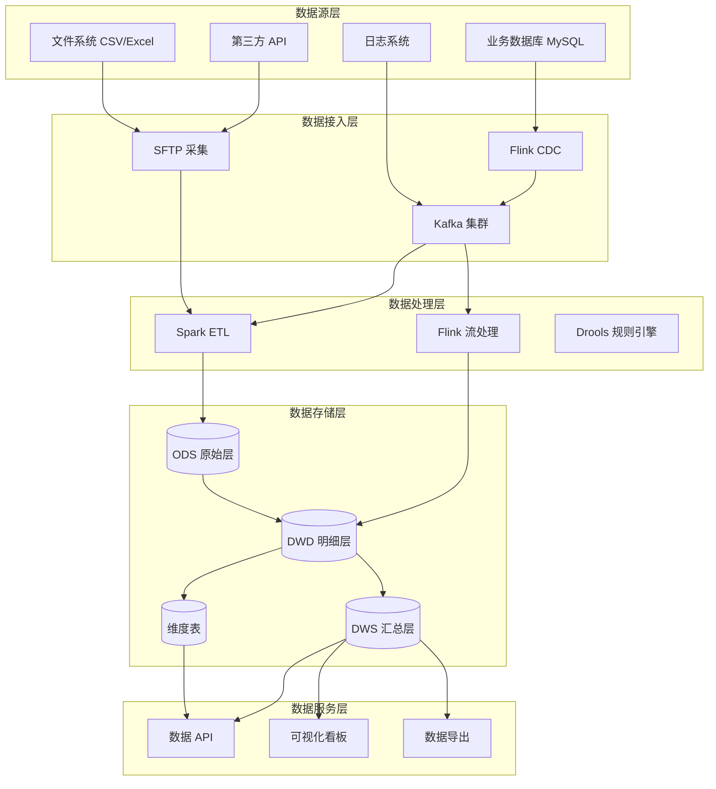

---

## 二、数据流图

### 2.1 模板模式

使用 `flowchart LR`（从左到右）方向，按数据处理阶段组织。

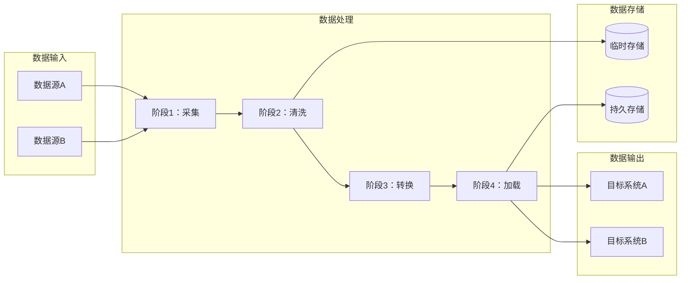

### 2.2 数据处理管线模式

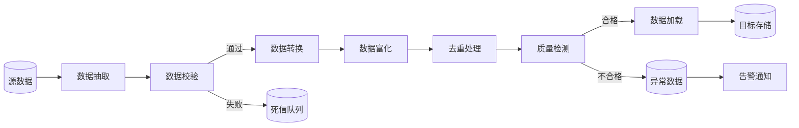

### 2.3 输入/处理/输出/存储标注规范

- **输入节点**：使用 `[名称]` 或 `[(名称)]`，标注数据类型与频率
- **处理节点**：使用 `[名称]`，标注处理动作
- **存储节点**：使用 `[(名称)]`，标注存储技术与保留策略
- **输出节点**：使用 `[名称]`，标注消费方
- **异常分支**：使用 `|条件|` 标注判断条件

### 2.4 示例：典型数据治理管线

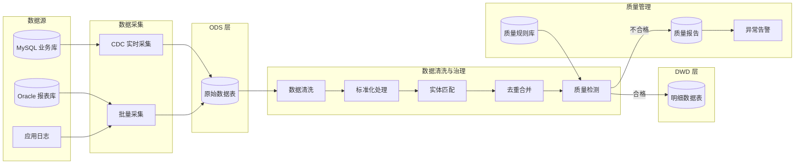

---

## 三、功能模块关系图

### 3.1 模板模式

使用 `graph LR` 配合 `subgraph` 展示模块分组与依赖关系。

```mermaid
graph LR
    subgraph 核心模块["核心模块"]
        M01[M01 用户管理]
        M02[M02 权限控制]
        M03[M03 数据管理]
    end

    subgraph 扩展模块["扩展模块"]
        M04[M04 报表中心]
        M05[M05 消息通知]
        M06[M06 工作流引擎]
    end

    subgraph 外部依赖["外部依赖"]
        EXT1[((LDAP)))
        EXT2[((SMS 网关)))
    end

    M01 --> M02
    M03 --> M01
    M04 --> M03
    M05 --> M03
    M06 --> M01 & M05
    M01 -.-> EXT1
    M05 -.-> EXT2
```

### 3.2 模块依赖标注规范

| 连线类型 | 语法 | 含义 |
|---------|------|------|
| 实线箭头 | `A --> B` | 强依赖（A 必须依赖 B 才能运行） |
| 虚线箭头 | `A -.-> B` | 弱依赖 / 可选依赖 |
| 双向箭头 | `A <--> B` | 双向依赖 / 相互调用 |
| 带标注 | `A -->|API| B` | 标注依赖方式 |

### 3.3 示例：功能模块关系

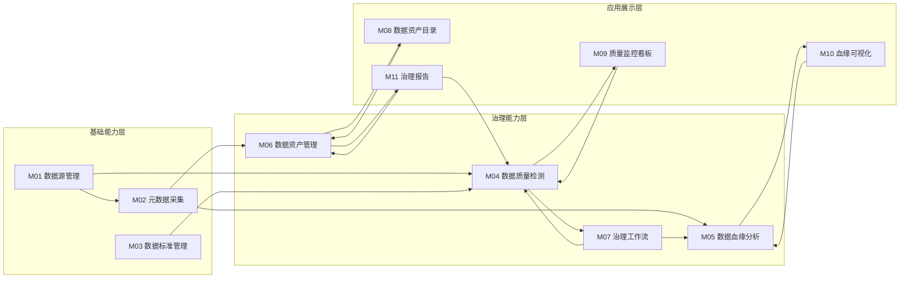

---

## 四、部署架构图

### 4.1 模板模式

使用 `graph TB` 展示物理部署拓扑，用 subgraph 表示物理节点或集群。

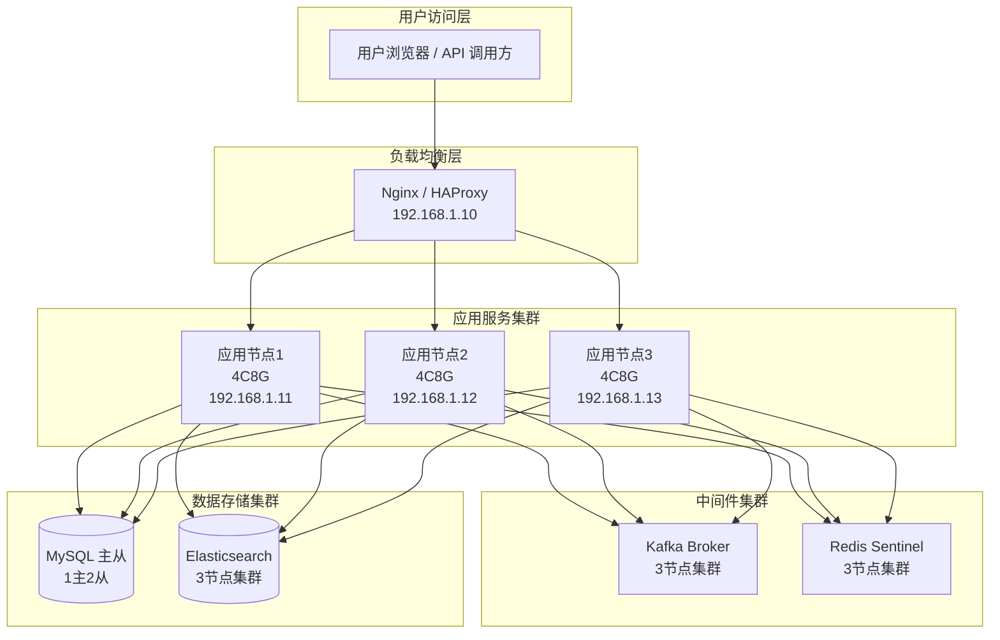

### 4.2 物理部署拓扑要点

- 标注节点 IP / 域名（如有）
- 标注硬件规格（CPU / 内存）
- 标注集群规模（节点数量）
- 区分有状态服务与无状态服务
- 标注网络分区（如 DMZ / 内网 / 数据网段）

### 4.3 示例：Docker 部署拓扑

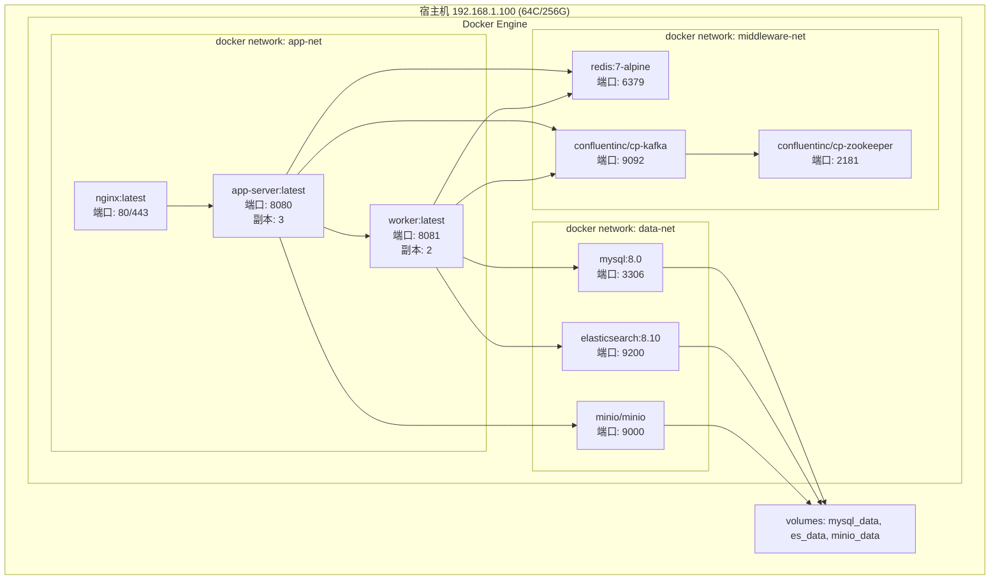

---

## 五、分类专属图表

### 5.1 模型训练：训练管线图

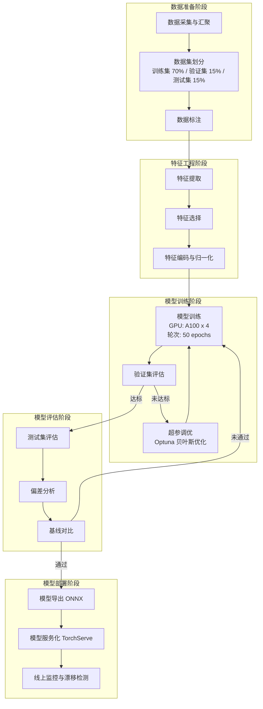

### 5.2 知识库：RAG 管线图

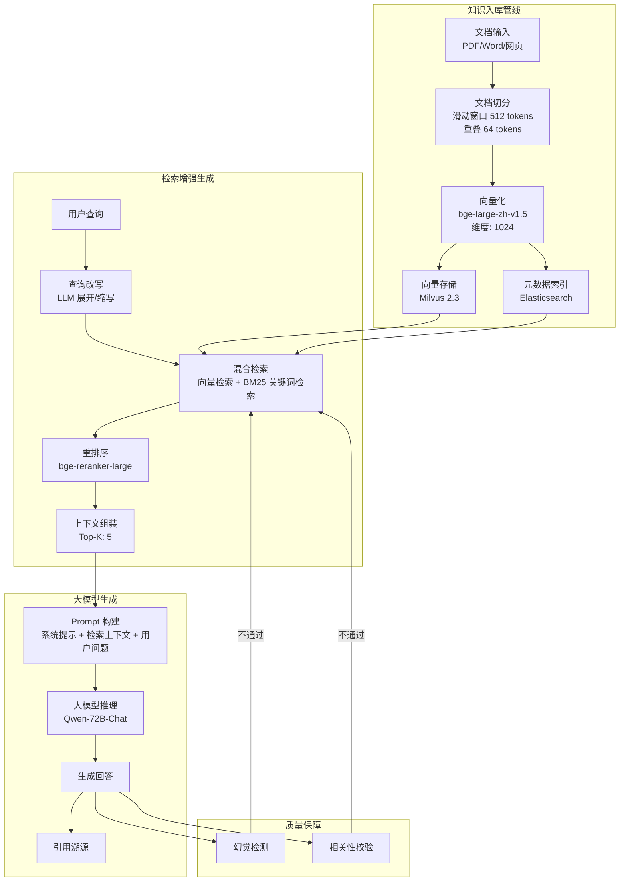

### 5.3 智能体：Agent 决策流程图

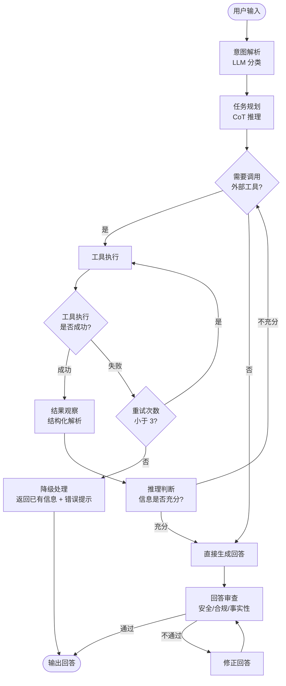

---

## 六、语法注意事项

### 6.1 中文节点标签

- **节点 ID 使用英文**，显示文本使用中文：

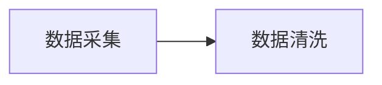

- **避免在节点 ID 中使用中文**，否则可能导致渲染问题：

```mermaid
%% 错误写法 - 节点 ID 含中文
graph LR
    数据采集 --> 数据清洗

%% 正确写法 - 节点 ID 为英文
graph LR
    collect[数据采集] --> clean[数据清洗]
```

### 6.2 Subgraph 命名规范

- Subgraph 标题支持中文，使用双引号包裹：

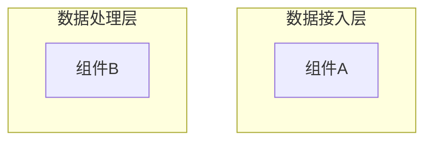

- Subgraph ID 使用英文，标题使用中文：

```mermaid
%% 正确
subgraph app_layer["应用服务层"]

%% 避免 - 标题不含引号可能导致解析异常
subgraph app_layer[应用服务层]
```

### 6.3 常见语法错误及修正

| 错误类型 | 错误写法 | 正确写法 | 说明 |
|---------|---------|---------|------|
| 箭头方向 | `A -- B` | `A --- B` 或 `A --> B` | 无箭头用 `---`，有箭头用 `-->` |
| 节点形状 | `A[文本]-->B(文本)` | 两种语法本身合法，但建议统一 | 保持风格一致 |
| 特殊字符 | `A[组件A/B]` | `A["组件A/B"]` | 含 `/` 等特殊字符时用引号包裹 |
| 连线标签 | `A --> B标签` | `A -->|标签| B` | 连线标签用 `\|标签\|` 语法 |
| 空格问题 | `A -->B` | `A --> B` | 箭头两侧加空格 |
| 中文括号 | `A（文本）` | `A["（文本）"]` | 中文括号需用引号包裹 |

### 6.4 长标签换行

使用 `<br/>` 在节点内换行：

```mermaid
graph TB
    A["数据采集服务<br/>Kafka Connect<br/>版本: 3.5.0"] --> B["ETL 引擎<br/>Apache Spark<br/>版本: 3.4.1"]
```

**注意事项：**
- `<br/>` 标签仅在双引号包裹的文本中生效
- 换行后的节点宽度会自动适配最长行
- 建议每行不超过 20 个中文字符，保持图表可读性
- 简洁优先，避免在节点中放入过多信息

### 6.5 图表大小控制

- **控制节点数量**：单张图建议不超过 20 个节点
- **拆分复杂架构**：超过 20 个节点时，考虑按层次拆分为多张子图
- **使用子图分组**：通过 subgraph 提升可读性
- **避免过度连线**：如果连线过于密集，考虑简化非核心依赖关系
