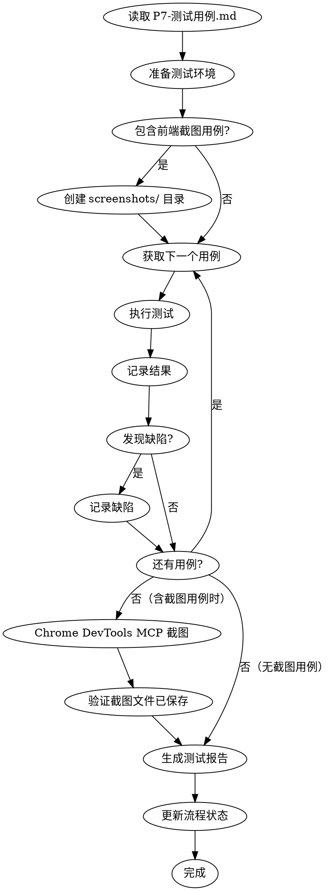

# 测试执行流程图



## 前端截图测试流程

当 P7 测试用例中包含前端截图用例时，在功能/边界/异常测试完成后执行：

```
确认存在 TC-S-* 类型用例
    |
    v
创建截图保存目录：docs/迭代/{需求名称}/screenshots/
    |
    v
逐个执行截图用例：
  Agent 通过 Chrome DevTools MCP 工具操控浏览器：
    1. 导航到目标页面
    2. 等待页面渲染完成
    3. 执行交互操作（点击、输入等，按用例要求）
    4. 调用截图功能
    5. 保存截图到 screenshots/ 目录
    |
    v
验证截图文件：
  ├── 文件存在于 screenshots/ 目录
  ├── 文件大小 > 10KB
  ├── 命名符合 TC-S-{id}_{name}.png 格式
  └── 视口使用当前屏幕分辨率（自动适配，无需配置）
    |
    v
将截图结果写入测试报告
```

## 调试流程

测试失败时的处理：

```
测试失败
    |
    v
暂停测试
    |
    v
调用 debug 子代理
    |
    ├── Phase 1: 根因调查
    ├── Phase 2: 模式分析
    ├── Phase 3: 假设测试
    └── Phase 4: TDD 修复
    |
    v
修复成功？
    ├── 是 -> 重新执行测试
    └── 否 -> 记录缺陷，等待人工介入
```
