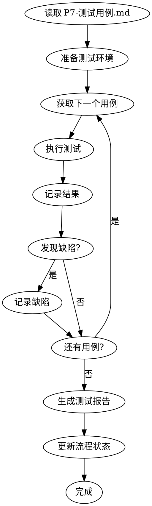

# 测试执行流程图



## 调试流程

测试失败时的处理：

```
测试失败
    │
    ▼
暂停测试
    │
    ▼
调用 debug 子代理
    │
    ├── Phase 1: 根因调查
    ├── Phase 2: 模式分析
    ├── Phase 3: 假设测试
    └── Phase 4: TDD 修复
    │
    ▼
修复成功？
    ├── 是 → 重新执行测试
    └── 否 → 记录缺陷，等待人工介入
```
