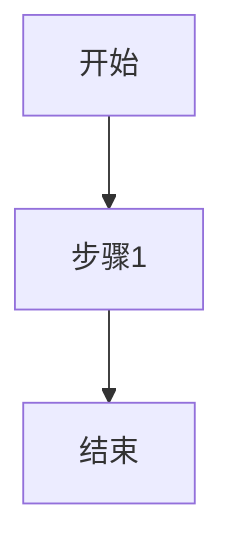

# Technical Proposal Illustration

技术方案智能配图，为章节内容自动生成匹配的示意图并插入文档。

## 核心原则

1. **内容优先** — 图片服务于文字，不是装饰。优先选择与内容相关性最强的类型。
2. **类型决定工具** — 流程图/时序图用 Mermaid 官方 CLI 转 PNG，架构图/数据图/原型图用 AI 生成。
3. **风格统一** — 技术方案统一风格，不混用多种视觉风格。
4. **白色背景** — 所有图片**必须使用白色背景**。
5. **学术规范** — 架构图/系统图采用学术论文风格，核心组件配图标。
6. **中文标签** — 图片中的所有文字标签**必须使用中文**，除非是其他语言的专有名词（如 API、URL、特定产品名称等约定俗成的英文术语）。

## 配图类型与工具选择

### 决策树

```
内容分析
  │
  ├─ 业务流程 / 工作流 / 业务阶段 ────────────→ Mermaid 官方 CLI (mmdc)
  │
  ├─ 时序 / 交互流程 ─────────────────────────→ Mermaid 官方 CLI (mmdc)
  │
  ├─ 数据流 / 数据加工路径 ──────────────────→ baoyu-image-gen (白底 + 学术数据流图)
  │
  ├─ 技术路线 / 演进路径 / 时间规划 ──────────→ baoyu-image-gen (白底 + 学术路线图)
  │
  ├─ 架构 / 系统结构 / 模块关系 ──────────────→ baoyu-image-gen (白底 + 学术架构图 + 图标)
  │
  ├─ 数据对比 / 指标 / 统计 ──────────────────→ baoyu-image-gen (白底 + 学术数据图)
  │
  ├─ 原型 / UI / 界面示意 ───────────────────→ baoyu-image-gen (白底 + wireframe)
  │
  └─ 概念解释 / 原理示意 ─────────────────────→ baoyu-image-gen (白底 + 学术风格)
```

### 工具速查

| 类型 | 工具 | 说明 |
|------|------|------|
| 业务流程图、工作流 | Mermaid CLI (mmdc) | 官方CLI转PNG，中文支持好 |
| 时序图、状态图 | Mermaid CLI (mmdc) | 官方CLI转PNG |
| 数据流图 | `baoyu-image-gen` | 白底 + 学术数据流图 |
| 技术路线图 / 时间轴 | `baoyu-image-gen` | 白底 + 学术路线图 |
| 架构图、系统图 | `baoyu-image-gen` | 白底 + 学术架构图 + 图标 |
| 数据图、指标对比 | `baoyu-image-gen` | 白底 + 学术数据图 |
| 原型界面 | `baoyu-image-gen` | 白底 + wireframe |
| 网络拓扑、部署图 | `baoyu-image-gen` | 白底 + 学术拓扑图 |
| 概念解释 | `baoyu-image-gen` | 白底 + 学术风格 |

**通用规范：所有图片必须为白色背景。**

## 执行流程

### Step 1: 分析章节内容

读取 `sections/` 目录下所有章节 markdown 文件，分析：

- 各章节主题（架构设计/数据治理/接口设计等）
- 包含的流程描述词（"首先...然后...最后"、"流程如下"）
- 包含的架构描述词（"系统分为...层"、"包括...模块"）
- 包含的数据描述词（"占比"、"对比"、"指标"）
- 现有的 Mermaid 代码块

输出：**配图候选清单**

### Step 2: 确认配图方案（AskUserQuestion）

向用户确认配图方案：

```
【P5 智能配图 - 方案确认】

已识别 N 个潜在配图位置：
- 图1：章节X.X "系统架构图" → 架构图 → baoyu-image-gen
- 图2：章节X.X "数据处理流程" → 流程图 → Mermaid CLI
- ...

生成工具：
- 流程图/时序图 → Mermaid 官方 CLI (mmdc) 转 PNG
- 架构图/数据图/原型图 → baoyu-image-gen

请确认：
1. 以上配图方案是否合理？有无遗漏或多余？
2. 风格偏好？（学术白底风格）
3. 是否需要补充其他类型的图？
```

### Step 3: 生成图片

#### 3.1 流程图/时序图（Mermaid CLI）

**工具**：`@mermaid-js/mermaid-cli`（官方 CLI）

**首次使用准备**（如果 puppeteer 未下载）：
```bash
# 预先下载 puppeteer（只需运行一次）
npx -y @mermaid-js/mermaid-cli mmdc -i /dev/null -o /dev/null
```

**单图转换命令**：
```bash
# 将 mermaid 代码写入临时文件
cat > /tmp/diagram.mmd << 'EOF'
flowchart TD
    A[开始] --> B[步骤1]
    B --> C[结束]
EOF

# 转换为 PNG（白色背景）
npx -y @mermaid-js/mermaid-cli mmdc \
  -i /tmp/diagram.mmd \
  -o output.png \
  -b white \
  -w 1600 -H 1200
```

**批量转换脚本**：
```bash
#!/bin/bash
# mmdc-batch.sh - 批量转换 mermaid 为 PNG

IMAGES_DIR="sections/images"
mkdir -p "$IMAGES_DIR"

# 从 markdown 中提取 mermaid 代码块并转换
for md_file in sections/*.md; do
    # 检查是否包含 mermaid 代码块
    if grep -q '```mermaid' "$md_file"; then
        echo "处理: $md_file"

        # 提取 mermaid 代码块（第一个）
        sed -n '/```mermaid/,/```/p' "$md_file" | sed '1d;$d' > /tmp/extracted.mmd

        # 生成输出文件名
        base_name=$(basename "$md_file" .md)
        output_file="$IMAGES_DIR/${base_name}-diagram.png"

        # 转换
        npx -y @mermaid-js/mermaid-cli mmdc \
          -i /tmp/extracted.mmd \
          -o "$output_file" \
          -b white \
          -w 1600 -H 1200

        echo "  -> $output_file"
    fi
done
```

**Mermaid CLI 参数说明**：

| 参数 | 说明 |
|------|------|
| `-i <file>` | 输入的 .mmd 文件 |
| `-o <file>` | 输出的图片文件（.png/.svg） |
| `-b <bg>` | 背景颜色（white/transparent） |
| `-w <px>` | 输出宽度（像素） |
| `-H <px>` | 输出高度（像素） |
| `-t <theme>` | 主题（default/mermaid/neutral/dark） |

**适合 Mermaid 的场景**：
- 工作流程（步骤1 → 步骤2 → 步骤3）
- 状态机（状态A ↔ 状态B）
- 时序图（用户 → 系统 → 数据库）
- 类图、ER 图
- 甘特图

**Mermaid 语法注意事项**：
- 节点标签用中文可以直接写，无需引号：`A[开始]`
- 中文字体需要确保系统有中文字体支持
- 复杂中文字符串可用引号包裹：`A["中文节点"]`

#### 3.2 AI 生成图片（baoyu-image-gen）

对于架构图、数据图、原型图等，调用 `baoyu-image-gen`：

```bash
# 确定脚本路径
baseDir="/Users/mathrippermacmini/.claude/skills/baoyu-image-gen"

# 设置 Google Native API（via 老张）
export GOOGLE_API_KEY="sk-xS0aIvt5ESBqgGPu56AcEc4932264a6b8fCcD8A9Aa75DbC3"
export GOOGLE_BASE_URL="https://api.laozhang.ai/v1beta"

cd "{项目目录}/项目文档/技术方案"

# 生成架构图
npx -y bun $baseDir/scripts/main.ts \
  --promptfiles sections/images/prompts/01-framework-xxx.md \
  --image sections/images/01-framework-xxx.png \
  --ar 16:9 --quality 2k --provider google

# 生成数据图
npx -y bun $baseDir/scripts/main.ts \
  --promptfiles sections/images/prompts/02-infographic-xxx.md \
  --image sections/images/02-infographic-xxx.png \
  --ar 16:9 --quality 2k --provider google
```

**Prompt 构造要点（技术方案风格）**：
- **白色背景**（必须）：`Background: Pure white (#FFFFFF). No dark backgrounds.`
- **中文标签**（必须）：所有文字标签使用中文，仅在其他语言的专有名词时使用英文（如 API、URL 等约定俗成的术语）
- 学术论文风格：简洁、专业、几何化，避免花哨装饰
- 核心组件配图标：用通用图标符号表示（数据库=圆柱、API=↔、用户=👤、服务=⚙）
- 包含具体的技术术语和数值
- 布局清晰，分区明确
- 色彩语义化且克制（蓝色=接入/接口，青色=服务层，紫色=数据层，灰色=基础设施）
- 无渐变、无阴影、无复杂纹理

**Prompt 示例（架构图 — 学术白底风格）**：
```
Technical system architecture diagram. Academic paper style.

BACKGROUND: Pure white (#FFFFFF). No gradients, no shadows, no textures.

Layout: Top-down hierarchical, 3 layers.

ZONES:
- Zone 1 (Top): API Gateway / User Interface layer
  → Icon: ↔ (bidirectional arrows) for gateway
  → Label: "接入层" in Chinese
- Zone 2 (Middle): Core Services layer
  → Icon: ⚙ (gear) for each service module
  → 3 service modules with icons: 用户服务 ⚙ / 业务服务 ⚙ / 数据服务 ⚙
  → Label: "服务层" in Chinese
- Zone 3 (Bottom): Data Persistence layer
  → Icon: ⧈ (cylinder) for database
  → 3 data stores: 主数据 ⧈ / 业务数据 ⧈ / 日志数据 ⧈
  → Label: "数据层" in Chinese

CONNECTIONS: Clean straight lines with directional arrows. No curved lines.
Clean geometric containers: rounded rectangles with 1px solid borders. No fill (white/transparent fill).

Colors:
- Gateway: Blue (#2563EB) outline
- Service modules: Teal (#0D9488) outline
- Data stores: Purple (#7C3AED) outline
- All text: Dark gray (#374151) or black
- Borders: 1px solid, matching component color

Style: Academic / technical diagram. Flat design, white background, precise layout, clean lines, minimal decoration. Each component has a clear icon. Text labels in Chinese. Professional and formal.
ASPECT: 16:9
```

### Step 4: 插入图片

#### Mermaid 生成的 PNG 图片

将 markdown 中的 mermaid 代码块替换为图片引用：

**替换前**：
````markdown

````

**替换后**：
```markdown
数据处理流程如下：


如图所示...
````

#### AI 生成的图片

在对应段落后插入图片引用：

```markdown
系统采用三层架构设计，各层职责清晰、边界明确。如图所示：


- 接入层：负责用户请求的接入、认证与路由
- 业务层：承载核心业务逻辑，支持水平扩展
- 数据层：提供统一的数据访问接口，支持多数据源
```

### Step 5: 输出报告

```
P5 智能配图完成

文档：{方案名称}
配图数量：N 张
- 流程图/时序图：M 张（Mermaid CLI）
- 架构图：K 张（baoyu-image-gen）
- 数据图：L 张（baoyu-image-gen）

产出文件：
- sections/（已更新，Mermaid代码块已替换为图片引用）
- images/（生成的图片）
  - 01-framework-xxx.png
  - 02-mermaid-diagram.png
  - ...
```

## 输出目录结构

```
{项目目录}/项目文档/技术方案/
├── sections/              # 已更新，Mermaid代码块已替换为图片引用
│   ├── 1-项目概述.md
│   ├── 2-知识资产现状分析.md
│   └── ...
├── images/                # 生成的图片
│   ├── 01-framework-xxx.png
│   ├── 02-mermaid-xxx.png
│   └── ...
└── 最终方案.docx          # P6合并后产出
```

## Mermaid CLI 常见问题

### 问题1：首次运行卡住（下载 puppeteer）

**现象**：命令执行后长时间无输出

**解决**：
```bash
# 先手动下载 puppeteer（约200MB，只需一次）
npx -y @mermaid-js/mermaid-cli mmdc -i /dev/null -o /dev/null
```

### 问题2：中文显示为方块

**原因**：系统缺少中文字体

**解决**：
```bash
# macOS 安装中文字体
brew install --cask adobe-source-han-sans-cn-fonts
# 或使用系统字体
```

### 问题3：图片尺寸不合适

**解决**：调整 `-w`（宽度）和 `-H`（高度）参数
```bash
npx -y @mermaid-js/mermaid-cli mmdc -i diagram.mmd -o diagram.png -w 1920 -H 1080
```

## 相关 Skills

- `baoyu-image-gen` — AI 图片生成（生成架构图、数据图、路线图）
- `technical-proposal-workflow` — 编排器（调用本 skill）
- `technical-proposal-writing` — P4 并行写作（产出的 sections/ 是本 skill 的输入）
- `technical-proposal-merge` — P6 文档合并（合并含图的 sections）
