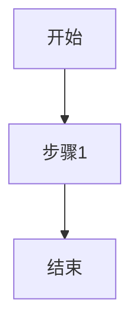

# Illustration (P5)

文档智能配图，为章节内容自动生成匹配的示意图并插入文档。

## 核心原则

1. **内容优先** — 图片服务于文字，不是装饰。优先选择与内容相关性最强的类型。
2. **类型决定工具** — 流程图/时序图用 Mermaid 官方 CLI 转 PNG，架构图/数据图/原型图用 AI 生成。
3. **风格统一** — 文档统一风格，不混用多种视觉风格。
4. **白色背景** — 所有图片**必须使用白色背景**。
5. **学术规范** — 架构图/系统图采用学术论文风格，核心组件配图标。
6. **中文标签** — 图片中的所有文字标签**必须使用中文**，除非是其他语言的专有名词（如 API、URL、特定产品名称等约定俗成的英文术语）。

## 配图类型与工具选择

详见：@references/decision-tree.md

## 执行流程

### Step 1: 分析章节内容

读取 `sections/` 目录下所有章节 markdown 文件，分析：

- 各章节主题（架构设计/数据治理/接口设计等）
- 包含的流程描述词（"首先...然后...最后"、"流程如下"）
- 包含的架构描述词（"系统分为...层"、"包括...模块"）
- 包含的数据描述词（"占比"、"对比"、"指标"）
- 现有的 Mermaid 代码块

输出：**配图候选清单**

### Step 2: 确认配图方案（AskUserQuestion）

向用户确认配图方案：

```
【P5 智能配图 - 方案确认】

已识别 N 个潜在配图位置：
- 图1：章节X.X "系统架构图" → 架构图 → baoyu-image-gen
- 图2：章节X.X "数据处理流程" → 流程图 → Mermaid CLI
- ...

生成工具：
- 流程图/时序图 → Mermaid 官方 CLI (mmdc) 转 PNG
- 架构图/数据图/原型图 → baoyu-image-gen

请确认：
1. 以上配图方案是否合理？有无遗漏或多余？
2. 风格偏好？（学术白底风格）
3. 是否需要补充其他类型的图？
```

### Step 3: 生成图片

#### 3.1 流程图/时序图（Mermaid CLI）

详见：@references/mermaid-guide.md

#### 3.2 AI 生成图片（baoyu-image-gen）

详见：@references/prompt-templates.md

### Step 4: 插入图片

#### Mermaid 生成的 PNG 图片

将 markdown 中的 mermaid 代码块替换为图片引用：

**替换前**：
````markdown

````

**替换后**：
```markdown
数据处理流程如下：


如图所示...
````

#### AI 生成的图片

在对应段落后插入图片引用：

```markdown
系统采用三层架构设计，各层职责清晰、边界明确。如图所示：


- 接入层：负责用户请求的接入、认证与路由
- 业务层：承载核心业务逻辑，支持水平扩展
- 数据层：提供统一的数据访问接口，支持多数据源
```

### Step 5: 输出报告

```
P5 智能配图完成

文档：{文档名称}
配图数量：N 张
- 流程图/时序图：M 张（Mermaid CLI）
- 架构图：K 张（baoyu-image-gen）
- 数据图：L 张（baoyu-image-gen）

产出文件：
- sections/（已更新，Mermaid代码块已替换为图片引用）
- images/（生成的图片）
  - 01-framework-xxx.png
  - 02-mermaid-xxx.png
  - ...
```

## 输出目录结构

```
{项目目录}/文档产出/
├── sections/              # 已更新，Mermaid代码块已替换为图片引用
│   ├── 1-概述.md
│   ├── 2-现状分析.md
│   └── ...
├── images/                # 生成的图片
│   ├── 01-framework-xxx.png
│   ├── 02-mermaid-xxx.png
│   └── ...
└── 最终交付物              # P6渲染后产出
```

## 相关 Skills

- `baoyu-image-gen` — AI 图片生成（生成架构图、数据图、路线图）
- `ideal-document-workflow` — 编排器（调用本 skill）
- `document-writing` — P4 并行写作（产出的 sections/ 是本 skill 的输入）
- `document-render` — P6 渲染输出（合并含图的 sections）
