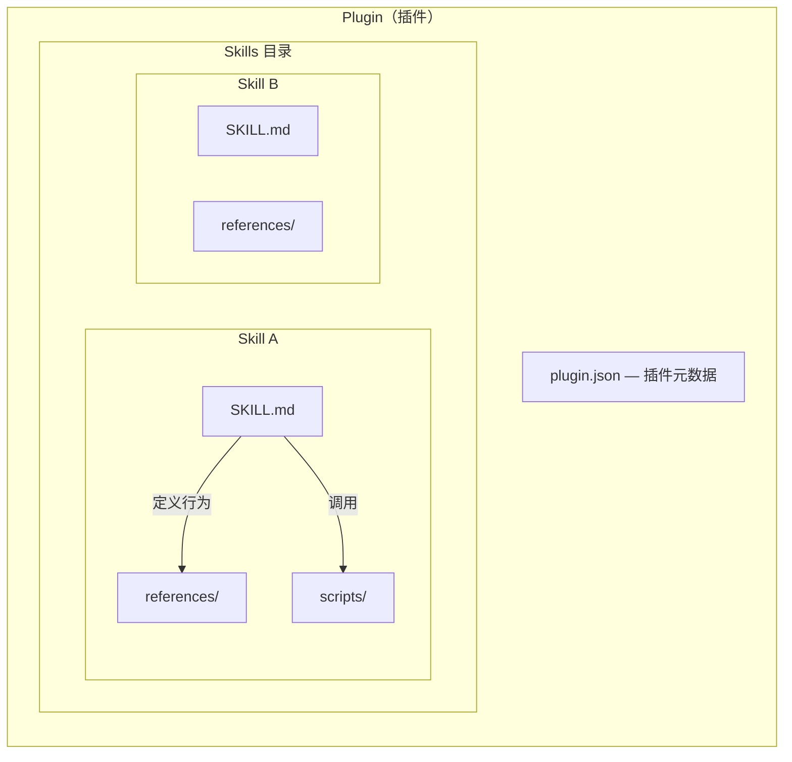

# 1. 从痛点出发：ideal-lab 是怎么来的

## 1.1 真实场景里的反复困扰

写一份技术方案，从打开空白文档到完成初稿，往往需要大半天。中间反复修改结构、补充论据、调整措辞，改完一版回头看，发现逻辑链条又断了。PPT 更是如此——从零开始排版、选风格、配图，一份 20 页的汇报材料能吃掉两三天。

代码评审看似有流程，实际常常变成"扫一眼、打个 LGTM"的走过场。不是不想认真审，而是没有结构化的评审框架，评审质量完全依赖个人经验和投入时间。更棘手的是经验传承问题：一个项目中踩过的坑、总结出的写法、验证过的方案，到了下一个项目常常要从头再来一遍，因为之前的经验没有被系统化地保留下来。

这些不是假设性的场景，是我在日常工作中反复遇到的困扰。

## 1.2 从重复中提炼，从迭代中沉淀

ideal-lab 的起点，就是在解决这些问题的过程中逐步形成的。最初没有"设计一个插件库"的想法，只是在一个个具体项目里，反复经历同一个模式：用 AI 辅助完成某项任务，发现输出质量不稳定，于是总结经验、写下来、固化成可复用的流程，下一次直接调用。

第一次用 AI 写技术文档时，发现生成的内容结构松散、深度不足。总结原因后发现，问题出在提示词不够具体——没有告诉 AI 应该遵循什么结构、达到什么深度、面向什么读者。于是把这些要求整理成一份写作规范，下次直接喂给 AI，输出质量立刻提升了一个档次。再后来发现，光有写作规范还不够，还需要需求分析、大纲评审、多轮校验这些前置和后置环节。每发现一个薄弱点，就补充一个对应的环节，逐步形成完整的写作工作流。

每一个 Skill 背后都有真实项目的影子。ideal-ppt-suite 里 17 种预设风格的来源，是在实际做 PPT 的过程中，发现不同场景需要不同的视觉策略，于是逐一沉淀下来的。ideal-deep-research 的 4 种深度模式，是因为调研任务的时间预算和深度要求差异很大，quick 模式和 ultradeep 模式面向的是完全不同的使用场景。

这个"踩坑—总结—固化—复用—再迭代"的循环，是 ideal-lab 成长的核心路径。不是先画架构图再填内容，而是从一个个具体的痛点出发，逐步生长出一套完整的工具体系。

## 1.3 ideal-lab 今天的样子

经过多轮迭代，ideal-lab 目前包含 **9 个插件**、**42 个 Skill**，覆盖开发流程、PPT 生成、文档写作、知识库构建、深度调研等场景。一句话定位：**从日常工作中沉淀的 Claude Code 最佳实践插件库**。

核心价值链可以概括为四个环节：

- **标准化**——把反复验证有效的做法固化为标准流程，避免每次重新摸索
- **可复用**——标准化之后的流程变成 Skill，任何项目都可以直接调用
- **质量保障**——每个工作流内嵌评审和校验环节，不依赖个人的认真程度
- **持续迭代**——在使用中发现更好的做法，更新 Skill，所有使用者同步受益

这条价值链不是口号，是实际迭代过程的总结。ideal-lab 本身就是一个持续迭代的活系统。

---

# 2. 插件架构：一套透明可审计的工具体系

## 2.1 Plugin → Skill → References 三层结构

ideal-lab 采用 Plugin → Skill → References/Scripts 三层结构，每一层职责清晰、自包含。

**Plugin（插件）** 是最大的能力单元。每个 Plugin 对应一个独立的工作领域，比如 ideal-dev-workflow 覆盖开发流程、ideal-ppt-suite 覆盖 PPT 生成。Plugin 之间完全解耦，按需安装，不需要全量部署。

**Skill（技能）** 是 Plugin 内的执行单元。每个 Skill 做一件事，通过 `SKILL.md` 定义"做什么"和"怎么做"。一个 Plugin 下的多个 Skill 按流程编排，形成完整工作流。

**References 和 Scripts** 是 Skill 的支撑资源。`references/` 存放参考文档（写作规范、模板、技术规格等），`scripts/` 存放执行脚本（格式校验、文件转换、自动化工具等）。Skill 在执行时读取这些资源，确保输出符合预设标准。



这种结构的好处是透明可审计。任何一个 Skill 的行为都可以通过阅读 `SKILL.md` 完整了解，不需要逆向工程。所有参考文档和执行脚本都以纯文本形式存放在仓库中，版本可追溯，变更可对比。

## 2.2 分发机制：Marketplace 一键安装

ideal-lab 通过 Claude Code 官方的 Plugin Marketplace 分发。三步即可上手：

**第一步：添加 Marketplace 源**

```bash
claude plugin marketplace add https://github.com/MTleen/ideal-lab
```

这一步告诉 Claude Code 从哪里获取插件清单和安装包。

**第二步：按需安装插件**

```bash
# 安装文档写作工作流（8 个 Skill）
claude plugin install ideal-document-workflow@ideal-lab

# 安装深度调研工具
claude plugin install ideal-deep-research@ideal-lab

# 安装开发流程工作流（14 个 Skill）
claude plugin install ideal-dev-workflow@ideal-lab
```

每个插件独立安装，用哪个装哪个。不需要全量安装，也不会因为安装了一个用不到的工作流而增加干扰。

**第三步：通过斜杠命令调用**

安装完成后，Skill 自动加载，直接在对话中通过斜杠命令调用：

```
/ideal-document-workflow:ideal-document-workflow    # 启动文档写作全流程
/ideal-deep-research:deep-research                  # 启动深度调研
/ideal-ppt-suite:ideal-ppt-workflow                 # 启动 PPT 生成全流程
```

每个工作流插件都有一个编排器 Skill，调用编排器即可自动走完整个流程，无需逐阶段手动触发。

## 2.3 版本管理与质量保障

ideal-lab 使用 **Changeset** 管理版本，配合 GitHub Actions 实现自动化校验和发布。

版本策略清晰明确：

| 版本类型 | 标准 | 示例 |
|---------|------|------|
| **patch** | 修 typo、补充说明、修脚本 bug | 1.0.0 → 1.0.1 |
| **minor** | 新增 Skill、可选配置、新 Provider | 1.0.0 → 1.1.0 |
| **major** | Skill 改名/删除、阶段编号变化、Schema 不兼容 | 1.0.0 → 2.0.0 |

每次提交改动时，维护工具自动检测变更范围、生成 Changeset、Bump 版本号。CI 流水线在合并前自动校验所有插件的结构完整性和配置合法性，确保发布的内容不会因为格式问题导致安装失败。

这套机制对使用者来说意味着两件事：**版本可追溯**——任何一个 Skill 的任何一次变更都有记录，可以回溯到具体的改动内容；**更新可控**——minor 版本保证向后兼容，不会因为升级而丢失已有配置。major 版本会提前说明不兼容的变更点，给足迁移时间。
