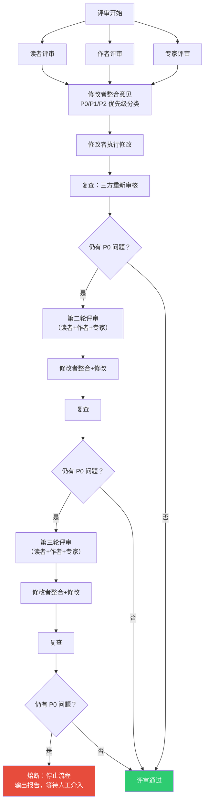

## 3. 深度解析：ideal-document-workflow 是怎么工作的？

前面介绍了 ideal-lab 的整体架构——Plugin、Skill、Marketplace。但对大多数同事来说，"概念"远不如"看到它怎么跑起来"来得直观。这一章用 ideal-document-workflow 作为完整案例，展示 ideal-lab 工作流的核心设计理念。

### 3.1 一个完整案例：从"帮我写一份技术方案"到交付

假设你正在做一个新项目，需要写一份技术方案文档。你在 Claude Code 中输入：

```
/ideal-document-workflow:ideal-document-workflow 帮我写一份 XX 项目的后端技术方案
```

接下来的过程不是你和 AI 反复对话、来回修改，而是一套自动化的端到端流程。你会经历几个关键节点：

**确认需求。** 工作流首先调用 `requirement-analysis` Skill，分析你的输入并生成一份需求文档，明确文档类型、目标读者、核心内容范围。你会看到这份需求文档并被要求确认——这是最后一个"你说啥它写啥"的环节，后续所有工作都以此为锚点。

**审核大纲。** 基于确认后的需求，工作流调用 `outline-generation` Skill 生成大纲。你审核大纲结构，调整章节顺序或补充遗漏主题。大纲一旦确认，后续写作严格围绕它展开。

**等待写作。** 这一步你不需要参与。工作流自动将大纲拆分为独立写作任务，调用多个 sub-agent（子智能体，相当于被临时指派任务的小组成员）并行写作各章节。每个 sub-agent 遵循统一的写作规范，确保全文档风格一致。

**审核配图。** 写作完成后，`illustration` Skill 分析每段内容，判断哪些地方需要配图并自动生成 Mermaid 图表。你审核配图是否合理。

**获得交付物。** 最终 `document-render` Skill 将所有章节组装成完整的 Markdown 文档。整个过程中，你的参与集中在"确认"和"审核"两个动作，内容的生成和组装由工作流自动完成。

这和传统的"对话式 AI 写作"有本质区别：你不是在和 AI 聊天，而是在驱动一条经过设计的工作流。

### 3.2 十二阶段流程全景

理想文档工作流包含 12 个阶段，分为三种类型：6 个产物阶段（生成具体产出物）、5 个评审阶段（审核产出物质量）、1 个交付阶段（最终组装）。阶段之间严格按序号推进，产物阶段和评审阶段交替出现。

产物阶段分别执行：P1 需求分析 → P3 大纲生成 → P5 任务拆分 → P7 并行写作 → P9 智能配图 → P11 渲染输出。每个产物阶段由一个专用的 Phase Skill 负责，例如 P7 写作阶段由 `document-writing` Skill 执行。

评审阶段穿插在产物阶段之间：P2 评审需求 → P4 评审大纲 → P6 评审任务拆分 → P8 评审写作内容 → P10 评审配图。每个评审阶段由一个评审团队（Agent Team）执行，包含多个角色的评审员。


这个"产物-评审-产物-评审"的交替节奏不是事先设计出来的，而是在实际使用中迭代出来的。最初版本没有评审阶段，AI 从头到尾一次写完，结果质量完全不可控——结构混乱、内容遗漏、风格不统一是常态。加入评审关卡后，每一步都有质量把关，问题在早期被发现和修正，而不是累积到最终交付物上才暴露。

### 3.3 编排器模式：只调度，不执行

ideal-document-workflow 的主智能体（Orchestrator，相当于项目经理）有一个核心原则：**永远不直接执行工作**。

它只做三件事。第一，读取 `流程状态.md` 文件，确定当前处于 12 个阶段中的哪一个。第二，根据当前阶段调用对应的 Phase Skill——比如当前是 P1 就调用 `requirement-analysis`，是 P7 就调用 `document-writing`。所有实际工作由 Phase Skill 内部 spawn 的 sub-agent 完成。第三，等 Skill 执行完毕后，更新 `流程状态.md`，推进到下一个阶段。

主智能体绝对不做的事包括：读取项目源码、做技术分析、写文档内容、执行评审、修改文档。这些工作全部由 Phase Skill 或评审团队内部的 sub-agent 完成。

这个设计遵循关注点分离（Separation of Concerns）原则，带来三个好处。**可审计**：流程状态文件完整记录了每个阶段的执行时间和产出物，出了问题可以追溯到具体阶段。**可插拔**：如果 P7 写作阶段的 Skill 需要升级，只替换 `document-writing` Skill 即可，编排器和其他阶段不受影响。**职责清晰**：编排器只管"做什么"，Skill 只管"怎么做"，评审只管"做得好不好"。

这个模式同样是在迭代中形成的。早期版本的主智能体既管调度又管执行，一个 Prompt 里塞了需求分析、大纲生成、写作、配图所有逻辑。结果是一旦某个环节出问题，整个流程都受影响，调试起来非常困难。拆分后，每个 Skill 独立迭代、独立测试，编排器只负责串联。

### 3.4 评审团队：三方视角 + 熔断保护

评审阶段是 ideal-document-workflow 区别于"AI 一次性输出"的关键设计。每个评审阶段（P2/P4/P6/P8/P10）会 spawn 一个评审团队（Agent Team），包含四个角色：

**读者评审**站在目标读者视角，核心问题是"这对我有用吗？我能理解吗？"。如果是写给管理层的技术方案，读者评审会检查管理层是否看得懂关键结论；如果是写给开发团队的技术文档，读者评审会检查是否有足够的技术细节。

**作者评审**站在文档创作者视角，核心问题是"这是我想表达的吗？有没有遗漏？"。作者评审负责检查内容是否偏离了原始需求、大纲中的要点是否被遗漏、整体叙事是否连贯。

**专家评审**站在领域专家视角，核心问题是"技术上站得住脚吗？有没有事实错误？"。专家评审负责检查技术选型是否合理、数据是否准确、逻辑链条是否完整。

**修改者**负责整合三方意见。修改者不是简单地把所有意见叠加，而是按优先级分类处理：P0 级问题是必须修改的硬伤，P1 级是应该修改的改进项，P2 级是可以跳过的建议。修改者先整合为统一的修改方案，再执行文档修改。



**熔断机制**是最后的安全网。评审最多进行 3 轮。如果 3 轮后仍有 P0 级问题未解决，工作流触发熔断——停止自动推进，输出熔断报告（包含未解决问题清单和三方评审意见），等待人工介入处理。打个比方：这就像项目验收中连续 3 次不通过，就不再继续改了，而是找老板拍板决定怎么处理。

### 3.5 两种模式：手动 vs 全自动

ideal-document-workflow 提供两种执行模式，由流程状态文件中的 `yolo_mode` 字段控制。

**手动模式**（yolo_mode: false）相当于"手动挡"——每个产物阶段完成后停下来等你确认，每个评审阶段展示评审摘要后等你确认。你对每一步都有控制权，适合首次使用、重要文档、或对质量要求极高的场景。

**YOLO 模式**（yolo_mode: true）相当于"自动挡"——阶段完成后不停止，自动推进到下一步，直到整个流程完成或触发熔断。评审团队的 modifier 整合修改工作仍然正常执行，只是不再需要你逐个确认。适合对流程已经熟悉、时间紧迫、或对 AI 输出质量有信心的场景。

| 维度 | 手动模式 | YOLO 模式 |
|------|---------|----------|
| 控制粒度 | 每阶段确认 | 全自动或熔断时介入 |
| 适用场景 | 首次使用、重要文档 | 日常文档、时间紧迫 |
| 人工参与 | 6-12 次确认 | 0-1 次介入（仅熔断时） |
| 出错恢复 | 每阶段可调整 | 熔断后人工处理 |

两种模式的底层逻辑完全一致——同样的阶段、同样的评审、同样的熔断机制。唯一的区别是：手动模式在每个阶段停一停，YOLO 模式一路跑到底。

### 3.6 关键最佳实践

ideal-document-workflow 中沉淀了几个在实践中反复验证过的写作最佳实践，它们不限于文档写作场景，可以迁移到任何需要 AI 输出结构化内容的场景。

**What-Why-How 写作模式。** 每个功能点或技术选型的描述都遵循统一结构：先说是什么（What），再说为什么（Why），最后说怎么做（How）。例如描述一个缓存方案时——Redis 是一种基于内存的键值存储（What）；选择它是因为读写延迟在微秒级，适合高并发场景（Why）；在实现上，将热点数据写入 Redis 并设置 TTL 过期策略（How）。这种模式确保内容既有概念解释又有决策依据还有落地路径，不会出现"说了是什么但没说为什么选它"的情况。

**按需调研。** 不是每个写作任务都需要外部调研。`document-writing` Skill 在执行前会判断当前任务是否需要调研——技术细节需要外部验证时调用 `ideal-deep-research`，需要从源码提取信息时读取源码文件，如果 P1/P3 阶段已完成调研则直接进入写作。这个"按需"设计避免了对每个任务都启动一轮耗时调研的浪费。

**统一写作风格规范。** `writing-skills` Skill 提供了完整的写作风格规范，所有 sub-agent 在写作时严格遵循同一套标准：无第一人称、无问句标题、无口语化表述、段落以叙述为主（列表不超过全文 5%）、数值标注来源和范围。规范的存在确保了多个 sub-agent 并行写作的各章节在风格上保持一致，而不是拼凑感明显。

这些最佳实践每一条都是在实际写作项目中踩过坑后总结出来的。例如 What-Why-How 模式是在发现 AI 写作经常"只说 What 不说 Why"后加上的；按需调研是在发现每次都调用 `ideal-deep-research` 导致流程过慢后优化的；写作风格规范是在收到多篇"列表堆砌、口语化严重"的初稿后逐步完善的。它们不是理论建议，是迭代的结果。
