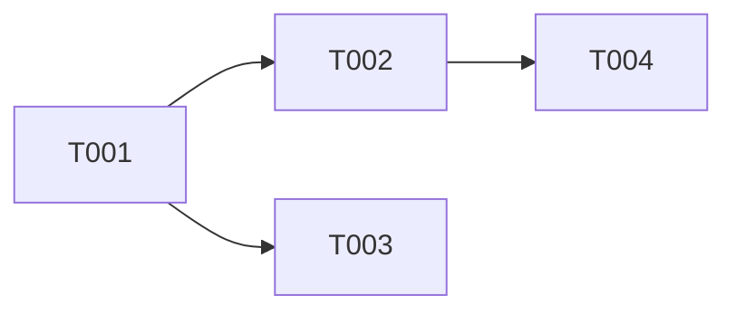

# ideal-dev-plan（P5 编码计划生成）

## 角色定位

Phase Skill — **执行协调者**。

职责：
1. 加载所需上下文（P3 技术方案 + P1 需求）
2. 调度子智能体进行任务拆分
3. 将产物写入文件系统
4. 返回执行摘要

**不负责**：更新 flow state、验证前置条件、协调评审。

---

## 输入

| 来源 | 内容 |
|------|------|
| P3-技术方案.md | 模块划分、架构设计、实施计划 |
| P1-需求文档.md | 功能需求、验收标准 |
| project-config.md | 技术栈、开发命令、测试命令（用于确定 story executor 标签） |
| project-config.md | 技术栈、开发命令、测试命令（用于确定 story executor 标签和 toolchain） |

---

## 输出

| 文件 | 路径 |
|------|------|
| P5-编码计划.md | `docs/迭代/{需求名称}/P5-编码计划.md` |
| stories/index.md | `docs/迭代/{需求名称}/stories/index.md` |
| stories/0XX-*.md | `docs/迭代/{需求名称}/stories/0XX-*.md` |

---

## 子智能体调度

| 调用时机 | 子智能体 | 任务 |
|----------|----------|------|
| 模块分解 | `architect` | 识别功能模块、标注依赖关系 |
| 任务拆分 | `pm` | 分解原子任务（2-5 分钟粒度）、定义验收标准 |
| 故事文件生成 | `architect` | 生成上下文隔离的故事文件 |

---

## P5-编码计划.md 必须包含

```markdown
# P5-编码计划

## 概述
{一句话描述构建目标}

## 架构方法
{2-3 句话描述实现方法}

## 任务拆分

### T001: {任务名称}
| 字段 | 内容 |
|------|------|
| 功能 | Fxxx — {功能描述} |
| 文件 | {修改的文件} |
| 前置条件 | {无 / Txxx 完成} |
| 变更内容 | {具体变更} |
| 验证 | {验证命令} |
| 依赖 | {Txxx / 无} |
| 工时估算 | {0.5h / 1h} |

...（更多任务）

## 任务依赖关系

```

## 验证清单
| # | 验证项 | 方法 | 预期 |
|---|--------|------|------|
| V1 | ... | ... | ... |

## 回滚方案
{如失败如何回滚}
```

---

## 执行流程

```
Step 0: 验证前置产物
  ├─ 检查 P3-技术方案.md 存在且非空 → 否则终止
  └─ 检查 P1-需求文档.md 存在且非空 → 否则终止

Step 1: 加载上下文
  ├─ 读取 P3-技术方案.md（提取模块、依赖、实施计划）
  └─ 读取 P1-需求文档.md（提取验收标准）

Step 2: 模块分解
  └─ Task(architect) → 识别模块、标注依赖关系、生成依赖图

Step 3: 任务拆分
  └─ Task(pm) → 分解原子任务（每个任务 2-5 分钟）、定义验收标准

Step 4: 生成编码计划文档
  └─ 写入 P5-编码计划.md

Step 5: 生成故事文件（上下文隔离）
  └─ Task(architect) → 为每个模块生成 stories/0XX-*.md
      - 每个故事包含：上下文片段、任务清单、验收标准、executor 标签
      - 上下文只引用相关片段，不引用完整文档
      - executor 标签指定执行该故事的 agent 类型（default / go-agent / react-agent / python-agent）

Step 6: 生成故事索引
  └─ 写入 stories/index.md
      - 故事列表 + 状态
      - 依赖关系图（Mermaid）
      - 执行顺序说明

Step 7: 返回摘要
  └─ 报告：任务数量、依赖层级、执行顺序建议
```

---

## 质量检查清单

产物写入前必须验证：

- [ ] 每个任务有清晰的验收标准
- [ ] 任务粒度为 2-5 分钟
- [ ] 依赖关系正确（无循环依赖）
- [ ] P5-编码计划.md 路径正确
- [ ] stories/ 目录结构正确
- [ ] 验证清单完整（覆盖所有任务）

---

## 返回格式

```markdown
## P5 编码计划 — 执行摘要

### 产物
- P5-编码计划.md：{N} 个任务
- stories/：{N} 个故事文件

### 任务统计
- 总任务数：{N}
- 可并行任务：{N} 个（第 X 层）
- 串行任务：{N} 个

### 执行顺序
{拓扑排序后的执行顺序说明}

### 关键风险
- {风险描述}：{缓解措施}
```

---

*Phase Skill v2.0 — 精简为执行协调者角色*
