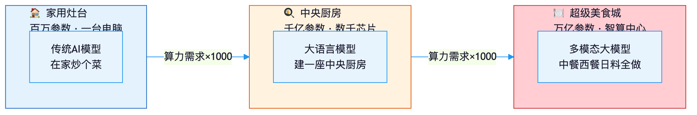
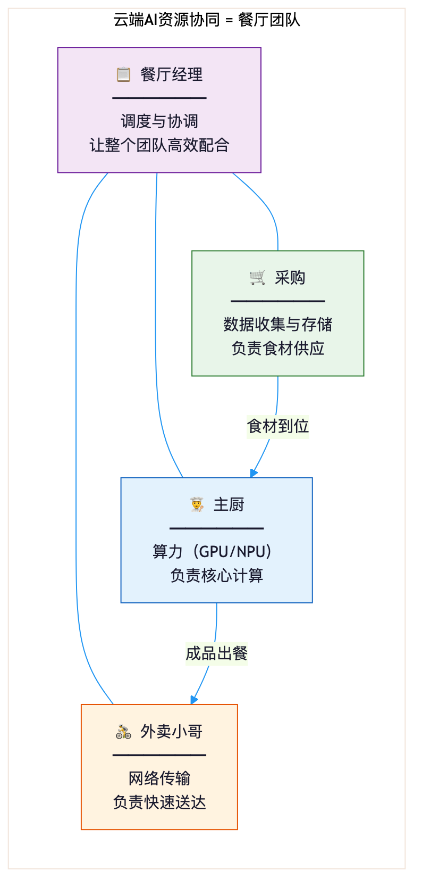

# 云端技术怎样助力人工智能高效落地

## 引子：你的生活中，AI已经无处不在

早上7点，手机闹钟响了。不是刺耳的蜂鸣，而是一段渐强的轻音乐——它记得你昨晚11点半才睡，所以比平时晚了15分钟叫你，让你多睡一会儿。

你赖在床上刷了五分钟短视频。刷到第三个，是一条关于咖啡拉花的教程。你并没有搜过"咖啡"，但算法知道你昨晚在社交平台点赞了一条"周末在家做拿铁"的帖子。它猜你可能对咖啡感兴趣，于是精准地递上了这条内容。

到了公司，座机响了。对面的"客服"声音温和、逻辑清晰，三分钟帮你查到了上个月的报销进度。你全程没觉得有任何不对劲——但接电话的，其实是一个AI程序。

这一切，就在你还没完全清醒的这一个小时里发生了。

有没有想过，这些AI背后的"发动机"是什么？你手机里那个推荐算法，凭什么能在几亿条视频里瞬间挑出你想看的？那个客服AI，为什么能像真人一样理解你的问题？

答案只有两个字：**算力**。

AI确实很聪明，但它非常"饿"——它需要海量计算能力才能运转。就像一个顶级大厨，手艺再好，没有巨大的厨房和源源不断的食材，也做不出一桌满汉全席。问题来了：普通公司甚至个人，去哪里弄这么大的"厨房"？

答案是**云计算**。接下来，我们就聊聊这个藏在AI身后的幕后英雄。

---

## 第一章：AI到底有多"吃"算力

### 1.1 从"小灶"到"超级厨房"——AI的算力胃口

把时间拨回2018年。那时候的AI，就像在家炒个菜——模型只有几百万个"参数"（你可以把参数理解成厨师脑子里的经验条目：火候、调料比例、食材搭配……每一条都是参数）。几百万个参数，一台性能不错的电脑，跑几天就能训练出来。

到了2023年，情况变了。所谓"大模型"横空出世，一个模型的参数量从几百万飙升到几千亿。这已经不是在家炒菜了，这是要建一座**中央厨房**，配齐上千名厨师，同时开火做菜。

训练一个大模型需要什么？几千块AI专用芯片——你可以把它理解为"专业灶台"，专为AI计算设计，比普通电脑芯片强几百倍。这些芯片要连续运转几周甚至几个月，才能"喂"出一个大模型。

到了2025年，中央厨房还不够用了。新一代的AI不仅能读文字，还能看图、听声音、看视频——业内管这叫"多模态"（"模态"就是信息的种类，文字是一种，图片是一种，声音又是一种）。这相当于厨房要同时会做中餐、西餐、日料、法甜。对算力的胃口，又翻了好几倍。

简单说：**几年时间里，AI的"胃口"膨胀了上百万倍。** 而这百万倍的膨胀，每一倍都需要更多算力来支撑。

### 1.2 自己建厨房？太贵了

既然AI这么"吃"算力，企业自己建一个"厨房"行不行？

技术上当然行。但从经济上看，这件事就像——**为了过年做一顿年夜饭，去建一个五星级酒店的厨房。**

首先，硬件投入惊人。一块AI专用芯片的价格，抵得上一辆小汽车。要训练一个大模型，你需要成百上千块这样的芯片，再加上配套的服务器、存储设备、冷却系统……一个算力中心建下来，动辄几亿甚至几十亿。

其次，大部分时间这些设备都在"空转"。AI训练就像做饭——有高峰也有低谷。训练任务来了，所有灶台满负荷运转；训练完成进入日常使用阶段，可能只用得到10%的算力。剩下90%呢？闲置在那里，但电费、维护费一分不少。

更头疼的是，这些芯片更新换代的速度非常快，大概两年就会有一代新产品。你花大价钱建好的厨房，两年后设备就不够先进了。要不要换？不换，性能落后；换，又是一笔天价投入。

所以，自建算力中心这件事，只有极少数巨头企业负担得起。对绝大多数公司来说，这条路走不通。

### 1.3 云端算力：用多少租多少

既然自己建厨房太贵，有没有别的办法？

有。就像你不需要建厨房也能吃上好饭——你可以点外卖。

**云计算，就是算力的"外卖平台"。**

你不需要买任何硬件，在云平台上注册一个账号就能开始用。想要多少算力，就租多少。用一个小时付一个小时的钱，就像用水用电一样按量计费。今天你的AI项目还在测试阶段，只需要一小份算力；明天模型训练正式启动，需要100倍的算力——云平台可以在几秒钟内完成扩容。训练结束，算力释放，不用继续付费。

这三个特点——**零门槛启动、按需付费、弹性伸缩**——彻底改变了企业使用AI算力的方式。你不用再纠结"建不建厨房"这个问题，只需要专注于"做什么菜"。

这背后的规模有多大？中国电信的天翼云已经建成了覆盖全国的智算资源体系——你可以理解为遍布全国各地的"超级厨房集群"，随时准备为各行各业的AI需求"出餐"。

一句话总结：**AI离不开云，就像现代餐饮离不开中央厨房和外卖平台。**

---

## 第二章：云端到底为AI做了什么

如果说第一章讲的是"为什么AI需要云"，那这一章我们要回答一个更深的问题：**云端到底为AI做了哪些事？**

很多人的印象里，云计算就是"租几台电脑"。但实际上，云端为AI提供的远不止算力——它是一套精密的支撑系统，像一个运转良好的大型餐饮集团，从食材采购到出餐配送，每个环节都在高效协同。

### 2.1 算力调度：云端"交通指挥"

想象一座城市的早高峰。进城方向车水马龙，出城方向空空荡荡。聪明的交通系统会怎么做？把更多的车道临时调整为进城方向——这叫"潮汐车道"，根据实时流量动态调配资源。

云端的算力调度，原理一模一样。

当几十个AI训练任务同时提交到云平台，有的紧急、有的不紧急，有的需要大量算力、有的只需要一点点，有的已经排了很长时间的队——谁来决定哪块芯片分给谁？这就是**算力调度系统**的工作。它就像城市交通指挥中心，根据每个任务的优先级、紧急程度、所需资源量，在成千上万台服务器之间动态分配算力。

没有这套调度系统，就像一个城市没有红绿灯——大量算力被浪费在等待和空转中。有了它，每一份算力都被用在刀刃上。对使用者来说，你不需要关心背后的调度细节，只需要提交任务、等待结果。

### 2.2 资源协同：不只有厨师，还有采购、仓管和外卖小哥

一家餐厅要正常运转，光有大厨够吗？显然不够。还需要有人负责采购食材（数据从哪来）、有人管理仓库（数据存在哪）、有人负责配送（数据怎么传到需要的地方）。

云端为AI做的事情也一样。它不只是一个"算力厨房"，而是把**计算、存储、网络**三大资源协同管理——就像一个配合默契的餐厅团队：

- **计算资源**（厨师）：负责AI模型的训练和运行
- **存储资源**（仓管）：负责安全地存放海量数据
- **网络资源**（外卖小哥）：负责快速传输数据到需要的地方

这三者的协同有一个核心原则：**数据在哪里，算力就调度到哪里。** 就像食材在哪里，厨房就应该搭在哪里——谁都不会把新鲜食材从城东运到城西再做菜，那既浪费时间又增加风险。云端也一样，它会自动把计算任务分配到离数据最近的服务器上，减少传输时间，提高效率。

### 2.3 从训练到上线：从"研发新菜"到"上架外卖"

假设你是一家连锁餐厅的研发总监，要推出一道新菜。整个流程大概是这样：

**第一步，研发新菜。** 厨师反复试验配方，尝试不同的食材组合和烹饪手法，不断调整味道。这一步费时费力，可能要试上百次。在AI的世界里，这叫**模型训练**——AI系统通过大量数据反复学习，调整内部参数，直到"学会"要做的事。

**第二步，确定配方。** 经过反复试验，最终确定了这道菜的配方。在AI世界里，这叫**微调**——在已有模型的基础上，根据具体需求做精细化调整，就像确定了"多加点辣、少放点盐"。

**第三步，标准化出餐。** 配方定好后，写成标准化的操作手册，分发到所有分店。任何一家分店按照手册操作，都能做出味道一致的菜。在AI世界里，这叫**部署**——把训练好的模型部署到云端服务器，让任何用户都能随时调用。

但大模型时代，这个流程出现了一个重要变化。以前，每家企业都要从零开始"研发新菜"。现在，云平台上已经有了大量"现成的招牌菜配方"——这些就是各种预训练好的大模型。企业不需要从零开始，只需要选一个最接近自己需求的"配方"，然后根据自己的"口味"做微调就行了。

这就像你不需要自己发明一道全新的宫保鸡丁，而是选一个经典配方，然后根据自己的偏好多放花生或者少放辣椒。开发门槛一下子降低了好几个量级。

### 2.4 数据管理：保证"食材"安全可追溯

餐饮行业有一句话：食材好，菜才好。AI也一样——数据质量直接决定了AI的"味道"。而云端，为AI数据提供了全套的"食品安全管理体系"。

首先是**数据的来源可追溯**。每一种食材从哪个供应商进的货、什么时候进的、质量检测报告是什么——这些信息都需要记录在案。AI的数据也同理：从哪里采集的、什么时间采集的、数据质量如何、是否符合使用规范，每一个环节都有迹可查。

其次是**数据的存储安全**。食材需要冷链运输、恒温保存，防止变质。AI的数据同样需要在安全的环境中存储，既要防止丢失，也要防止被未经授权的人访问。

但这里有一个特别有意思的技术，值得单独说说：**隐私计算**。

什么叫隐私计算？打个比方：两家餐厅想合作研发一道新菜。A餐厅有独家酱料配方，B餐厅有秘制烹饪手法，但双方都不想把各自的"商业机密"交给对方。怎么办？他们可以用一个"密封操作箱"——双方把各自的材料放进去，箱子自动完成调配，最后只输出成品菜的味道方案。整个过程，双方都看不到对方的具体材料。

隐私计算做的是类似的事情。它让AI能够在不直接接触原始数据的情况下进行计算。比如，A医院和B医院想合作训练一个AI诊断模型，但患者的病历数据涉及隐私，按规定不能直接共享。隐私计算技术可以让AI在"看不见原始病历"的情况下完成学习——就像上面那个密封操作箱，只输出学习成果，不暴露任何原始数据。

这在医疗、金融等对数据隐私要求极高的行业里，尤其关键。云端提供的这套"食材安全检测体系"，让AI既能"吃饱"（获得足够的数据学习），又能"吃得安全"（不泄露隐私）。

---

*（上篇完。下篇将带你看到云与AI融合的全景画面，以及这些技术正在怎样改变你的生活。）*
