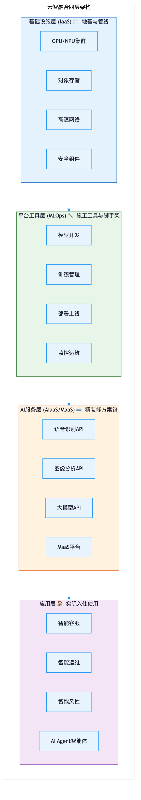
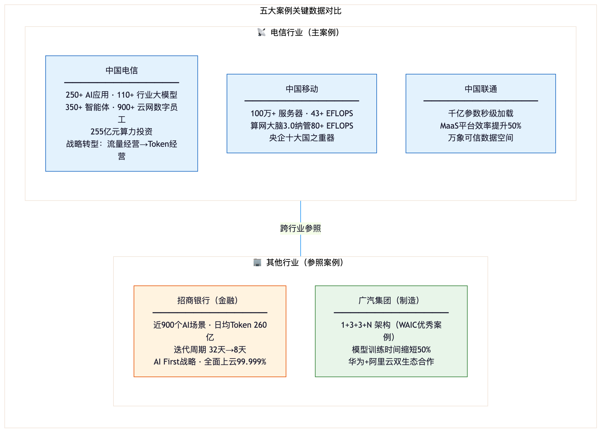

## 第三章：云+AI融合的全景画面

前两章我们聊了"为什么AI需要云"和"云端为AI做了什么"。接下来，让我们退后一步，看看云和AI融合之后，整体是什么样子。

### 3.1 四层"大楼"：云智融合的完整架构

把云和AI的融合想象成一栋大楼。不是那种毛坯房，而是从地基到精装、从图纸到入住，完整的一栋楼。

**第一层：地基与管线——基础设施层。**

这栋楼的地基是什么？算力、存储、网络。它们埋在地下，你看不见，但承载着楼上的一切。没有坚实的地基，再漂亮的装修也白搭。中国电信的天翼云AIDC（AI数据中心，你可以理解成专门为AI设计的"超级机房"，比普通数据中心更强大、更高效）就属于这一层。还有紫金DPU（一种专门处理数据传输和网络任务的芯片，就像大楼里的水管和电线，让数据跑得更快、更稳），也在地基里默默工作。2026年，中国电信在算力上的投资达到了**255亿元**——你可以想象这栋楼的地基打得有多深。

**第二层：施工工具——平台工具层。**

地基打好了，要往上盖楼，得有工具吧？锤子、电钻、脚手架……这些是施工工具。在云智融合的世界里，这一层提供的是AI开发、训练、部署的各种工具——你可以理解为"AI施工队"的全套装备。有了这些工具，开发人员不需要自己造锤子、焊电钻，拿来就能用。

**第三层：精装方案包——AI服务层。**

楼盖好了，内部装修怎么办？一种选择是自己买瓷砖、刷墙面、装灯具，费时费力。另一种是直接选一套现成的精装方案包，拎包入住。这一层提供的就是现成的AI能力——已经训练好的模型、已经封装好的智能服务，拿来就能集成到你的业务里。

**第四层：实际入住——应用层。**

装修完了，人住进来了。这一层就是你在日常生活中实际接触到的AI应用：智能客服、语音助手、自动翻译、图像识别……你不需要知道楼下三层在干什么，你只需要享受最终的服务体验。

这四层从下到上，构成了一个完整的"云智融合"体系。而其中第三层，有一个近年来特别火的模式，值得我们单独聊聊。

### 3.2 MaaS：AI的"菜谱平台"

你可能听过SaaS（软件即服务，就是不用买软件，在网页上直接用），现在AI领域出了一个新词：**MaaS，全称"模型即服务"（Model as a Service）**。听起来有点绕？没关系，想象一个美食平台就好了。

假设你想开一家餐厅，但自己不会做菜。你打开一个美食平台，上面有几百道菜的完整菜谱——川菜、粤菜、法餐、日料，应有尽有。你不需要自己发明菜谱，只需要三步：

**第一步，选菜谱。** 浏览几百个AI模型，找到最适合你需求的那一个。就像翻菜谱，找到你想做的那道菜。

**第二步，改菜谱。** 选好的菜谱大致方向对了，但可能需要根据你当地的口味做些调整——多放点辣椒、少放点糖、换一种本地特有的香料。在AI世界里，这叫"微调"——在大模型的基础上，用你自己的数据做针对性优化。

**第三步，上桌吃。** 改好的菜谱直接交给后厨出餐。在AI世界里，就是直接调用模型接口，让AI开始为你工作。不用自己搭厨房，不用自己训练模型，选好、调好、用起来。

MaaS平台把这三步全部搬到了云端，让你像在美食平台上点菜一样使用AI。这意味着什么？以前开发一个行业AI应用可能需要半年甚至更久，现在几周就能搞定。

对于中小企业来说，MaaS尤其重要。它把AI的门槛从"你得先学会做菜"降到了"你只需要会点菜"。不会做菜的人，也能开一家好餐厅。

### 3.3 AI智能体：从"工具"变成"助手"

最后，我们来聊聊云智融合体系里一个正在快速发展的新物种：**AI智能体**。

要理解智能体和传统AI的区别，可以用一个简单的类比——**计算器 vs 实习生**。

传统AI像一个计算器：你输入"37乘以58"，它算出"2146"。你按一下，它动一下。你不按，它就在那里等着，不会主动做任何事。

AI智能体像一个实习生：你跟他说"帮我查一下上个月的销售额，做个同比分析，整理成PPT发到群里"。他会自己规划步骤——先查数据，再计算，再制图，再写PPT，最后发送。中间遇到问题，他会想办法解决（比如发现数据缺了一块，会主动去找补充数据）。你不需要一步步告诉他怎么做，只要交代一个目标，他自己就能跑起来。

这就是智能体的核心特征：**主动性、规划能力、多步骤执行。**

中国电信目前已经部署了超过**350个**AI智能体，覆盖客服、运维、营销等多个场景。这些智能体不是简单地回答问题，而是能自主完成一系列复杂任务——像一个靠谱的实习生团队，7x24小时在线，不知疲倦。

当然，智能体要正常运转，离不开云端的支持。它需要持续在线、调用多种工具、访问各种数据——这些都依赖云端的计算、存储和网络基础设施。没有云，智能体就像一个没有办公设备、没有网络的实习生，再有想法也干不了活。

---

## 第四章：这跟你有什么关系

聊了这么多技术框架和行业趋势，你可能会问：这些跟我有什么关系？

关系大了。这些技术不是在某个实验室里安静地待着，它们已经在影响你每天的通信、上网、甚至生活方式了。而且，这一切主要发生在中国电信这样的运营商身上——因为它们既掌握着通信网络，又拥有云计算平台，是云和AI融合最彻底的领域之一。

### 4.1 已经在发生的改变

**场景一：你打客服电话——AI在帮你解决问题。**

下次你拨打电信运营商的客服热线，注意听一下。如果对面那个"客服"语速均匀、逻辑清晰、从不叹气也从不打哈欠——大概率，你在跟一个AI说话。

中国电信目前已经上线了超过**250个**AI应用，其中很大一部分就在客服领域。这些AI客服不仅能听懂你说的普通话，还能识别方言；不仅能理解你的问题，还能直接帮你查账单、改套餐、处理故障。

你可能会说："AI客服？我打过，跟机器人似的，听不懂人话。"那是几年前的版本了。今天的大模型驱动的AI客服，理解能力、应变能力和信息处理能力都发生了质的飞跃。很多用户打完电话才发现——原来对方不是真人。处理速度呢？往往比人工更快，因为它不需要"请您稍等，我帮您查一下"，所有信息都在它"脑子里"，瞬间调取。

**场景二：你的网络突然断了——AI可能在你发现之前就修好了。**

你有没有过这样的经历：正用着WiFi上网，突然断了一下，还没来得及投诉，几秒钟后网络又恢复了。你以为是自己眼花了，但很可能，是AI在背后完成了一次"自愈"。

中国电信基于网络大模型，打造了**20余类、900余个**"云网数字员工"，覆盖全国31个省份。这些数字员工是做什么的？简单说，它们7x24小时监控着通信网络的运行状态。一旦发现某条线路信号异常、某个基站负载过高、某个节点可能出现故障——它们会立刻启动诊断和修复流程。很多时候，故障在你还没感知到的时候，就已经被处理掉了。

这就像你家里装了一个超级智能的物业管家：水管刚有一丝渗漏的迹象，它就发现了，在你看到水渍之前就已经修好了。你说，这跟你有没有关系？

**场景三：你所在城市的通信基础设施——天翼云AIDC在背后支撑。**

你可能听说过"天翼云"，但大概率没有直接用过它。没关系，你不需要直接用——你用的每一项线上服务，背后可能都跑在天翼云上。

天翼云AIDC是专门为AI时代设计的新型数据中心。你可以把它理解为"AI专用的超级机房"——它比普通数据中心算力更强、效率更高、能耗更低。中国电信正在全国范围内大力推进AIDC的建设和升级。

这意味着什么？意味着你所在城市——无论是一线大城市还是三四线小城——的通信基础设施正在被AI重新武装。未来你使用任何需要AI能力的服务（智能客服、语音助手、图像识别、自动驾驶支持……），背后都有可能是这些AIDC在提供算力支撑。

**场景四：行业客户怎么用AI——110多个行业大模型服务千行百业。**

你可能会想："这些都是运营商自己的事情，跟我有什么关系？"关系在于，中国电信不仅自己用AI，还把AI能力输出给了各行各业。

中国电信已经打造了超过**110个**行业大模型——你可以理解为110多套"行业专用AI方案"。这些模型覆盖了政务、工业、医疗、教育、交通等领域。什么意思呢？你去医院挂号，医院用的智能导诊系统可能就是基于中国电信的医疗大模型；你所在城市的政务服务热线，背后的AI能力可能来自中国电信的政务大模型；工厂流水线上的产品质检，背后也可能是中国电信的工业大模型在驱动。

AI不像手机那样有一个具体的品牌让你看到。它更像电力——你看不见它，但它无处不在。

### 4.2 还会带来什么改变

正在发生的变化只是序章。接下来几年，云智融合还会带来更深层的改变。

**更智能的日常生活。** 你的手机助手会从"帮你设闹钟、查天气"进化到"帮你规划周末行程、预订餐厅、回复重要邮件"。智能家居会从"定时开关灯"进化到"根据你的作息自动调节全屋灯光、温度和音乐"。这些都需要AI在云端持续学习你的偏好，而云计算让这种"持续学习"成为可能。

**AI辅助人，而非替代人。** 每次技术浪潮来临时，总有人担心"AI会不会取代我的工作"。更准确的描述是：AI会替代你工作中的重复性部分，让你有更多时间做创造性的事情。中国电信的900多个"数字员工"就是这样——它们处理了大量重复性工作，让真人员工能专注于更复杂的判断和决策。

**小公司也能用上AI了。** 前面提到的MaaS模式，让AI从"只有大企业玩得起"变成了"中小企业也能用"。就像外卖平台让街边小店也能提供配送服务一样，MaaS让一家只有十几个人的创业公司，也能用上和大企业同等水平的AI能力。这对整个行业的公平竞争和技术普及，意义重大。

### 4.3 三个核心认知

聊到这里，有三个核心认知值得你记住：

**第一，AI的规模化应用离不开云计算。** AI再聪明，没有云端提供的算力、存储、网络和工具链，就只能待在实验室里当demo（演示品）。云计算是AI从"实验室"走向"千家万户"的关键桥梁。

**第二，云智融合已经形成完整体系。** 从基础设施到平台工具、从AI服务到最终应用，每一层都在快速成熟。这不是一个概念或者愿景，而是正在发生的事实。

**第三，每个人都会受到影响。** 不是"要不要接受AI"的问题，而是"如何更好地理解它、利用它"的问题。就像当年的互联网——你没有选择要不要上网，但你可以选择是被动适应还是主动驾驭。

---

## 结语：面向未来

让我们回到文章开头那个普通的早晨。

闹钟根据你的睡眠智能响了。短视频推荐了你可能感兴趣的内容。公司的AI客服帮你查了报销进度。你以为这些只是"手机变聪明了"，但背后其实是一场更大的变革：云计算正在把AI从少数人的专利，变成每个人都能享受的基础服务。

中国电信从"流量经营"转向"Token经营"（简单说，就是从"卖流量"变成"卖AI服务"）的战略转型，不只是一个企业的新战略——它代表着整个行业从"卖通信管道"到"卖智能服务"的转变。当一家拥有数亿用户的通信运营商，把AI能力铺到全国每一张网络上时，这种改变就不是某个APP的升级，而是整个数字基础设施的进化。

云计算，是让AI走出实验室、走进千家万户的那个关键推手。

未来五年，云和AI的融合会加速渗透到更多行业和更多场景。你会在更多地方感受到AI的存在——有些你能察觉到，有些你察觉不到。但无论你是否察觉，它都在那里，默默让你的生活变得更方便一点、更高效一点。

理解云智融合，就是理解未来十年的技术主旋律。而你现在，已经迈出了理解它的第一步。
